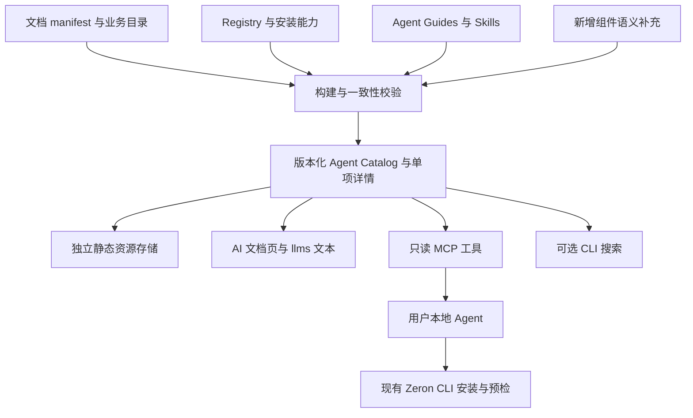

# Zeron AI 接入与 MCP 实施方案

创建日期：2026-10-03；文档更新：2026-10-04。  
状态：本地实现与部分检查已完成；正式资源发布、实际客户端连接、Vercel 部署和回退尚未验收。

目标：让外部 Agent 能可靠地发现、理解、安装和验证 Zeron 组件，让网站、Registry、Skills 与 MCP 使用同一版本的资料。

结论：采用与文档站同部署的无状态只读 MCP，安装继续由用户本地 CLI 执行，不可变发布资源放在独立 Blob 存储。Vercel 的技术路线已具备本地实现；真实项目部署、客户端连接与回退仍需验收。

当前先交付 **网站与只读 MCP 的同项目部署**：修复 review 问题后，按 commit 计划提交，推送 main 触发 Vercel 构建，再复验实际域名下的服务。正式安装资源链路的下一项工程交付仍是落实 G0 人工批准的可信来源与允许批准者，完成部署检查入口与正式构建接入；该链路不能将本地检查当作已批准或上线。具体状态见第 12.1 节，正式发布顺序见第 12.3 节，原始结果保留在[证据附录](./2026-10-03-agent-access-and-mcp-evidence.md)。

### 当前交付范围：网站与只读 MCP

- 网站、静态目录／指南、Skill 下载和 `/api/mcp` 同属现有 Next.js 应用、同一次 Vercel 部署。Vercel 可按请求扩缩容，不要求同一台常驻进程。
- 初版使用默认 `AGENT_CATALOG_MODE=development`，构建命令为 `pnpm build`，不设置 `AGENT_RELEASE_RECORD`；无需 Blob 或 CI 发布身份。`get_install_command` 按设计返回 `INSTALLATION_UNVERIFIED`，不宣称安装组合已验收。
- `vercel.json` 已调整为 `git.deploymentEnabled.main=true`，保留原有 Skill／Registry 响应头。推送前核对目标项目关联和生产分支；配置尚未提交，未因此触发新部署。实际部署达到 `READY` 后复验 AI 页面、目录及 MCP 初始化／工具调用。
- 本文后续 S／P／D、R1–R6、G0–G3 与独立 Blob 的要求描述正式资源发布和安装命令交付，不是当前网站／只读查询首次上线的前置条件。以后将关联项目切换为 release 模式前，需另落实对应正式项目的 Preview／生产推广控制，不能沿用当前 Git 自动部署设置就声称正式门槛已接入。

本轮整改、验证和提交范围统一见 [代码 Review 与 Commit 计划](./2026-10-04-agent-code-review-and-commit-plan.md)。

状态统一使用：**草稿存在**表示代码／文件已有但对应检查未完成，**已实现**表示实现已接入，**本地已验证**表示指定字节和范围有本地结果，**线上已验收**表示真实服务和客户端证据通过。“拟”“待实现”均不表示命令已可执行。第 12.1 节维护当前状态；证据附录保留历史状态。

| 阅读目的 | 入口 |
| --- | --- |
| 判断现在能用什么 | 第 12.1 节当前状态；第 10.4 节命令状态 |
| 开始下一项开发 | 第 12.3 节顺序；第 12.4 节输入输出契约；第 12.5 节检查单 |
| 准备实际发布 | 第 4.2 节交接时点；第 4.3 节待决输入；第 10.5 节 CI 条件 |
| 发布、部署和验收 | 第 13.1 节产物交接；第 13.1.3 节审查交接；第 13.4 节 G0–G3 门槛 |
| 维护指南、Skill 和范例 | 第 6–7 节；历史结果见证据附录 |

本文中 **S** 是发布内容的干净 Git 提交，**P** 是后续发布工作流在 main 启动时的平台提交，**D** 是以 S 为基础仅加入合法发布记录与选择文件的部署提交。P 可以等于 S；若 main 已前进，须核对 S→P 的发布控制文件字节。D 与 P 分别核验，不能因 P 更新就把资源来源改成 P。**前代**是最近已批准的冻结记录，不等于当前生产选择。来源四字段为 `sourceRevision`、`sourceInputSha256`、`lockfileSha256`、`sourceClean`。fixture 是明确用于测试的模拟输入，不是正式发布证据。

| 执行问题 | 当前结论 |
| --- | --- |
| MCP 是否无状态 | 本项目工具请求不依赖服务端会话；固定目录和公开资源是产品数据。Arc 页面不足以判断其内部会话实现 |
| 能否部署到 Vercel | 采用 Node 22 的 Next.js 路由，技术路线支持；实际项目的正式构建、访问配置及客户端连接尚未验收 |
| 现在先做什么 | 完成 review 整改与提交，再部署网站／只读 MCP；G0 可信审查及发布全链路继续作为正式模式的后续工作 |
| 哪些信息影响线上步骤 | 第 4.3 节列出源站、项目、CLI、G0 审查及客户端输入；缺失不阻止独立本地工作，但阻止对应正式步骤 |
| 什么时候算完成 | R1–R6 的退出条件及第 13.4 节全部通过；本地 core、临时 fixture 或一次部署不代替完整交付 |

| 编号 | 用途 | 当前执行方式 |
| --- | --- | --- |
| M0–M4 | 原始范围与工期估算 | 供预算参考，不用于更新当前完成率 |
| R1–R3 | 本地工具与内容工作包 | R1 负责消费者，R2 负责发现／范例及验证支持，R3 负责 Catalog／冻结及发布编排；允许独立 fixture 开发 |
| R4–R6 | 运行工具的实际发布与验收 | R4 发布资源／运行真实检查，R5 验收 Preview，R6 回退及生产复验 |
| G0–G3 | 对应发布阶段的放行条件 | 按顺序检查；文件存在或本地回归不代替放行 |

完整正式资源首版须满足 R1–R6 的退出条件和 G0–G3 门槛。当前网站／只读 MCP 交付按前述范围独立验证；缺少正式配置时，该正式链路继续保持未完成。

## 1. 核心决策

采用“统一目录 + 分层文档 + 现有 Skills + 无状态 MCP + 现有 CLI”的架构。

- 在现有 Next.js 项目增加 `/api/mcp`，与文档站一起部署到 Vercel。
- MCP 首版提供公开、只读的搜索与文档工具，不保存用户项目、会话历史和安装状态。
- 每次调用携带完整参数，服务端实例可随时被替换；目录的内存缓存只能是性能优化。
- 复用现有 Zeron CLI 安装预检、冲突处理、别名与依赖解析；MCP 只生成命令。
- 网站、静态文件与 MCP 共用构建产物，不各自维护组件知识。
- 首版不需要数据库、Redis、模型 API、向量数据库或账号系统。
- 不可变 Registry、Skill 与目录快照独立存入公开静态资源存储，首版选用 Vercel Blob；应用部署只负责选择当前版本和提供 MCP。资源存储不承载用户会话，也不参与每次 MCP 查询。
- 保留页面构建和迁移 Skill 的现有职责，增加接入说明与示例，不重写迁移引擎。

本次借鉴 Arc 的集中入口、按任务查找和渐进式上下文读取。Zeron 的组件契约、迁移证据和安装保护继续作为自身规范；不复制 Arc 特定的字体、焦点或文案限制。

“无状态”指每个工具请求独立完成，不依赖服务端会话、上一次搜索或某台实例。目录快照、发布验证记录和存储中的历史资源是持久化的公共产品数据，不属于用户会话。客户端负责传回目录版本和分页游标，Vercel 可在不同实例处理连续请求。

### 1.1 Arc 对照与项目选择

2026-10-04 核对 [Arc AI 文档](https://uiarc.dev/docs/ai)。页面展示只读 MCP 的五类工具、Skill、短规则和 Registry，并通过账号登录及 Pro 权限控制部分内容访问。页面介绍不能证明其服务器内部是否保存协议会话，Zeron 的无状态结论应由自身配置和测试得出。

| 对照点 | Zeron 的实施选择 | 验证方式 |
| --- | --- | --- |
| 按任务搜索，再读取资料 | 共用确定性目录，保留五个只读工具 | 双语任务评测、详情及文本降级检查 |
| Skill 与短规则 | 保留现有页面构建／迁移 Skill，补发现策略 | 有／无 MCP 的完整用户路径 |
| Registry 安装 | 使用现有 Zeron CLI，固定实际已验证版本及资源 URL | 精确 npm 包与最终 URL 消费者矩阵 |
| 分层上下文 | 共用生成器，预算超限可继续读取 | 字节预算、完整性与静态入口检查 |
| 账号与付费访问 | 首版公开只读；后续私有内容另立鉴权方案 | 原生客户端、浏览器来源和只读工具验收 |

## 2. 当前基础与已确认缺口

以下区分原有基础、本地实现和正式发布。第 12.1–12.2 节记录已执行的检查及其边界；本地生产构建通过不等于 Vercel 部署或公开安装组合通过。

| 资产 | 当前能力 | 本方案的处理 |
| --- | --- | --- |
| `docs/manifest.ts` | 文档分类、slug、Registry 映射 | 作为文档身份与路由依据 |
| `docs/catalog/artifacts.ts` | 业务域、搜索词、适配程度、数据模式、设备分类 | 复用字段，为组件补齐对应语义 |
| `docs/catalog/standalone-pages.ts` | 有页面但没有 Registry 的独立演示 | 允许发现，明确不能安装 |
| `packages/blocks/block-capabilities.json` | Block 的框架与 template/data-block 分类 | 继续作为安装能力依据 |
| `public/r/` | 可安装 Registry 与元数据 | 作为发布内容及依赖依据 |
| `docs/agent-guides/` | 原有 17 份，现增至 23 份，其中组件指南 12 份、Block 指南 11 份；6 个新 TSX 示例类型检查通过 | 保留路由／trace 回归；指南示例不计为完整业务范例 |
| `public/llms*.txt` | 分层生成和已提交文本漂移检查已通过 | 增加超大合集拆分；在独立临时 checkout 验证可复现性 |
| `.agents/skills/` | 页面构建、迁移两套 Skill；共享版本发现参考与包内文本选择已接入 | 三个业务页面已交付本地源码；完整示例证据与实际客户端发现路径待验收 |
| `scripts/build-skill-distribution.mjs` | 保留 schema 1；已增加 schema 2 隔离候选、完整源站 URL 和固定指南 | 历史还原与当前入口绑定已有本地 fixture 回归；真实记录发布与公开下载待验收 |
| `scripts/create-registry-release.mjs` | 显式资源源站、隔离候选、全文件清单和冲突拒绝；上传控制器已有本地回归 | 执行实际上传与回读，再由冻结入口绑定；当前候选不代表公开可用 |
| `scripts/test-consumer-installs.mjs` | 本地 CLI 打包、本地 Registry 与 URL 改写 | 保留开发测试，另建实际 npm 包和正式快照的发布测试 |
| `packages/cli/` | 安装、预检、查询、迁移扫描与检查 | 保留安装职责，后续可增加语义搜索 |
| `packages/lint/` | 仓库内设计检查 | 当前是私有包，不能宣称外部项目自动获得 |

此前线上抽查中，`user-account-01.md`、`resource-detail-page-01.md` 的公开 Agent Guide URL 返回 404；`llms.txt`、Skill 安装指南和 Button Guide 可访问。这是历史抽查结果，不能代表本地改动部署后的状态。

本地开发目录包含 141 项，来源 Registry 包含 133 项。`lib/agent-catalog/`、`lib/mcp/` 和 `/api/mcp` 已提供查询与只读工具；目录仍为 `mode: development`，`catalogUrl` 与安装验证记录为 null。固定命令生成只在测试 fixture 中验证，尚没有真实发布组合可供工具返回。完整交付状态以第 12.1 节为准。

注意三个名称不能混用：文档 slug、Registry name、业务展示名称。例如文档资源市场的 slug 与安装名称不同。文档属于 pages 也不意味着其 Registry 类型不再是 block。

## 3. 用户流程与首版范围

### 3.1 已连接 MCP

1. 用户提出任务，例如“给现有 Vite 项目做资源列表，保留已有导航”。
2. Agent 读取本地环境，通过 `search_components` 查找候选。
3. 读取候选详情，核对框架、布局归属、公开 API、数据接入和状态要求。
4. 获取安装命令，本地执行 CLI 预检，再安装和接入业务。
5. 根据 Skill 做类型、交互、布局及已配置的设计检查。
6. 报告实际采用项、业务适配、验证结果和未覆盖项。

### 3.2 未连接 MCP

Agent 从 `/llms.txt` 进入，读取统一目录和单项 Markdown，再沿用同一套安装与验证流程。MCP 不可用时，这条路径必须仍可工作。

### 3.3 旧项目迁移

仍由 `swap-to-zeronui` 管理范围、映射、清理和完成证据。MCP 仅协助选型和读取资料，不对外提供 `migrate_app`、`swap_apply` 或远程修改项目工具。

### 3.4 首版交付界限

首版包含全量基础目录、全部现有指南公开化、分层上下文、5 个 MCP 工具、双语 AI 入口和 3 个完整示例。高频条目的深入指南先覆盖至少 12 项，其余明确标记文档深度。外部设计检查分发作为后续独立交付，不阻塞只读 MCP。

## 4. 数据架构与维护规则



“统一”是按字段确定权威来源，不是把现有目录全部复制进一份新 JSON。

| 字段 | 权威来源 | 冲突处理 |
| --- | --- | --- |
| 文档身份、分类、URL | `docs/manifest.ts` 与现有路由函数 | 不手拼页面分类；无对应路由则失败 |
| Registry 名称、依赖、文件 | Registry 生成内容 | 不存在的项不可标记为可安装 |
| 框架与安装类型 | Block capability、Registry metadata | 两处不一致则构建失败 |
| 产品、业务域、适配程度、数据模式 | 现有 artifact catalog | 保留原语义；组件无此字段时允许 null |
| 使用／不使用场景、关联项、关键词 | 新增组件语义补充与已结构化指南 | 只补缺失语义，不重复框架约束 |
| 详细规则与示例 | Agent Guides、Skill references | 链接到真实内容，不生成猜测 API |
| 公共导出与关键类型 | 对应发布源码／TypeScript 声明 | 安装源码为最终依据 |

`docs/agent-data/` 放组件语义补充、纯数据来源适配和发布记录；`lib/agent-catalog/schema.ts` 是目录与运行时的共用机器契约。资源清单、Skill 分发和冻结记录分别使用对应 schema，不在各调用方重复定义。构建脚本使用现有 esbuild 将纯数据 TypeScript 模块编译后读取；公开导出使用 TypeScript AST 提取，不执行组件模块。首版不新增 workspace 包。

约定 `ARTIFACT_BASE_URL` 为已创建资源存储的实际 HTTPS 源站地址。发布配置先固定该值，再生成 Registry 的绝对依赖 URL；不从 Preview 域名、请求 Host 或用户输入推导。本文使用变量表示，不能在实施前冒充已经存在的资源域名。

配置分为三个边界：`SITE_BASE_URL` 是文档站的固定公开地址；`ARTIFACT_BASE_URL` 是公开 Blob 源站；`MCP_ALLOWED_ORIGINS` 是可选浏览器调用来源的精确列表。Preview 地址不能覆盖资源源站。Blob 写入凭据只注入发布作业，不注入应用运行时；访问保护绕过凭据只用于验收请求，不进入目录、文档或日志。

### 4.1 配置与执行责任

| 输入 | 使用位置 | 约束／缺失时行为 |
| --- | --- | --- |
| `SITE_BASE_URL` | 内容生成、Skill 更新入口 | 固定 HTTPS origin；不带路径、查询或凭据；正式候选缺失即停止 |
| `ARTIFACT_BASE_URL` | 候选生成、上传及正式还原 | 实际公开 Blob HTTPS origin；与全部阶段清单一致，不能使用保留示例域名发布 |
| `MCP_ALLOWED_ORIGINS` | 应用运行时 | 逗号分隔精确 origin；无末尾斜杠，允许列表同时包含 `SITE_BASE_URL`；缺少 Origin 的原生客户端仍可调用 |
| `AGENT_CATALOG_MODE` | 应用构建 | 正式 Preview／生产显式设为 `release`；默认 development 只供开发，不能用于 G1／G3 |
| `AGENT_RELEASE_RECORD` | 应用构建 | 与 release 模式成对配置；指向已提交的 `docs/agent-data/releases/current.json` 或指定版本记录，字节须与 D 的提交对象一致 |
| Blob 写权限 | 独立发布作业 | 按执行环境选 OIDC 或静态 token；只检查存在性，不输出值；应用部署不连接该写入身份 |
| Vercel 项目／团队、Node 版本 | 部署作业 | 固定项目，Node 22；核实套餐、访问及回退资格；正式构建还须通过提交记录读取的预检 |
| 精确 CLI 版本与 npm 完整性 | 发布消费者测试 | 实际 npm 获取并验证；缺失或不匹配时安装能力保持未验证 |
| 当前冻结记录及历史引用 | 正式构建 | 来自受审查提交；不得按远端 latest 自动选择 |
| CI 读取身份 | CI 核验／发布作业 | 核验入口优先读取 `AGENT_CI_READ_TOKEN`，未配置时使用 `GITHUB_TOKEN`；需 Actions／Contents 读取及实际保护规则读取权限。classic 保护另需 Administration read，不能默认工作流 token 足够；读取失败不放行 |
| 安装测试配置与 Registry release ID | 验证工作流的输入准备作业 | 固定 `docs/agent-data/installation-config.json` 已按严格 schema 准备，包含实际 `.17` npm SRI／四格，尚未提交；须纳入 S。手动工作流仅接收 `registry_release_id`，必须指向同一 S 已公开的安装资源 |
| 验证工作流变量与写入身份 | Registry／Skill 已公开后的实际执行 | 仓库变量为 `ARTIFACT_BASE_URL`、`SITE_BASE_URL`；两类 jobs 引用环境 `agent-artifact-publication`。在该环境保存 `AGENT_BLOB_TOKEN`，仅执行和内容检查步骤注入为 `BLOB_READ_WRITE_TOKEN`，内容检查不联网。将环境限制为 main、禁用其他分支／标签，核对实际授权；不能仅凭 YAML 引用就认为平台已配置 |
| CI 持久归档位置与读写身份 | 冻结交接作业 | 固定规范化 `docs/agent-data/ci-archive-storage.json` 随 S 提交，当前缺失；指定独立私有 Blob origin 和保留策略。仅发布作业配置该存储的 `AGENT_CI_ARCHIVE_BLOB_TOKEN`，不得复用产品存储凭据或注入应用。写入后认证回读并检查匿名读取被拒绝，缺配置／权限不完成冻结 |
| 发布工作流输入 | 后续 `Agent release publication` | 消费者及范例各自的完成 run ID／attempt、同一 `registry_release_id`、明确 `predecessor`。不接受用户指定来源 SHA、任意 URL 或导入 pass；输入与失败规则见第 10.6 节，本地已验证，实际运行待 R4 |

Blob SDK 在 Vercel 上可通过 `BLOB_STORE_ID` 和平台管理的 OIDC 身份认证；外部作业可使用 `BLOB_READ_WRITE_TOKEN`。SDK 负责平台 token 的读取与刷新，业务脚本不打印或手工传递其值。连接存储时应核对环境注入，避免写权限进入文档站部署。[Blob 认证说明](https://vercel.com/docs/vercel-blob/using-blob-sdk)

**应用与发布身份必须实际隔离。** 首版优先使用独立 CI 发布作业的受保护 Blob token，文档站项目不连接可写 Blob store，也不配置该 token。验证工作流已引用固定发布环境，但只读权限与 main 条件不能阻止其他工作流读取仓库级 secret；不要在仓库级另放同名写入凭据。正式启用前核对环境的 main 限制、secret 存放范围及既有仓库审查流程；引用环境名称不证明这些配置已经落实。若发布作业改用 Vercel OIDC，使用独立发布项目并核对 store 的项目／环境连接及身份授权；平台可能自动提供 OIDC，不能仅凭“没有手动注入 token”判断应用没有写权限。G1 核对配置与授权范围，应用 runtime 只读取已内置的资料。该隔离是部署要求，当前工作区未证明线上授权已经配置。

执行角色可由同一人承担，但交付责任分别记录：内容维护者负责语义、指南、范例与 Skill；工程实现者负责 schema、生成器、查询和发布脚本；发布者负责源站、凭据、npm 版本、部署及回退；验收者核对证据与退出条件。发布者不能手填测试 pass 代替脚本结果。

配置交接记录只保存公开 origin、项目／环境标识、版本、权限类别、是否已核对及证据位置。凭据只记录存在性和用途。配置须在对应首次执行前落实：R4 需要源站、CLI 与资源发布／CI 读取权限；R5 需要项目、构建及客户端访问配置；R6 需要实际回退权限和域名。无需等全部线上配置齐备才开发 R1–R3，但缺失项不能跳过该阶段的退出条件。

所有源码、引用和链接都必须来自允许列表。读取 Markdown 不等于执行其中的指令；只有人工维护、明确纳入分发的资料可发布。

### 4.2 首次发布的配置交接

发布者按下表时点补齐交接；两份规范化配置须在 S 固定前提交。表中的“缺失”来自本次工作区文件核对，不能推断平台账号没有权限。仅保存公开配置及凭据用途／核对结果，不保存凭据值。

| 交接项 | 交付方式 | 当前状态与核对时点 |
| --- | --- | --- |
| 站点和产品资源源站 | 实际 `SITE_BASE_URL`、`ARTIFACT_BASE_URL`；与安装配置一致 | 现有正式域名已确认 `https://zeron-ui.vercel.app`；产品 Blob origin 仍未确定，生成 Registry／Skill 前核对 |
| 安装测试配置 | 按 `installationConfigurationSchema` 生成规范化 `docs/agent-data/installation-config.json`，包含实际 CLI pin／SRI 和完整矩阵 | `.17` 元数据读取恢复后已实际下载并核验 19,329 bytes tarball，配置已准备、尚未提交。四格与 Next-only 项匹配现有身份／框架；须随 S 固定，不表示正式安装通过 |
| CI 私有归档配置 | 按 `ciArchiveStorageSchema` 生成规范化 `docs/agent-data/ci-archive-storage.json`；独立私有 store | 文件缺失；须随 S 提交，冻结前核对认证回读、匿名拒绝及留存权限 |
| 平台规则与身份 | main 保护／ruleset、固定发布环境的分支限制、环境级 `AGENT_BLOB_TOKEN`／`AGENT_CI_ARCHIVE_BLOB_TOKEN`、CI 读取身份 | 2026-10-04 已配置 classic 保护并回读管理员约束／禁止强推／删除；发布环境仅允许 main 已实际核验。仓库 `SITE_BASE_URL` 已创建并回读，与安装配置一致；`ARTIFACT_BASE_URL` 缺失，环境和仓库 secret 列表仍为空，写入和作业读取身份尚未配置 |
| G0 审查读取 | 既有审查流程、允许批准者、可核对记录及四份 JSON 的字节绑定方式 | 接入尚未定义；先落实第 13.1.3 节契约，再完成部署门槛的批准正例 |
| 正式模式的生产推广控制 | 核对正式项目的 Git 分支、构建模式与推广入口 | 当前网站／只读 MCP 初版已启用 main 自动 Git 部署；`vercel.json` 仍纳入 S→P 字节比较。以后将项目切换到 release 模式前另落实正式推广控制；尚未提交／平台验收，不能把当前配置视为 G0–G3 门槛 |
| 应用部署 | 正式项目／团队／套餐、Preview 配置、Git 对象读取方式 | 现有正式域名对应 `zeron-ui-6iw7`，项目 Node 22 已实际修改并回读；已准备忽略的 `.vercel/project.json`。套餐、CLI 身份、构建／访问门槛仍待 R5 验收 |
| 客户端和回退 | 两个实际客户端及版本；独立验收项目和生产域名；回退权限 | R5／R6 前确认；两个不同 Preview URL 不代替真实回退 |

上述 schema 为实现中的权威字段定义；本表不复制另一份可漂移的 JSON 模板。配置交接完成后重新冻结 S，来源四字段随实际提交重算。

准备分为四个时点：**S 固定前**提交两份真实配置和全部发布控制代码；**S 进入 main 前**处理生产自动部署；**R4 执行前**落实源站、CLI 与发布／读取身份；**R5 构建前**落实 G0 审查交接、目标项目和客户端。S 固定后若修改受第 10.6 节约束的发布控制文件，必须生成新 S 并重跑验证，不能仅在 P 补上缺失配置。

### 4.3 待决输入与交付位置

以下是首次正式执行仍需确定的输入，不采用默认值替代。第 4.2 节维护配置是否就绪；本节明确谁交付、交付到哪里，以及缺失影响哪一步。

| 待决输入 | 责任与可审查交付 | 最迟时点／缺失影响 |
| --- | --- | --- |
| 应用目标 | 已按既有正式域名 `zeron-ui.vercel.app` 确认应用项目 `zeron-ui-6iw7`，ID／团队写入本地链接文件并留实际读取证据；另一关联项目为 `zeronui`。独立验收项目尚未确定 | 两个项目最近均从 main 生成生产部署；S 进入 main 前须验证自动部署控制对所有关联项目生效，R5／G2 前落实目标构建及独立回退项目 |
| 两个存储源站 | 发布者交付产品公开 Blob origin、独立私有归档 origin、权限用途和核对位置；工程实现者写入私有归档配置并核对公开发布变量。安装配置独立准备，不包含 Blob origin | S 固定前；缺失不能完成私有配置、上传或成功冻结 |
| 精确 CLI 与矩阵 | 实际 `.17` 元数据／tarball 已核验，安装配置已包含四格代表项和 Next-only 拒绝项；原字节及哈希保存在 `installation-configuration-02/` | 须随 S 固定；Registry／Skill 完成标记及四格真实安装仍待 R4，不因 CLI 字节核验通过启用正式安装命令 |
| G0 批准来源 | 仓库维护者明确既有审查系统、允许批准者、记录读取权限、撤销／过期语义及四文件哈希绑定；工程实现者实现第 13.1.3 节读取与构建检查 | 审查策略／代码随 S 固定；实际批准在冻结材料就绪后、D 构建前完成。分支保护和环境名不代替批准 |
| 实际 CI 身份 | 发布者在固定环境配置两类独立写入身份、CI 读取身份及两项仓库变量；交付权限范围与只记录存在性的核对结果 | R4 首次执行前；没有实际授权不运行成功发布链路 |
| 客户端与回退 | 验收者登记两个实际客户端名称／版本／连接方式；发布者交付独立项目生产域名与可回退权限 | G1 前固定客户端，G2 前固定域名／权限；Inspector 和两个 Preview URL 不能代替这些验收 |

Vercel 插件安装、授权读取、项目选择和发布写入权限分别记录。2026-10-04 项目／域名读取已确认既有站点归属，随后仅对该项目将 Node 24 改为 Node 22，并回读确认现有部署／域名不变；没有执行新部署、修改访问保护或存储授权。CI 不会自动获得连接器身份。最新实际结果见[项目准备实施记录](./2026-10-03-agent-access-and-mcp-evidence.md#vercel-项目准备与部署控制文件2026-10-04)，前次只读列表见[文档优化记录](./2026-10-03-agent-access-and-mcp-evidence.md#实施入口与前置条件优化2026-10-04)。

## 5. 目录契约与版本

### 5.1 目录摘要

新增站点 `/ai/catalog.json`，返回 `schemaVersion`、`catalogVersion`、`sourceRevision`、`registryReleaseId`、`skillVersion`、不可变 `catalogUrl` 和条目摘要。它是当前部署的版本入口，搜索只读取摘要，不加载完整源码。

条目字段：

| 字段 | 约定 |
| --- | --- |
| `id` | 首次登记时固定为 `component:<registryName>`、`block:<registryName>`、`support:<registryName>` 或不可安装项的独立 ID；调整网站分类时保留旧 ID |
| `slug` / `registryName` | 分开保存；不可安装项的 registryName 为 null |
| `kind` / `collection` | 设计用途与网站分类分别保存 |
| `title` / `summary` | 支持 zh-CN、en；缺失翻译显式回退 |
| `keywords` / `useCases` | 中英文任务词、常见同义词 |
| `framework` / `react` / `tailwind` | 来自实际安装元数据，不推断框架测试已通过 |
| `installable` / `installationKind` | 与 Registry 是否存在及 template/data-block 对应 |
| `readiness` / `dataMode` / `devices` | 复用业务目录；未知可为 null |
| `docs` / `markdown` / `detailUrl` | 本版本的明确链接 |
| `coverage` | `basic`：仅基础资料；`guided`：有经核对的深入指南；`example-verified`：另有绑定版本的运行范例证据。它不代替安装验证 |

每个可安装 UI、Block 及公开独立演示都纳入基础目录。主题、lib、hook 等支持依赖仍保留可查询身份，但默认搜索隐藏，只有显式请求支持项时展示。

别名包含 Registry name、文档 slug 和人工维护的旧名称。别名冲突返回候选 ID，不能取数组中的第一项。`related` 必须解析为真实稳定 ID。必需字段缺失或来源冲突使构建失败；允许为空的翻译、指南和适配字段保持 null，并产生可审查的覆盖报告。

`docs/agent-data/item-identities.json` 已登记现有 141 项的固定 ID、来源键、当前／旧别名及退役状态。生成器读取登记表，不再根据当前 kind 拼 ID；调整分类或改名时继续使用旧 ID。退役项保留身份及明确原因，不能将旧 ID 分配给另一项。新增项缺少登记、重复 ID／现役来源、缺少当前或初始别名、现役登记失去来源均使构建失败。

`validateItemIdentityEvolution` 已提供发布间校验：拒绝删除既有 ID、丢失任一历史别名或重新启用退役 ID。还原器按旧到新比较历史身份清单，Catalog 候选／上传／冻结入口也已接入对前代正式记录的公开读取与比较。真实前代链仍待 R4 验收；不能用当前登记表与自身比较代替这一步。

### 5.2 单项详情

新增 `/ai/items/<id>.json` 与 `/ai/items/<id>.md`，路径中对 ID 做标准编码。详情包含摘要、适用／不适用场景、组合约定、相关项、公开导出、经核对的关键参数、示例、状态与定制规则、安装约束及来源。

URL 与文件名只经过一次编码／解码：例如 `component:button` 的 URL 段为 `component%3Abutton`；静态文件和路由按同一规则映射，禁止把 `%3A` 再编码成 `%253A`。通过实际 HTTP 请求验证含冒号 ID，不能仅测字符串生成。发布版详情的 Markdown、JSON、指南和示例链接指向同一不可变版本；普通网站页面链接仅供展示。

不承诺首版自动导出全部复杂 React Props。先提取公开 exports 和类型定位；关键 API 与示例人工核对。缺少详细指南时仍生成基础 Markdown，但标为 `basic`，不假称存在完整指导。语言回退返回 `requestedLocale` 与 `contentLocale`。

### 5.3 版本一致性

- `catalogVersion` 对显式的规范化 payload 计算 SHA-256。payload 包括条目、指南与示例字节哈希、Registry 全文件清单哈希、Skill manifest 哈希，以及已验证 CLI 的版本／包完整性／验证范围摘要。
- 排除 `catalogVersion` 自身、含该版本的派生 URL、测试时间、构建时间和发布记录所在提交的 HEAD。先计算版本，再填充派生 URL，避免自引用。`sourceRevision` 单独固定为内容来源提交；内容相同的重建复用同一份发布记录，不追随后续元数据提交漂移。
- Registry 清单覆盖 `registry.json`、所有条目文件及依赖闭包，不能只对索引计算哈希。Registry release ID 在生成绝对依赖 URL 前分配并冻结；同 ID 不允许生成不同字节。
- `${ARTIFACT_BASE_URL}/ai/releases/<catalogVersion>/` 保存不可变目录及单项内容；站点 `/ai/catalog.json` 是当前部署的版本别名，不承担不可变资源的唯一托管职责。
- Registry 与 Skill 分别放在同一源站的 `/r/releases/<releaseId>/` 和 `/skills/releases/<skillVersion>/`。详情和安装命令直接返回完整资源 URL，不依赖应用回退后仍存在同名路由。
- 旧 `/agent-guides/...`、`/llms.txt` 与 `/skills/install.md` 入口保留；这些入口的“当前版本”可随应用回退改变，已经发出的固定版本 URL 不改变。
- 所有 MCP 结果返回实际 `catalogVersion`。Agent 搜索后应在后续调用传回该值。
- 未传版本时使用当前版本；指定版本不可用时返回 `VERSION_UNAVAILABLE`，不静默改用最新版。
- 协议工具名首版按版本 1 管理，只做兼容扩展；破坏性参数修改需要单独升级方案。

MCP 构建时加载当前及前两个已发布目录／指南快照，必要的 Skill 文本也来自其固定版本。函数内不携带历史 Registry 全源码。回退后的旧函数可能不识别回退前的新目录，必须返回 `VERSION_UNAVAILABLE`，不能伪装成仍能查询该版本；客户端使用已获得的 `catalogUrl` 继续静态读取。

独立存储中的正式版本首版不自动删除，发布脚本只追加；应用回退不执行存储删除。未来若需要清理，另订公告期与依赖引用检查，不能把函数只加载三个版本误解成存储只保留三个版本。未完成发布的候选也不被应用标为当前版本。

规范化 JSON 使用 UTF-8、LF 换行、固定对象键排序和按稳定身份排序的集合；保留有意义的数组顺序。资源文件哈希始终基于最终分发的原始字节，下载校验时不重新格式化 JSON、Markdown 或 ZIP。开发目录显式返回 `mode: development`，安装记录为 null，不生成“已验证”命令，也不把未上传的候选 URL 标为公开可用。正式目录使用 `mode: release`，必须绑定下述发布记录。

### 5.4 资源发布清单

每个资源阶段输出清单：文件路径、字节数、SHA-256、最终 URL 和内容类型。固定路径上传关闭随机后缀和覆盖；路径已存在时读取并核对哈希，相同则复用，不同则停止并使用新版本。不可变性由发布流程保证，不把普通对象存储称为 WORM 存储。[Blob SDK](https://vercel.com/docs/vercel-blob/using-blob-sdk)

显式设置 `access: public`、`addRandomSuffix: false`、`allowOverwrite: false`，不依赖 SDK 默认值。清单不包含自身的字节哈希；清单哈希由外层冻结发布记录保存。完成标记最后上传，列出被确认的清单哈希；已有完成标记也必须回读核对，不能只检查文件存在。同一 release 的写入作业串行化，冲突后重读核验，不临时开启覆盖。

上传完成后逐项通过公开 URL 回读核对，最后写入该阶段的完成清单。失败时不发布完成标记，也不切换当前版本；重试只补缺失的相同内容。上传权限仅用于受控发布作业，文档站、MCP 运行时与普通 PR CI 不需要写入凭据。存储连接和权限范围在 M0 验证，不让 MCP 为此获得对象写权限。

### 5.5 冻结发布记录

在 `docs/agent-data/releases/` 提交 schema 校验后的精简记录，另以当前版本选择文件引用它。记录至少包含：

| 部分 | 必需字段 |
| --- | --- |
| 身份 | schemaVersion、内容来源 revision、catalogVersion、固定源站 |
| Registry | releaseId、清单 URL／SHA-256、完成标记 URL／SHA-256 |
| Skill | skillVersion、manifest URL／SHA-256、ZIP URL／SHA-256、固定安装指南哈希 |
| 目录 | catalog、单项内容、运行时快照的清单 URL／SHA-256及完成标记 |
| 安装验证 | 精确 CLI 版本、dist.integrity、测试矩阵、测试项与闭包、证据附件哈希 |
| 运行时历史 | 当前及最多两个此前正式版本的记录引用 |

正式构建由提交记录中的哈希作为信任起点，验证下载的清单、完成标记及所有需要还原的文件，不能接受远端返回的任意“新哈希”。Registry 全文件回读属于资源发布与消费者验收；应用还原只校验其清单、完成标记和目录中的绑定关系，不重新把 Registry 全源码打包进函数。前一版本不足两个时只加载实际存在的版本。应用／客户端验收证据单独追加，不反向修改冻结目录或安装验证摘要。

Skill 的 `manifest.json` 是 schema 2 的安装契约；该阶段的全文件清单使用 `artifacts.json`，列出 ZIP、内层 manifest、指南和全部 `sources/` 文件，避免清单自引用。冻结记录还须绑定该清单及最后的 `complete.json` URL／哈希。Registry 的阶段清单仍使用 `manifest.json`。当前只有本地 dry-run 生成完成标记的候选字节，不写入候选目录，也不称其为已发布完成标记。

冻结记录 schema、严格四格安装验证契约及正式还原器已实现；独立安装输入、公开资源／npm 字节核验、四格执行器、证据发布及冻结入口已接入。消费者完整实测、Catalog 发布、真实冻结及持久交接仍待验收。机器约束如下：

- 记录使用严格 schema，拒绝未知字段。`sourceRevision` 为实际 40 位提交 SHA，另存 `sourceInputSha256` 与 `lockfileSha256`；正式来源必须 `sourceClean: true`。发布记录所在提交可以晚于内容来源提交，两者不混用。
- 每个远端信任入口同时固定 `url`、`bytes`、`sha256`。包括三个阶段的外层清单、完成标记，以及 Skill 内层 manifest；仅记录 URL 和哈希不足以在读取前分配安全预算。
- 完成标记绑定阶段 kind、release ID、base URL、清单原始字节哈希、payload 文件数及总字节数。这两个计数不包括外层清单和完成标记；dry-run 的对象总数／上传字节则包括二者。
- CLI 完整性限定为合法 SHA-512 SRI，解码后必须恰为 64 字节；当前正则已约束编码长度和末尾填充位。它只能验证声明形式，真实消费者生成器仍须对下载的 tarball 计算 SHA-512 并与精确版本的 npm 元数据比较。
- 当前选择文件只引用一个冻结记录；该记录的 `history` 保存最多两个此前记录的文件名、字节数与哈希。还原器只读取这一层历史，不递归追踪旧记录自己的 history。版本去重并拒绝自身引用，不按远端列表、文件时间或哈希大小推断“上一版”。
- 内容相同且来源绑定相同的重试复用原记录；不能为了刷新时间或 HEAD 改写已冻结文件。安装、源码或源站变更后重新验证并生成对应版本。

### 5.6 公开下载与还原预算

下表为正式链路的固定上限；下载器、集合预算、隔离还原及正式构建接入已实现并通过定向回归。定向测试不代表真实 Blob 下载、正式记录发布或 Vercel 验收。

| 项目 | 初始上限／处理 |
| --- | --- |
| 单次尝试 | 12 秒，覆盖请求头和完整响应体；到时中止读取并释放连接 |
| 重试 | 最多 3 次总尝试；只重试超时、网络错误、429、5xx及发布回读时的暂时 404；还原的缺失文件仍以失败结束 |
| 跳转 | 手工处理，最多 3 次；每个目标保持配置的 HTTPS origin，无凭据、查询或 fragment |
| 元数据 | 外层清单最多 2 MiB，完成标记最多 64 KiB；先用冻结记录的 bytes 校验，再解析 |
| 普通文件／ZIP | 单文件最多 16 MiB；Skill 解压继续使用第 6.3 节的独立预算 |
| 集合 | 每阶段最多 1,024 个 payload、256 MiB；单次应用还原总下载最多 512 MiB，最多三个目录版本 |
| 应用还原作业 | 总时限 10 分钟，最多 4 个下载并发；这是构建作业预算，不是 MCP 函数时限 |

所有大小按实际流式读取执行，不能只信 Content-Length；已知期望 bytes 时读超立即停止。拒绝 HTML 错误页、大小或哈希不一致、跨源跳转、非法路径及未列入清单的文件。哈希错误和契约错误不自动重试；缓存也必须重新验证原始字节，不把重新格式化 JSON 后的哈希当成下载哈希。

还原先写隔离目录，全部校验后才替换当前构建输入。中途失败保留安全错误码和文件身份，不留下可被后续构建误用的部分 runtime；正式模式不得沿用旧生成目录冒充成功。发布器对已存在对象的复用同样调用公开下载校验，不携带写入凭据。

还原器按每次实际解码读取的字节累加预算，包括失败尝试；相同 URL／大小／哈希的重复引用在本次作业内复用已验证字节。应用 runtime bundle 另限制为 16 MiB，不能代替最终函数 trace 的 20 MiB 总预算。替换失败时恢复原生成输出；若恢复也因文件系统故障失败，保留隔离目录中的备份并报告 `ACTIVATION_ROLLBACK_FAILED`，不清理唯一恢复副本。

记录文件名固定为 `<catalogVersion>.json`，当前选择文件通常为 `current.json`。正式 CLI 要求它们位于 `docs/agent-data/releases/` 且读取字节与 HEAD 的提交对象一致；纯函数测试允许临时 fixture，不会创建或选用工作区正式记录。Catalog 阶段新增 `identity.json`、`runtime.json`、`item-identities.json`、`installation-verification.json`，同时保存单项、指南和上下文文件；还原时重算 identity 哈希并重建预期文件，不能只接受文件中声称的版本。

## 6. 文档与 Skill 发布

### 6.1 补齐现有指南

生成 `docs/generated/agent-guide-loaders.generated.ts`，为每份公开指南生成字面量文件路径；现有 Markdown 路由改读该白名单。保持 Next.js 可静态追踪文件，避免运行时按输入路径扫描仓库。

指南的公开地址另在 `docs/agent-data/guide-routes.json` 显式登记为 `{path,itemId}`，不从条目 ID 前缀、当前 Registry name 或分类推导。新开发目录和新正式候选必须带上映射；生成器核对每个当前指南文件的实际身份，runtime 核对路径唯一／有序、目标存在且有指南、全部指南已登记。旧路径可以与新路径共同指向同一稳定 ID，已公开路径不得删除或改绑。

映射已纳入目录身份、`guide-routes.json` 分发文件和历史还原；每个快照只读自身映射，历史还原比较前后路径归属，失败不激活输出。旧格式快照缺少映射时保持其当时的地址约定，不注入当前文件；新候选拒绝缺少映射。候选／上传／冻结已接入前代公开比较；真实发布验收仍须证明该门槛使用的是已批准前代及其原始字节。

CI 验证全部指南已注册。没有对应文档／Registry 的指南必须显式标注为 legacy 或 reference-only，不通过假建目录条目消除错误。

### 6.2 上下文分层

| 路径 | 内容 | 初始预算 |
| --- | --- | --- |
| `/llms-small.txt` | 接入、安装、关键规则及分类链接 | 16 KiB 以内 |
| `/llms.txt` | 全量摘要索引、框架约束、指南入口 | 64 KiB 以内 |
| `/llms-full.txt` | 规则与指南合集，明确覆盖清单，不塞全部源码 | 超过 512 KiB 时按分类拆分并给链接 |
| `/ai/items/<id>.md` | 单项按需上下文 | 超限按固定章节读取 |
| `/ai/instructions.md` | 可放入项目规则的简短约定 | 8 KiB 以内 |

预算是首版产品约束，不是平台限制。内容大时返回章节入口与 `truncated` 标记，不静默截断代码或必需条件。

静态合集超限时已支持按分类生成索引和有序片段，顶层文件保留覆盖清单与子文件链接；每个子文件也执行预算检查。分段清单记录完整原文哈希、UTF-8 字节范围、正文在片段中的偏移和分段哈希，可还原全部原始字节。长行按 Unicode 边界分段，代码围栏在片段边界显式闭合／重开，新增围栏不算原文。`truncated` 用于工具分页提示，不表示丢弃内容。`ai/instructions.md` 已单独执行 8 KiB 检查。

### 6.3 Skill 调整

页面构建 Skill 增加：已连接 MCP 时搜索 → 读取候选详情；否则读取版本化静态目录。两条路径都核对本地安装类型与源码。迁移 Skill 继续管理范围和证据。

发现流程先确认当前工程的框架、包管理器、已安装源码及设计系统，再固定本轮 `catalogVersion`。后续详情和安装查询传回同一版本；正式版 MCP 不可用时，沿固定 `catalogUrl` 读取静态资料。开发模式的该字段为 null，只能使用开发静态入口并保持安装未验证。若服务拒绝旧版本，保留已经获得的固定链接，或明确重启新版本选型，不能混合两版详情后生成安装命令。已有本地定制与分发版本不同须报告；安装是否覆盖仍交由 CLI 预检及现有 Skill 规则处理。

MCP 的 `get_skill` 用于读取，不能代替现有完整 ZIP 安装流程。保留成对安装、哈希校验和本地修改保护。短规则不要求每次加载全部迁移资料。

扩展现有 Skill 构建器：支持显式资源源站，将正式 manifest 的 `archive.url` 指向独立存储；每个 Skill 版本保存 ZIP、manifest、固定安装指南及参考文件映射。历史版本不从当前 Skill 源码重新生成，也不依赖被忽略的 `public/skills/` 残留目录。旧站点入口读取发布记录中的当前 Skill 版本。

现有 `version = ZIP SHA-256` 仅能识别源码包，无法区分相同 ZIP 对应不同安装指南或下载源站。新正式分发的 `skillVersion` 对规范化发布身份计算哈希，包含 ZIP 哈希、文件清单、安装指南模板哈希、固定源站与分发 schema；排除自身版本和由它生成的链接，随后填充 manifest 与指南。`archive.sha256` 仍是实际 ZIP 字节哈希。既有版本与入口保留原语义，新 manifest 用升级的 schemaVersion 标明两者区别；安装流程不得再假设 skillVersion 等于 ZIP 哈希。

这部分已实现为 schema 2 本地候选：指南指纹覆盖模式展开后的完整模板，包含注入的固定说明，不只散列原始 Markdown。身份同时包含 `SITE_BASE_URL`，因此更新入口变化也会产生新版本。不可变 Skill 清单不放 Git provenance；候选证据和后续冻结记录另存来源 revision、实际源码集合和锁文件哈希，避免无关源码变动改写同一内容版本。R2 增加发现参考与文本选择文件后，当前包包含 26 个来源文件，ZIP 与来源逐项核对；此前 24 文件候选证据保持历史范围。当前解压预算为 ZIP 16 MiB、单文件 8 MiB、合计 32 MiB、最多 256 文件，普通 ZIP 中的链接、重复项、加密、矛盾头信息和错误 CRC 均被拒绝。以上是本地源码验证，不是公开下载验收。

候选生成器在版本目录旁保存 `.source.json` 来源记录，文件名绑定内容版本、提交和实际输入哈希；它不进入公开资源清单。正式上传使用这份记录，核对干净来源及清单绑定，再从当前固定源码重新生成 Skill 身份和指南；不能仅靠手填 provenance 宣称对应某次提交。

同步更新 `docs/skills/install.md`：当前模板要求下载与指南同源，不能直接换成 Blob URL 后继续沿用该描述。新指南写明发布配置确认的资源源站，使用完整的固定 manifest／ZIP URL，仅接受该允许源站并保留哈希与解压校验；检查更新的站点 URL 也使用绝对地址，避免在 Blob 源站误请求 `/skills/manifest.json`。为旧站点入口和固定资源指南分别验证实际下载链路。

新增资源列表、资源详情、设置页 3 个完整范例，包含组件选择、真实接口接入点、加载／空／错误／权限状态、窄屏行为和验收步骤。复用既有消费者样例与安装路径；不创建第二套设计组件。

范例中的外部接口可用可切换状态的确定性测试适配器替代；必须同时给出真实接口类型、接入位置和回调，不能把硬编码展示数据称为真实集成。三个范例逐一记录所用条目、固定资源版本、可运行入口、状态测试与窄／宽屏证据。至少 12 项深入指南按组件 ID 单独计数，不以 Block 指南或语义关键词文件凑数。

每个范例至少交付以下内容；业务源码集中在 `tests/fixtures/agent-examples/`，包括三个 `<exampleId>/page.tsx`、宿主导航入口及 `shared/` 接口、确定性适配器、过期请求和重复提交保护。开发入口已注册为 `agents:examples`，复用现有 Next／Vite 消费者模板、锁文件及安装路径；运行方式与适用状态见该目录的 README。公开组件由 CLI 安装，范例不复制另一套组件实现：

| 范例 | 必须演示的接入 | 关键验收 |
| --- | --- | --- |
| 资源列表 | 分页、筛选、排序查询类型；加载／重试回调；取消过期请求 | 后返回的旧请求不覆盖当前筛选；加载、空、失败、无权限；窄屏操作可达 |
| 资源详情 | 按 ID 获取详情；编辑／操作回调；服务端错误映射 | 详情切换不串数据；不存在、无权限、操作中及失败；返回列表保持合理上下文 |
| 设置页 | 读取／保存设置类型；字段校验、脏值与提交回调 | 禁止重复提交；保存失败保留输入，成功更新状态；键盘和窄屏表单可用 |

开发运行器必须调用 CLI 的实际可执行入口 `packages/cli/src/index.js`，不能把可导入的 `cli.js` 返回零当作安装成功。每个消费端自带工作区边界，防止位于 `output/` 内的目录加入主项目；主项目类型检查排除消费端输出，各消费端独立检查。开发报告保留安装文件、依赖闭包、锁文件和源码哈希；错误、超时及中止不能生成成功报告。宿主 API 对象须按账号／租户保持稳定，账号切换重挂载页面；取消请求只阻止旧结果写入 UI，不能撤销服务端已经完成的操作。

当前消费端结果统一见第 12.1 节，逐次原始报告见证据附录。四格历史上各有全新开发安装／类型／构建结果，来源分别保留。最新运行从这些宿主派生新目录，复制当前范例源码，复用既有组件与依赖，分别重新执行类型、生产构建和三例浏览器检查；本次四格绑定同一实际源码集合，但不包含全新 bootstrap／CLI 安装。历史 Vite × pnpm 的部分浏览器与焦点修复报告保持原范围，不拼接进最新矩阵。

当前 npm 模板声明 `npm@10.9.2`，pnpm 模板声明 `pnpm@10.12.4`；开发与正式执行器均核对声明及唯一对应锁文件。Next 模板限定项目根目录，并以 `@source not` 排除 `node_modules`／`.next`，保留业务与安装组件的扫描。[Tailwind 源文件检测](https://tailwindcss.com/docs/detecting-classes-in-source-files)是语法依据；混用包管理器、扫描超时、诊断及修复前后结果均留在证据附录，不作为正式组合通过证据。

开发运行器的 bootstrap 单步预算为十分钟，其余步骤为五分钟；日志记录预算，超时终止进程并保留失败。正式范例入口总预算为一小时，安装沿用 R1 的进程预算；预览就绪最多三十秒，每格三例浏览器进程最多五分钟且受剩余总预算约束，内部关闭预算提前五秒。附件 I/O 最多十分钟，同样不能超过剩余作业预算。修复后使用新目录复验，旧失败保留。开发状态／键盘／视口矩阵已有结果，正式安装、真实 Blob 与可信 CI 集成仍待验收。

开发阶段可绑定开发快照验证代码和交互；正式范例在 R4 绑定固定 Registry／Skill／CLI 及消费端实际安装结果，R3 冻结目录时纳入范例与证据哈希，才可将对应条目标为 `example-verified`。不要求先存在 Catalog 版本；版本计算后再填其派生链接，R5 只复验相同内容。缺少这些证据则保持原 coverage，不能在部署验收后原位改写冻结目录。范例至少覆盖加载、成功、空、错误、权限状态；不适用的状态须说明原因，不能用无实际交互的截图代替状态测试。

范例覆盖按实际运行组合登记：每例声明支持的框架及包管理器，并对声明的组合执行检查；四格基础安装通过不能推导范例在四格均可运行。状态适配器须能稳定切换失败、权限及请求先后顺序；业务状态测试使用接口边界断言，不仅断言截图或模拟数据存在。

**范例源码契约（已实现，本地定向验证）：** `docs/agent-data/examples.json` 登记三个固定 `exampleId`、相对入口、采用的稳定条目 ID、源文件路径、拟支持组合及不适用状态原因。`scripts/agent-example-sources.mjs` 提供严格 schema、原始文件 `{path,bytes,sha256}` 清单和 TypeScript 静态导入图核对；宿主入口和运行说明也在清单中。开发运行器据此解析实际 Registry 名称，安装范围不再手填或从 ID 前缀猜测；复制只改写导入语句，登记消费端字节哈希。执行前后校验源码清单、消费端文件／入口和来源集合，漂移不输出成功报告。源码模块及运行器有本地回归，完整声明组合与正式证据仍待验收。

声明中的四格表示待验证范围，不表示已支持。每例每格单独通过后才登记该组合的实际支持；不能因某一页通过就给另外两页补通过，也不能因 Vite × pnpm 通过推导其余三格。

**正式范例证据契约（执行入口／SDK／Catalog 字节绑定已接入，正式全链路与可信发布待完成）：** 每例每个声明组合绑定内容来源 S、源码清单哈希、安装输入哈希、Registry release／manifest、Skill version／manifest、CLI 版本／SRI、实际安装闭包，以及实际 Node／框架／包管理器版本。记录逐项类型／构建／行为／键盘／视口结果；附件使用 `{url,bytes,sha256}`。正式运行器从实际安装、命令和浏览器生成结果，Catalog 候选入口仍须回读原始附件并核对资源绑定及可信执行来源，不能只接受手填 `passed: true`。源码清单验证通过只能证明输入可复现，不能证明页面可运行。

`scripts/agent-example-evidence.mjs` 已提供严格 schema、`validateExampleEvidenceBatch`、`readExampleVerification` 和 `publishExampleEvidence`。当前声明要求三例 × 四格共 12 行；原声明、十个源码文件、适配后的全部宿主文件／入口均核对原始字节。每行绑定最终消费端哈希、全部宿主安装闭包与采用项，逐项附带命令、状态、键盘和两种视口的结构化检查记录；不适用原因须与声明相同。截图检查完整 PNG、尺寸、分块校验和有界解码，不仅检查文件头。

公开附件固定在 `${ARTIFACT_BASE_URL}/evidence/examples/<sha256>.json|png`，不依赖 Catalog 版本。JSON 单件最多 1 MiB，PNG 单件最多 8 MiB，批次最多 128 个去重附件／128 MiB；单次 I/O 最多 12 秒、总时限十分钟，实际读取及重试计入预算。全批次校验后才允许写入；存在同路径不同字节即失败，中断或未知写入结果只经原字节公开回读恢复。完整执行日志与作业身份仍需正式运行器归档到受控 CI。

`test:examples:published` 已注册，复用 R1 的正式消费者执行核心；预览管理器和独立 Playwright 浏览器 worker 已接入。确定性宿主仅在显式 `observe=1` 时暴露只读调用快照，检查实际 UI、请求结果、取消及保存次数；不允许浏览器注入接口结果。派生开发宿主已实际执行全部声明状态、键盘和视口，但正式入口要求 Node 22 Linux、干净来源和已公开的安装输入，尚无全链路执行证据。SDK 代码已接入，不等于实际 Blob 写入通过；没有提升 coverage。

默认入口写 `local-verification.json`，其包装明确不属于正式发布或可信 CI 证明；显式 `--publish-evidence` 在全部实际检查及匿名公开回读通过后才写严格 `examples-verification.json`。另写 `execution-index.json`，绑定报告、运行器和完整输出字节；其中工作流环境字段仅作定位。**范例入口自身不核验平台执行可信度，须另运行已接入的 `agents:ci:check`；Catalog 候选、上传及冻结会重新核验，工作流集成及真实 G0 验收尚待完成，严格报告或独立核验回执都不能直接放行发布。**

**字节校验与执行可信度分开。** 哈希、PNG 解码及严格 schema 能证明附件完整并与输入一致，不能证明浏览器或命令确实运行。正式通过声明还须来自受控 CI 的已审查运行器及实际作业；平台核验器已接入仓库／工作流、内容提交 S、实际步骤与归档字节检查，候选／上传／冻结入口均重新核验。信任由受保护源码、实际作业和归档记录建立，不能依赖报告自填的 run ID。作业索引另存，不向既有严格报告增加未定义字段；真实 CI 正例仍待验收。

| 检查类别 | 每例每个声明组合必须留下的证据 | 失败或不适用处理 |
| --- | --- | --- |
| 安装与源码 | 精确已发布 CLI 的实际执行字节、最终 Registry URL、全部采用项及依赖闭包；消费端适配后源码与原清单的对应关系 | R1 代表项矩阵不能替代范例安装；范围遗漏、资源或源码漂移即失败 |
| 类型与构建 | 当前消费端的类型检查、生产构建结果及原始附件引用 | bootstrap 超时属于未进入检查，不记为页面通过 |
| 页面状态 | 共同覆盖加载、成功、错误、权限；列表另测空、请求过期、筛选／排序重置、分页与返回上下文；详情另测不存在、请求过期、保存中／失败／权限、只读与返回上下文；设置另测保存中／失败／权限、只读、校验、脏值重置及重复提交 | 详情／设置的集合空状态明确不适用，保留原因；详情不存在须单独通过。不适用不计通过 |
| 键盘与视口 | 实际键盘完成主要操作及导航返回；390／1440 视口截图与溢出／焦点结果 | 截图不代替交互断言；修复前后附件分别绑定源码，不混成同一次通过 |
| 报告完整性 | 三例及所有声明组合齐全，附件字节／哈希和检查范围匹配 | 任何缺失、失败或未知结果均不输出正式成功报告，不提升 coverage |

源文件和适配器在 S 中固定；测试报告、截图及安装证据写隔离输出，不在执行后修改 S。报告不包含尚未计算的 `catalogVersion`，公开证据使用内容哈希路径；Catalog 身份包含范例清单与证据的原始字节哈希，计算后再派生下载链接，避免范例验收与目录版本互相依赖。

## 7. MCP 工具契约

端点：`/api/mcp`。公共参数支持 `locale` 和可选 `catalogVersion`。首版只读，不接收用户项目源码、任意 URL 或任意文件路径。

| 工具 | 主要参数 | 输出 |
| --- | --- | --- |
| `search_components` | `query`、可选 `kind/framework/installable`、`includeSupportItems`、`limit/cursor` | 排序摘要、匹配理由、兼容性、版本、下一页 |
| `list_components` | 分类、业务域、类型、框架、`includeSupportItems`、分页 | 稳定排序目录与数量 |
| `get_component` | `id` 或已登记别名、可选 `sections` | 指定项详情、缺失覆盖、版本链接 |
| `get_install_command` | `ids`、`packageManager`、可选 `targetFramework` | 固定版本 CLI 的预检／安装命令、约束、未能生成原因 |
| `get_skill` | `name`、允许列表内 `reference`、可选 `section` | 精确版本 Skill 文本、关联参考与完整安装入口 |

响应以 `structuredContent` 提供机器结构，并保留客户端可展示的文本摘要；两者表达相同结果，不在文本里隐藏结构中不存在的命令或约束。每个工具登记输入／输出 schema。SDK 的序列化与客户端展示在 M0、M2 实测，未支持的客户端只降级展示文本，不改变工具的结果语义。

文本降级已包含结果身份、实际版本、关键限制、Markdown 入口和本次所读章节；详情／Skill 不再只写“请读取 structuredContent”。未读完时提供带实际版本与游标的完整继续调用参数。查询层为文本内容、元数据与协议包装预留空间，HTTP 回归按机器结构与文本的合计字节验收。已验证文本结果可完整读完长引用；真实目标客户端展示仍待 M4 验证。

通用成功返回元数据：`schemaVersion`、`catalogVersion`、`catalogUrl`、`sourceRevision`、`warnings`；Agent 应保留固定 `catalogUrl` 供版本回退时使用。未知版本错误返回请求版本与本实例可用版本，不编造该版本的 URL。合法查询无结果返回空数组；未知项、版本缺失、不可安装、框架不兼容和未验证安装链路分别使用明确错误码，不返回伪成功。

初始输入限制：查询 256 字符，分页默认 10／最多 20，批量安装最多 20 项，工具请求体上限 64 KiB。搜索响应目标不超过 32 KiB，详情与 Skill 单次不超过 64 KiB。超限返回可继续读取的章节或游标。

公共参数默认 `locale: zh-CN`；只接受 `zh-CN | en`。`framework/targetFramework` 只接受 `react | next | vite`，其中 react 表示通用 React 能力，不代表具体构建环境已经测过；可执行命令需明确 next 或 vite。`packageManager` 只接受 npm 或 pnpm，不接受任意 shell 字符串。schema 拒绝未知字段、空白查询、非法版本与超范围分页。

`get_component.sections` 从 `overview | usage | api | examples | installation | sources` 选择；`get_skill.reference` 缺省为 `SKILL.md`，其余只能选 manifest 中的精确路径。章节不存在时返回 `SECTION_NOT_FOUND` 和可用章节，不猜测标题。超限返回完整的可容纳章节、`truncated: true`、`availableSections` 与下一次读取参数，不切断代码块；单章节仍过大时按固定内容块分页。

R2 已将 Skill 文本读取扩展到包内显式登记的 26 份 UTF-8 参考，包含 Markdown、JSON、YAML 和脚本；schema、构建、正式组装、历史还原和分页使用同一选择规则。脚本仅返回内容，不执行；二进制文件仍走固定 ZIP 下载。工具只读取本版本登记的参考，AI 页不得宣称它能读取包内任意文件。当前／历史字节及协议预算已有本地回归，真实客户端展示仍待验收。

**R2 文本读取的实施契约（已实现，本地定向验证）：**

| 边界 | 固定做法 | 必须通过的验证 |
| --- | --- | --- |
| 明确选择 | 成对 ZIP 中包含 `zeron-page-builder/assets/text-references.json`，结构为 `{schemaVersion: 1, references: string[]}`；路径从成对包根开始，排序且唯一，包含两份 `SKILL.md` 及该选择文件自身 | 选择项必须是同版本 manifest 中的普通文件；拒绝不存在、越界、重复路径及链接 |
| 绑定版本 | 选择文件由既有 manifest 的 `files`／`references` 绑定大小和原始字节哈希；选择变化会改变 ZIP 和 Skill 身份 | 不给现有严格 schema 2 增加未定义字段；开发与正式生成、历史还原共用选择规则 |
| 历史兼容 | 历史 manifest 未包含选择文件时，仅使用该历史 manifest 的 `.md` 文件；存在选择文件但内容错误时失败 | 不读取当前源码的选择文件补齐旧版本；当前／历史文本原始字节逐项一致 |
| 文件解码 | 只接收严格 UTF-8 且无 NUL 的选定文本；大小沿用单文件 8 MiB、全部来源 32 MiB 的既有预算 | 扩展名不构成自动授权；JSON、YAML、脚本只返回文本，不执行或导入 |
| 非 Markdown 分页 | 单节名为 `Content`；保留原文，包括换行、代码围栏与开头的 `---`；按 Unicode 边界拆分，不补围栏或换行 | 返回 `contentFormat: text`、`sourceBytes`、`sourceSha256`；每段带 UTF-8 的 `[startByte,endByte)`，依序拼接必须等于原字节 |
| Markdown 分页 | 保持现有章节和围栏显示行为；新增元数据为兼容性扩展 | 旧 Markdown 调用继续可用；两种格式的游标均绑定版本、参考路径和章节，不能跨版本复用 |

选择文件只登记路径，不记录自身哈希，避免自引用；哈希由 manifest 提供。新增返回字段已同步输出 schema、文本降级和协议测试，仍执行完整序列化响应预算。开发生成另核对当前来源全文件清单与 Skill 分发，漂移时要求先重建 Skills，不混用旧 manifest 与新源码。

### 7.1 结果与错误约定

成功结构为 `{ meta, data }`；`meta` 包含上述版本信息及语言回退说明。搜索／列表的 `data` 包含 `items`、`total`、`nextCursor`；无结果时为 `items: []`、`total: 0`、`nextCursor: null`，不是错误。

未能选定请求版本时，错误的 `meta.catalogVersion/catalogUrl` 为 null；`error.details` 返回 `requestedVersion` 和 `availableVersions`。不得拿当前版本元数据冒充请求版本。语言回退按文本字段／指南分别说明，不给包含两种语言的详情标一个不准确的单一语言。

| 层级 | 行为 |
| --- | --- |
| HTTP／传输错误 | 非法 Origin 返回 403；超过请求体上限返回 413；协商、JSON-RPC 格式与方法错误交由适配器按协议返回 |
| 工具参数错误 | 由登记 schema 拒绝，保持 SDK 的标准错误语义，不伪造空搜索结果 |
| 业务错误 | 返回 `isError: true` 及 `{ meta, error: { code, message, details } }`；保留适用的版本信息和可操作提示 |
| 未知内部错误 | 返回经过清理的错误和 request ID，不暴露路径、凭据或堆栈 |

业务错误码固定为 `ITEM_NOT_FOUND`、`AMBIGUOUS_ITEM`、`VERSION_UNAVAILABLE`、`INVALID_CURSOR`、`NOT_INSTALLABLE`、`FRAMEWORK_INCOMPATIBLE`、`TARGET_ENVIRONMENT_REQUIRED`、`INSTALLATION_UNVERIFIED`、`SKILL_NOT_FOUND`、`REFERENCE_NOT_FOUND`、`SECTION_NOT_FOUND`。框架或包管理器缺少验证组合属于 `INSTALLATION_UNVERIFIED`。业务失败不是 HTTP 服务故障；状态统计区分二者。

### 7.2 搜索规则

采用确定性关键词检索：精确 ID／别名优先，其次标题、任务词、关键词与摘要。中文使用维护的短语／同义词及子串匹配，英文做标准化分词。排序分数相同时按稳定 ID 排序。

显式框架筛选时排除已知不兼容项；兼容性未知时标为 unknown，不当作已支持。Next-only Block 不因视觉匹配而推荐给 Vite 直接安装。游标携带版本、筛选条件指纹和偏移，不需要服务端会话；版本或筛选改变时要求重新查询。

框架映射固定为：元数据 react 可用于 next／vite 候选检索，元数据 next 仅适用于 next，缺失元数据保留 unknown 并禁止生成声称兼容的命令。游标指纹包括规范化查询、筛选、locale、排序版本和分页大小；游标仅是分页位置，不是访问凭据。校验格式、偏移与版本，不能直接把解码值用于文件读取。

无需向量数据库即可完成首版。只有评测证明关键词检索持续无法满足任务后，再评估向量检索。

### 7.3 安装命令

命令形式：`npx zeron-ui@<verifiedVersion> add <registryNames> --registry <verifiedReleaseBase>`，预检命令另加 `--dry-run`。npm/pnpm 输出对应调用形式，参数来自校验后的目录，不拼入用户任意字符串。

只有“精确 npm CLI 包 + 正式资源 URL 下的 Registry 快照”的组合通过发布验证，才返回可执行的固定命令。npm 最新标签只能证明发布，不能证明兼容；本地 `npm pack` 通过也不能证明已发布包相同。

安装验证分两条路径，结果不能互换：

| 路径 | 输入与方式 | 能证明什么 |
| --- | --- | --- |
| 开发回归 | 保留现有消费者脚本，本地 CLI tarball、本地 Registry、必要的 URL 改写 | 当前源码安装逻辑和代表组件没有回归 |
| 发布验证 | 新增 `scripts/test-published-consumer-installs.mjs`，下载精确 npm 版本、核对 `dist.integrity`，访问已上传的最终 Registry URL | MCP 即将返回的 CLI 包及资源组合确实能被消费 |

发布验证使用全新临时项目、独立包缓存和真实 npm／pnpm 调用；不链接 workspace、不将 Registry 转发到 localhost、不替换依赖 URL。先遍历依赖闭包并核对清单哈希与源站，防止某个依赖仍指向旧生产域名。允许真正的第三方 Registry 依赖须列入发布清单，并单独标记不能由本发布固定的边界。

验证报告遵循 `publishedInstallationVerificationSchema`：包含精确 CLI 版本／SRI／tarball URL 与大小、Registry 身份／清单哈希／静态检查范围，以及四格矩阵的版本、测试项、闭包、检查结果和证据引用。记录由发布测试生成，不能人工填写 pass。时间、作业 ID 和完整日志另存 CI 归档索引，不向严格报告 schema 塞入未定义字段；运行时只带固定摘要。具体输入、失败报告和证据顺序见第 12.4 节 R1。

Next／Vite 与 npm／pnpm 组合分别记录。可执行命令必须有适用的安装引擎验证和请求条目的静态闭包检查。代表项通过不等于全库逐项通过；工具额外返回 `itemVerification` 与未做逐项消费者测试的提示，不把框架元数据当测试结论。未明确 next／vite 目标时返回 `TARGET_ENVIRONMENT_REQUIRED`，列出本地确认项；首次不输出可执行命令，补充目标后重试。

批量请求采用全有或全无：去重后逐项校验身份、可安装性、框架与验证组合，任一项失败就返回逐项原因，命令字段为空，不能悄悄忽略失败项。npm 形式为 `npx zeron-ui@<verifiedVersion> ...`，pnpm 为 `pnpm dlx zeron-ui@<verifiedVersion> ...`；版本、名称与源站均取自固定记录并验证。命令参数同时作为数组返回，便于客户端避免再次拼接 shell 文本。

未建立验证组合时返回 `INSTALLATION_UNVERIFIED` 与安装指南，不把本地 package.json 版本冒充已发布版本。默认不生成 `--overwrite` 或 `--yes`。独立演示返回 `NOT_INSTALLABLE`。读取工具不会执行 CLI。

Registry／Skill 资源先上传并验证，随后才冻结包含验证摘要的目录并计算 `catalogVersion`。这样生成目录不等待一个“必须先部署该目录才能执行”的验证，避免发布循环。资源字节、CLI 包或适用矩阵发生变化，旧验证记录立即不再适用。

## 8. Next.js 与 Vercel 部署

新增 `app/api/mcp/route.ts`，使用 Node.js runtime；部署 Node 版本与现有 CI 的 Node 22 对齐。MCP 路由保持站点根级路径，不经过 locale 重定向；当前 middleware 匹配范围未包含 `/api`，增加回归检查即可。

采用 Vercel 官方的 `mcp-handler` 路线。工作区已固定 `mcp-handler 2.2.0`、`@modelcontextprotocol/server 2.3.0`、`zod 4.4.3`；依赖声明要求 Node ≥20，部署与 CI 使用 Node 22。依赖安装不等于 Next 15 或目标客户端兼容验证，仍以端到端握手及生产构建结果为准。[官方部署指南](https://vercel.com/docs/mcp/deploy-mcp-servers-to-vercel)

支持 Streamable HTTP 的无状态请求。本地已测试 `2025-11-25` 兼容路径和 `2026-07-28` 原生请求路径，包括工具发现与调用；兼容路径另测初始化。旧 HTTP+SSE 已移除，GET／DELETE 会话操作返回 405 属于预期，不能用浏览器 GET 是否为 200 判断服务健康。实际目标客户端能否采用其中某条路径，仍需逐个连接验证。[适配器说明](https://github.com/vercel-labs/mcp-handler)

工具注册采用 `createMcpHandler(register, options)` 与 `server.registerTool`，inputSchema 为完整 schema 对象；不用 1.x 的第三个配置参数、basePath、redisUrl 或 sessionIdGenerator。设置 `maxSubscriptions: 0`，首版不开放订阅和长连接。`runtime: nodejs` 与 `maxDuration: 15` 放在 Next 路由导出中，不作为已移除的适配器配置。

无状态验收同时检查业务查询和协议传输。当前锁定适配器在本地使用 `legacy: "stateless"`；不能从“只读工具”推导协议无状态，也不能把单次 POST 返回的 SSE 格式误认成旧版 HTTP+SSE 会话服务。Streamable HTTP 的会话 ID 是可选机制；以下按锁定适配器逐项核验，线上结果仍待 G1 留证。[MCP 传输规范](https://modelcontextprotocol.io/specification/2025-06-18/basic/transports)

| 检查 | 本方案预期 | 验收位置 |
| --- | --- | --- |
| 初始化与后续调用 | 2025 兼容路径按协议初始化；后续调用不依赖服务端保存初始化状态或 `Mcp-Session-Id` | 本地协议回归及 G1 实际客户端 |
| 新处理实例 | 初始化／发现后换新 handler，携带相同版本与完整参数仍可查询 | R5 新实例回归；不以清空缓存代替实例更换 |
| 并发隔离 | 不同 locale、目录版本及分页游标互不污染；游标只绑定公开资料位置 | 现有回归与 G1 多客户端检查 |
| HTTP 方法 | POST 处理请求，OPTIONS 处理预检；当前配置的 GET／DELETE 返回 405 | G1 检查状态、Allow／CORS 及无重定向 |

协议升级仅作为后续独立变更；本轮继续使用锁文件中的版本和已列协议路径，不照抄官方示例中的版本号覆盖当前依赖。

部署细节：

- 服务端读取部署内静态导入的目录和详情，不请求自己的公网域名，也不动态扫描源码。发布构建从固定资源清单下载所需快照并验证哈希；工具请求过程中不依赖 Blob 的读取可用性。
- 不在函数内执行构建、安装、模型调用或用户代码。
- 独立存储的固定版本 URL 使用长期不可变缓存；应用内当前版本别名用短缓存及 ETag。MCP POST 首版不做 CDN 缓存。
- 多实例之间不共享可变会话；并发请求的 locale、filters、versions 不存入全局变量。
- 设置函数执行时长目标为 15 秒，并在实际套餐允许范围内配置；短查询达到目标后再决定是否调整。
- 首版函数压缩后依赖与数据的内部预算为 20 MiB。检查部署 trace，确保不带入 `.next/cache`、浏览器或全部示例资源。
- Preview 的部署保护可能阻止 Agent，验收时使用适当的访问配置；浏览器打开页面不等于 MCP 可访问。
- Preview 与生产读取同一份冻结发布记录，返回相同的外部资源 URL。推广到生产时不能改写 Registry 源站、目录内容或验证摘要；必须重建时逐项核对相同哈希。

函数时长、请求体、内存与计费以部署时套餐为准，本文不承诺免费或无限调用。[Vercel Functions 限制](https://vercel.com/docs/functions/limitations)

新增 Blob 存储与下载流量费用单独计入预算。它承载公开组件资料和发布文件，不承载账号或会话；公共读取与应用部署的生命周期分开。实际资源源站和发布权限准备好之前，先做本地开发验证，不对外宣称固定版本可用。[Vercel Blob](https://vercel.com/docs/vercel-blob)

### 8.1 基础防护与观察

工具只读，明确设置适配器支持的只读提示；提示不是权限控制。落实输入 schema、路径允许列表、Origin 校验、错误边界、响应体上限。缺少 Origin 的原生客户端按协议处理，不简单要求浏览器头。浏览器跨域需求用明确允许列表，不把 CORS 当鉴权。

Origin 存在时按配置精确比较 scheme／host／port，不信任任意请求 Host 或转发头构造允许列表；仅开发环境允许显式 localhost 来源。64 KiB 上限在实际读取请求流时执行，不能只检查可伪造或缺失的 Content-Length。错误边界同样不得让 SDK 的事件回调记录原始 parameters／result。

公共访问先不引入 OAuth。限流由 Vercel 可用的 Firewall 能力承担并验证配额；若目标套餐不支持所需规则，明确改用外部计数存储或调整流量发布范围，不能用实例内 Map 宣称全局限流。

日志只记录 request ID、工具名、版本、耗时、结果数量与错误码；默认不记原始查询文本、token 或用户工程内容。观察错误率、空结果比例、响应大小与函数费用。出现异常时可关闭 MCP 路由，同时保留静态目录和 CLI。

### 8.2 正式构建的部署前预检

这里有两项独立检查：现有还原器验证记录与 HEAD 的字节一致；完整的 S→D 门槛还验证内容来源、允许差异和 G0 审查交接。`agent-deployment-git.mjs` 已完成 Git／来源／草稿字节的基础检查，但可信批准读取、正式入口及构建接入仍未完成。当前 `pnpm build` 只接入现有还原器，不能把模式包装器视为完整部署门槛。

当前还原 CLI 通过 Git 提交对象验证 `docs/agent-data/releases/` 的记录字节。首次 Preview 前，须在实际构建环境确认可读取 HEAD 中的选择文件、当前记录和最多两个历史记录。`sourceRevision` 的格式校验不等于来源真实性；发布作业仍负责固定干净来源及输入／锁文件哈希。

不能假定所有 Vercel 构建方式均携带本地测试所用的 Git 元数据。若该预检不通过，首版改由受控 CI checkout 完成 S→D／G0 检查及同一正式还原，再以 `vercel build` 生成 `.vercel/output`，核验后使用 `vercel deploy --prebuilt`。先同步目标环境配置，核对构建期系统变量需求；普通 `.next` 目录不能直接作为预构建部署输入。这条备用路径本身须验收，不得关闭 `requireCommitted`、接受远端自报哈希或改用 development 模式绕过。R5 记录实际构建方式和信任校验结果。[Vercel build](https://vercel.com/docs/cli/build)、[预构建部署及限制](https://vercel.com/docs/cli/deploy#prebuilt)

两种构建方式使用同一放行顺序：**可信 G0 交接 → S→D 检查 → 正式资源还原 → 站点构建 → Preview 验收**。门槛尚未接入时，两种方式都不具备正式部署资格。预构建方式须绑定目标项目／环境、D、产物描述符和实际部署 ID；推广或回退使用已验收部署，重新构建时重新核对内容与环境。该流程是待实施契约，不是已经可直接执行的部署脚本。

### 8.3 Vercel 部署交接

下表用于 release 模式的 R5 正式资源首次部署，不适用于前述默认模式的网站／只读 MCP 初次上线。这不是已经部署成功的配置记录。

| 设置 | 固定选择 | 核验结果 |
| --- | --- | --- |
| Framework／Root Directory | Next.js；当前仓库根目录 | 能读取 workspace、锁文件及固定记录 |
| Node／依赖 | Node 22；pnpm 10.12.4，锁文件安装 | 保存实际解析版本，不使用浮动 latest |
| Build Command | `pnpm build` | 使用第 8.2 节完整门槛；当前包装器仅接入正式还原，补齐 S→D／G0 后才能放行。不能直接以 `next build` 绕过 |
| Output Directory | Next.js 框架默认 | 预构建路线另使用 `.vercel/output` |
| 正式构建环境 | 第 4.1 节的站点／源站、`AGENT_CATALOG_MODE=release` 及已提交记录路径 | Preview／生产绑定相同内容，核验 D 与 S |
| 应用运行时 | 精确 Origin 列表；不授予 Blob 写权限 | 原生客户端与允许／拒绝的浏览器来源分别检查 |
| Deployment Protection | 选择能供目标客户端访问的配置 | 逐客户端验证；仅 HTTP 检查能携带 bypass 不代表客户端可连接 |
| 分支与推广 | 内容提交 S 与记录提交 D 在验收期间都只产生 Preview；生产启用经过 G0–G2 | 所有关联项目的生产自动部署在 S 进入 main 前核对，R5 复核实际配置；G3 复验正式域名 |

部署后通过 MCP 协议 POST 验证发现与调用，并读取 `/ai/catalog.json` 核对身份；不把地址能在浏览器打开当作 MCP 健康检查。函数 trace 的内部预算、日志、性能与源站 URL 一并归档。项目／权限未就绪时保留可审查的配置清单，继续本地工具开发。

## 9. AI 使用页

新增 `/docs/ai` 与 `/en/docs/ai`，作为独立指南页接入站点导航及 i18n，不伪装成一个 UI 组件进入组件画廊。

页面按用户动作组织：连接 MCP → 安装 Skills → 直接读取文档 → 选择任务示例。首页和介绍页链接至此，原安装入口继续有效。

提供端点复制、已实测客户端的配置、三种任务提示词和问题排查。只有对应客户端通过当前版本验证，才显示“已验证”；其他客户端提供通用 URL 并标记未验证。连接配置在实施时对照各客户端官方说明，避免长期维护过时命令。

常见错误至少覆盖：端点被部署保护拦截、语言重定向、协议不兼容、指定目录版本不存在、仅演示项不可安装、已安装组件版本与指南不一致。

页面使用项目现有 Zeron 组件。交互仅承担复制、导航、配置说明；不把哈希、内部构建图和完整协议字段放进首次使用流程。

## 10. 构建、文件范围与 CI

### 10.1 实现位置与剩余改动

| 路径 | 工作 |
| --- | --- |
| `docs/agent-data/` | 语义补充、来源适配、发布验证记录 |
| `docs/agent-data/releases/` | 提交精简的冻结发布记录、快照 URL／哈希和当前版本选择；不提交完整测试日志 |
| `scripts/build-agent-catalog.mjs` | 构建目录、详情、llms 与版本快照 |
| `scripts/create-registry-release.mjs` | 增加显式资源源站与隔离输出，生成全文件清单；取消生产域名硬编码 |
| `scripts/build-skill-distribution.mjs` | 支持正式资源源站、固定安装指南及历史 manifest 还原 |
| `docs/skills/install.md` | 更新正式资源源站、固定下载 URL 与同源校验说明，保留文件哈希检查 |
| `scripts/publish-agent-artifacts.mjs` | Registry／Skill／Catalog 只追加上传、公开 URL 回读、完成清单与幂等重试；Catalog 另要求新核验门槛 |
| `scripts/download-agent-artifact.mjs` | 公开读取的源站、超时、流式大小与原始哈希校验；接入发布回读及正式还原 |
| `scripts/agent-release-record.mjs` | 冻结记录、选择入口及真实消费者验证报告契约；完整性限定合法 64 字节 SHA-512 SRI |
| `scripts/published-installation-input.mjs` | 独立安装输入组装、全量公开资源／闭包与精确 npm tarball 校验；不生成消费者通过报告 |
| `scripts/check-published-installation-input.mjs` | Node 22 的来源门槛、实际源码重建比较、安全失败输出与全新隔离目录；仅核验输入 |
| `scripts/published-consumer-runtime.mjs`、`scripts/run-verified-published-cli.mjs` | 隔离环境、有预算的进程执行、实际 CLI 字节核对；支持 npm 符号链接与 pnpm 包装文件，直接执行已核对包入口 |
| `scripts/published-consumer-matrix.mjs`、`tests/fixtures/published-consumers/` | 四套固定模板／锁文件；真实预检、安装、状态绑定、主题、类型及框架构建；模板与 CLI 启动已实测，正式安装矩阵待执行 |
| `scripts/published-consumer-evidence.mjs` | 全格证据绑定、不可变上传／公开回读及严格报告组装；已有模拟失败回归，实际 Blob 写入待验收 |
| `scripts/prepare-published-installation-input.mjs` | 来源重建、实际完成标记字节核验、严格配置与安装输入输出；尚无真实发布输入通过证据 |
| `scripts/agent-catalog-release.mjs`、`scripts/agent-catalog-examples.mjs` | 目录纯组装、完整范例文件／报告／输入纳入身份、采用项推导、runtime 链接及精确文件核验；纯组装不证明正式来源或执行可信 |
| `scripts/create-agent-catalog-release.mjs`、`scripts/agent-catalog-predecessor.mjs` | 已注册正式候选命令；固定来源／公开资源重建、重新核验 CI、报告原字节比较、强制三例／12 行、已提交前代链与公开快照比较；仅生成隔离候选，真实 CI 正例待验收 |
| `scripts/agent-catalog-publication.mjs` | 本地审查材料／payload 原字节绑定；上传时复用正式候选入口重新核验来源、CI 和前代；控制器捕获上传字节后、首次存储请求前复核来源及候选 |
| `scripts/freeze-agent-release.mjs` | 已注册冻结入口；重新核验候选／CI／前代，临时完整还原三阶段及历史；持久副本通过后输出确定性记录和选择草稿，失败移除可用草稿 |
| `scripts/agent-ci-retention.mjs` | 固定私有 Blob 配置、独立 token、原 ZIP／API／回执及记录字节绑定；内容哈希路径、只追加写入、认证回读及匿名拒绝，索引最后写入；真实转存待验收 |
| `docs/agent-data/examples.json`、`scripts/agent-example-sources.mjs` | 范例声明与实际导入图／源码哈希契约已接入运行器及 Catalog；历史原字节也重建导入图，不使用当前范例源码代替。实际正式来源／公开资源／CI 待验收 |
| `scripts/agent-example-evidence.mjs`、`tests/agent-example-evidence.test.mjs` | 逐例报告／原始附件、源码图与安装闭包绑定、PNG 校验、只追加发布及公开回读；纯 fixture 不证明实际执行，真实 Blob／Catalog 发布待验收 |
| `scripts/test-published-examples.mjs` | 正式范例入口、四格完整采用项安装、真实检查汇总、SDK 接入、失败清理与执行索引；Node 22 Linux 及正式资源全链路尚未执行，可信 CI 门槛待接入 |
| `scripts/agent-execution-index.mjs` | R1／R2 统一严格索引、实际报告包装、完整输出／公开附件及执行器源码哈希；归档精确文件集、必需进程日志及完整矩阵核验。纯字节契约不证明平台作业可信 |
| `scripts/safe-ci-zip.mjs` | 支持普通目录及有／无签名数据描述符的有界 ZIP 读取；拒绝非法路径／类型、ZIP64、隐藏／重叠数据、CRC 与解压预算错误；只返回内存文件，不落盘执行 |
| `docs/agent-data/ci-trust.json`、`scripts/agent-ci-contract.mjs`、`scripts/agent-ci-github.mjs`、`scripts/agent-ci-trust.mjs` | 固定身份、严格定位／回执、平台保护／发布环境／attempt／job 与 ZIP 编排已实现；要求执行／内容检查／上传三个必需步骤，下载后复核内容。CI 当前五文件 170 项回归使用模拟平台；实际环境配置另验收，真实 CI 正例仍缺失 |
| `scripts/check-agent-ci-evidence.mjs` | 已注册生产命令；从 Git S 读取策略／工作流／执行器，完整安装输入核验后核对平台、ZIP 和公开附件，最终来源复核后才写回执；真实正例待执行 |
| `scripts/prepare-agent-ci-input.mjs`、`.github/workflows/agent-release-validation.yml` | 输入准备及固定 artifact ID／bytes／SHA-256 交接、环境引用及条件上传已接入；环境 main 规则已实际核验，正式输入／身份及真实执行待验收 |
| `scripts/check-agent-ci-archive.mjs` | 按固定执行器路径、文件／字节预算、规范化 JSON、已知凭据／签名地址与 PNG 元数据检查内容；成功归档另核验完整索引。原字节复制到全新隔离目录并回读，上传步骤仅用该副本；不改写或补造执行结果 |
| `.github/workflows/agent-release-publication.yml`、`scripts/agent-publication-workflow.mjs` | 已接入完成 run 解析、S／P 控制比较、切换到 S、核验／候选／上传／冻结及固定审查文件；39 项本地契约回归通过，包含真实临时 Git 树比较和实际入口拒绝。未运行真实 Actions，契约见第 10.6 节 |
| `scripts/agent-deployment-git.mjs` | 已接入实际 S／D、完整 Git 树及工作文件原字节与模式、不可变旧记录、四件草稿交接及隔离 S 来源重算；43 项临时 Git 回归通过。仅内部基础模块，无 CLI、批准或构建放行 |
| `scripts/agent-example-preview.mjs`、`scripts/agent-example-browser.mjs` | 自有预览进程的日志／HTTP readiness、超时清理；真实 Chromium 状态、键盘、视口和接口调用观察。四个派生开发宿主已验证，不证明正式安装 |
| `scripts/agent-examples.mjs`、`tests/fixtures/agent-examples/` | 三个页面、接口／状态适配器与隔离开发消费端；正式资源输入及完整组合验收待补齐 |
| `scripts/restore-agent-release.mjs` | 固定记录的当前／历史下载、交叉绑定、隔离替换和恢复；有范例的快照另核验原源码图、相关 Registry 字节及全部公开检查／截图，失败不激活 |
| `scripts/build-site.mjs` | 按模式选择前置步骤，正式构建跳过旧 Skill／开发目录重建 |
| `vercel.json` | 在既有配置中显式允许 main 自动 Git 部署，供当前网站／只读 MCP 初版使用，保留 framework 和 Skill／Registry 响应头；作为必需发布控制文件比较 S／P 原字节。尚未提交或证明平台生效，不控制手动部署／推广；切换正式模式前另落实推广控制 |
| `scripts/test-published-consumer-installs.mjs` | 精确 npm 包、最终资源 URL、真实消费者验证与证据输出 |
| `scripts/generate-agent-guide-loaders.mjs` | 生成指南静态白名单，支持 `--check` |
| `docs/generated/agent-guide-loaders.generated.ts` | 提交到版本库的可审查映射 |
| `docs/generated/agent-runtime/` | 构建时生成、被服务端静态导入的数据 |
| `public/ai/` | 构建时生成的当前目录和单项入口；固定版本以独立存储为准 |
| `public/llms*.txt` | 生成并提交，CI 检查漂移 |
| `app/agent-guides/[collection]/[slug]/route.ts` | 新快照按显式指南路径映射读取；旧格式保留当时地址约定，缺项不回退当前源码。历史演进及候选／上传前比较已接入，真实发布仍待验收 |
| `lib/agent-catalog/` | 共用 schema、纯查询、搜索、分页、版本与安装命令逻辑 |
| `lib/mcp/` | 输入输出 schema、工具注册与协议适配 |
| `app/api/mcp/route.ts` | MCP 路由入口 |
| `app/[locale]/docs/ai/page.tsx` | 独立双语 AI 说明页 |
| `.agents/skills/zeron-page-builder/` | 发现策略、短规则关联、完整范例 |
| `tests/agent-catalog*`、`tests/mcp*` | 数据、工具及生产路由验证 |
| `package.json`、`.gitignore`、CI | 生成命令、产物策略、依赖与检查顺序 |

此表同时包含已有基础实现与待实现路径；文件存在不能作为服务上线的证据。普通 lint 命令已包含新增 `lib/`；新增发布入口继续纳入相同检查范围。

### 10.2 干净 checkout 的 CI 顺序

原 CI 曾在 Registry 和 Skills 构建之前运行全部测试；工作区已重排前置生成，并将模块测试与生产 HTTP 测试拆开。全新 checkout 按下列顺序执行：

1. 安装锁文件依赖，执行不依赖生成模块的源码检查。
2. 检查已提交的 tokens、文档路由和 loader 是否过期；生成被忽略的 code-engine 产物。已提交产物的过期检查必须在重写之前执行。
   新增的自包含指南代码使用 `agents:guides:examples:check` 直接从 Markdown 提取并核对实际公共类型，不维护另一份不同步的示例源码。
3. 构建 Registry 并检查已提交 `public/r` 的漂移及依赖闭包；构建本次 Skill ZIP／manifest。
   `registry:release:check` 另在隔离目录使用保留示例源站验证候选：相同输入复用，不同源站拒绝覆盖，旧入口与合并文件字节不变。它不访问示例域名，也不执行上传。
   `skills:release:check` 验证 schema 2 候选、CLI 实际入口、原始 ZIP／来源文件、源站和更新地址变化、新身份与同内容重试；两套检查均产出发布 dry-run，保留全文件清单供审查。普通 CI 不使用 Blob 写权限。
4. 执行 `agents:check`：在临时目录生成并校验数据及已提交 loader／llms，失败即停止，不修改工作区。
5. 执行 `agents:build --mode development`：生成实际供静态导入的 `docs/generated/agent-runtime/` 和公开文件。开发模式安装记录默认为未验证；测试 fixture 的 pass 不能流入发布输出。
6. 运行完整 lint、设计 lint、类型检查、`pnpm test:unit` 和 CLI 测试。此时导入路由的模块／协议测试已经具备运行时数据；`test:unit` 排除需要 `.next` 的生产 HTTP 用例。
7. 运行已有本地消费者安装／迁移检查，执行 `pnpm build`，随后执行 `pnpm test:production` 和受影响页面的浏览器检查。该应用可以使用 development 目录；生产形态指 `next build`／`next start`，不代表已经完成正式发布模式。`pnpm test` 仍包含全部用例，只在生产构建已存在时作为全集入口使用。
8. 上传测试证据；普通 PR CI 到此结束，不上传公开资源、不依赖 Blob 写入凭据。

`agents:build`、`agents:check`、`test:mcp`、`test:unit`、`test:production`、`test:consumer:published` 和 `test:examples:published` 已注册；两个发布执行入口不在普通 PR CI 自动运行，也不注入 Blob 身份。`agents:check` 只做校验，不能代替第 5 步生成运行时模块。所有原检查保留；不得通过跳过 MCP 导入测试掩盖缺失文件。

`test:mcp` 在全部测试已包含同一组用例时作为定向调试入口，不在同一 CI 作业重复执行。生产 HTTP 检查则保留为独立验证，因为它覆盖路由、文件追踪、编码与中间件，不能由纯函数测试替代。清单、指南和 Skill 内容修改后重跑依赖它们的生成检查。

已增加独立临时 checkout 作业与 `agents:verify:clean`：克隆 Git 历史，叠加当前非忽略源码，确认依赖、Skills、AI、runtime 和 Next 缓存缺席后跑完整顺序。源码副本哈希与基线 revision 分开记录；未提交源码不能因此被冒充为固定 release revision。作业只操作临时目录，保留失败证据，成功后清理副本。`--core` 只跳过消费者安装与迁移，报告明确记录范围，不能当成完整流程。

### 10.3 开发、候选和正式构建的界限

- 开发启动先调用前置生成命令；目录或 Skill 变化后重跑生成，首版不另建复杂 watcher。
- Registry 候选已在 `output/agent-releases/registry/<releaseId>/` 隔离生成，显式接收资源源站，由 Git 读取来源 revision，同时记录实际源码集合与锁文件哈希、`sourceClean`。它不修改 legacy `public/r` 或原合并文件。`--require-clean` 拒绝未提交源码；普通本地候选明确为 `local-candidate-not-uploaded`，不能据此启用安装命令。
- Skill 的 `skills:build --mode release` 只生成隔离候选，不修改 `public/skills`；应用正式还原由独立的 `agents:build --mode release` 完成。省略 Skill 模式仍保持 schema 1 开发分发。三阶段发布器已接入 `@vercel/blob 2.8.0`、来源门槛和公开回读，但尚未执行实际 Blob 上传。Catalog 上传必须携带候选审查材料并重新核验来源／CI／前代，不能仅凭 manifest 或旧回执放行。
- 发布应用构建使用 `agents:build --mode release --release <record>`，读取已冻结发布记录、从公开资源下载并校验快照。它不能重新用当前 Skill 源码生成另一份“同版本”内容。
- 正式模式缺少完成清单、真实验证记录或任一资源哈希不符时直接失败，不能回退到开发模式。
- `public/ai/`、运行时数据及本地候选输出均为忽略产物；loader 与稳定 llms 索引提交。提交的 llms 索引使用稳定入口，不嵌入当前 HEAD 或尚未冻结的版本 URL，避免提交生成文件本身再次改变版本。
- `pnpm build` 已改为模式包装器：开发模式保留原生成顺序；`AGENT_CATALOG_MODE=release` 必须同时指定 `AGENT_RELEASE_RECORD`，先还原固定记录再调用 Next。正式模式不会执行 legacy `skills:build` 或开发目录生成；配置不完整时失败，不降级。

正式资源上传、真实安装测试和 Preview 验证属于受控发布工作流，流程见第 13 节。普通 CI 的安装回归通过不能替代该工作流。

### 10.4 命令接口与执行责任

下表区分已接入入口和待实现接口。执行前使用锁文件安装依赖；首次目录生成还需现有 `pnpm skills:build` 和 Registry 输入。本地契约通过后，仍须落实第 4.2、10.5 节配置及真实运行门槛，不能把 legacy 输出当作正式候选。

正式执行统一从内容提交 S 的干净 checkout 开始，使用 Node 22；四格消费者还要求 Linux。候选目录和各次运行输出置于忽略目录或仓库外，不在候选目录中保存执行结果。表中 `<...>` 是需替换的输入，不是可以直接执行的默认值；命令成功后读取本次产物及状态，不凭退出码猜测是否已发布。

| 操作 | 命令接口／输入 | 工作区状态与输出责任 |
| --- | --- | --- |
| 生成指南映射 | `pnpm agents:guides:build`；CI 用 `pnpm agents:guides:check` | 已实现；可提交的静态映射，内容维护者核对 |
| 指南代码 | `pnpm agents:guides:examples:check` | 已实现；编译明确登记为自包含的 TSX 片段，输出示例哈希与类型诊断；不执行真实业务 |
| 开发生成／校验 | `pnpm agents:build --mode development`、`pnpm agents:check` | 已实现；本地目录与运行时，工程实现者负责；校验不写生成输出 |
| 搜索评测 | `pnpm agents:evaluate` | 已实现；核对所有预期 ID，保存当前版本的逐例 Top-3 结果 |
| 独立构建 | `pnpm agents:verify:clean`；有限范围用 `--core` | 已实现；无缓存的隔离副本与逐阶段证据，报告不能混用范围 |
| 定向工具测试 | `pnpm test:mcp` | 已实现；当前只覆盖查询与协议两份测试，不包含生成器或生产 HTTP 检查 |
| 模块／生产回归 | `pnpm test:unit`；构建后 `pnpm test:production` | 已实现；前者包含生成器回归，后者验证实际生产服务器 |
| Registry 候选 | `pnpm registry:release --release-id <id> --artifact-base-url <https-origin>`；正式候选增加 `--require-clean` | 已实现隔离生成；源站也可由 `ARTIFACT_BASE_URL` 显式配置。输出 134 个分发文件及不自引用的 `manifest.json`；仍未上传 |
| Registry 候选回归 | `pnpm registry:release:check` | 已实现；实际构建验证相同重试、源站冲突、dirty 门槛和旧入口原始字节，证据仅覆盖本地候选 |
| Skill 候选 | `pnpm skills:build --mode release --artifact-base-url <https-origin> --site-base-url <https-origin>`；可加 `--output <isolated-dir>`、`--require-clean` | 已实现 schema 2；也接受 `ARTIFACT_BASE_URL`／`SITE_BASE_URL`。默认写入 `output/agent-releases/skills/<skillVersion>/`，不修改旧入口 |
| Skill 候选回归 | `pnpm skills:release:check` | 已实现；Node 22 上实际构建与 CLI 入口通过，保留候选、内外清单和 dry-run；证据不代表公开下载 |
| 资源 dry-run | `pnpm agents:publish --manifest <artifact-manifest> --dry-run`；可加 `--output <report>` | 已实现三阶段本地校验和完成标记排序；Skill 使用 `artifacts.json`，Registry 使用 `manifest.json`，Catalog 使用候选的 `payload/manifest.json` 并要求同目录树的审查材料。不访问网络，不上传；本地通过不证明 CI 可信 |
| 资源上传 | `pnpm agents:publish --manifest <artifact-manifest> --upload`；Skill 必须加 `--provenance <source-record>`，可加 `--output <report>` | 三阶段控制器、SDK 接入及失败回归已实现；要求干净 Node 22 来源、实际 `ARTIFACT_BASE_URL` 和发布身份。Catalog 自动读取候选材料并重新核验来源／CI／前代，禁止加 `--provenance` 代替该门槛；尚无实际 Blob 写入证据，普通 CI 不启用 |
| 公开下载校验 | `scripts/download-agent-artifact.mjs` 内部接口；暂无独立命令 | 接入发布回读和还原；测试覆盖源站、字节／哈希、重试、响应流超时及累计读取预算 |
| 安装输入组装 | `pnpm agents:installation:prepare --registry-manifest <file> --skill-artifacts <file> --skill-provenance <file> --config <file> --output <new-isolated-dir>` | 已接入；干净 Node 22 来源、两阶段本地清单／来源重建、实际完成标记回读、严格配置及身份登记。生成规范化 `installation-input.json`；描述符不代表消费者通过 |
| 安装输入核验 | `pnpm agents:installation:check --input <installation-input.json> --output <new-isolated-dir>` | 已实现；固定来源与身份校验、全量 Registry／Skill 回读、实际源码重建比较和精确 npm SRI。输出 `input-verification.json` 或 `failure.json`；拒绝复用旧目录，不生成安装 pass |
| 真实消费者 | `pnpm test:consumer:published --input <installation-input.json> --output <new-isolated-dir>`；公开证据另显式加 `--publish-evidence` | 已接入，要求 Node 22 Linux；共享来源／公开输入核验并跑固定四格。默认写 `local-verification.json`；公开证据通过后才写严格 `verification.json`。正式安装矩阵及 Blob 实测待执行 |
| 完整业务范例 | `pnpm agents:examples --framework next\|vite --package-manager npm\|pnpm --output <new-isolated-dir>`；可加 `--serve --port <port>` | 开发入口已注册，使用工作区 CLI 和回环 Registry；四格安装及派生行为结果分别见第 12.1 节。R4 使用同一 S 和正式入口复验，不能用开发结果代替 |
| 正式范例执行 | `pnpm test:examples:published --input <installation-input.json> --output <new-isolated-dir>`；发布附件显式加 `--publish-evidence` | 已注册，要求 Node 22 Linux；自动执行三例全部声明组合，不接收外部通过结果。默认写本地包装；实际检查及公开回读通过后写 `examples-verification.json` 和执行索引。真实资源执行、CI 可信归档及 Catalog 门槛未完成，严格报告不能直接放行 |
| CI 证据核验 | `pnpm agents:ci:check --input <installation-input.json> --locator <ci-locator.json> --output <new-isolated-dir>` | 已注册；完整输入核验后读取真实平台元数据、ZIP 及公开附件，来源复核后写 `ci-verification.json` 和原始材料；失败写安全 `failure.json`。本地模拟正例通过，真实 CI 待验收；不生成安装 pass，见第 10.5 节 |
| 工作流输入准备 | 验证工作流内部执行 `node scripts/prepare-agent-ci-input.mjs --release-id <id> --output <new-isolated-dir>` | 已接入，不是新的 pnpm 命令；要求 Node 22 Linux、固定仓库工作流与干净 S，从已提交固定配置重建候选并核对公开完成标记。输出输入和传输描述符，不上传 Blob，也不生成成功安装报告 |
| Catalog 候选 | `pnpm agents:catalog:release --input <installation-input.json> --verification <verification.json> --examples <examples-verification.json> --ci-evidence <ci-locator.json> --predecessor <committed-record-or-none> --output <new-isolated-dir>` | 已注册，要求干净 Node 22 来源；重新核验 CI，报告字节须与本次归档一致；重建 S、强制三例／12 行、读取已提交前代并比较其公开身份／路径。输出隔离 payload／manifest 与独立 review 材料，不上传；真实 CI 成功候选尚未验收 |
| 冻结记录 | `pnpm agents:release:freeze --input <installation-input.json> --verification <verification.json> --examples <examples-verification.json> --ci-evidence <ci-locator.json> --catalog-manifest <candidate>/payload/manifest.json --predecessor <committed-record-or-none> --output <new-isolated-dir>` | 已注册，要求干净 Node 22 来源及 S 的归档配置／独立凭据；重新核验候选、CI、前代，完整公开还原及私有副本回读后输出 `releases/` 草稿和 `freeze-review.json`。冻结包含归档写入，产品资源须先发布；真实成功路径待验收，审查提交后才可正式还原 |
| 后续发布编排 | `Agent release publication` 内部的 `resolve`、`prepare`、`stage` 三模式，完整参数见第 10.6 节 | 已接入，未注册新 pnpm 命令；39 项本地契约／拒绝回归通过。实际 Node 22 Linux、干净来源及平台／存储成功链路待 R4；成功最多交付待审查冻结草稿 |
| S→D 部署差异门槛 | 固定 S、D、G0 交接描述符及当前选择 | Git／字节基础模块已有本地验证；完整门槛待实现，暂无可执行命令。第 13.1.2–13.1.3 节定义剩余审查读取与构建接入，现有还原 CLI 不能代替它 |
| 正式还原 | `pnpm agents:build --mode release --release <committed-record-or-selection>` | 已实现；记录必须位于规定目录并与 HEAD 字节一致。当前及最多两版历史从固定资源还原，不读取当前 Skill 源码；当前还没有真实发布记录可用 |
| 正式站点构建 | 配置 `AGENT_CATALOG_MODE=release`、`AGENT_RELEASE_RECORD=docs/agent-data/releases/current.json` 后执行 `pnpm build` | 模式包装器已实现；正式还原失败即停止。S→D／G0 检查尚未接入，当前命令不能单独放行部署；开发模式不得同时指定正式记录 |
| Preview／生产 | 固定发布记录和锁文件，使用正式还原结果构建 | 尚未执行；部署者负责应用及客户端验收，失败不切换当前版本 |

配置检查、候选生成和上传 dry-run 在权限未就绪时仍可完成。dry-run 列出源站、路径、内容哈希和预计字节数；凭据不写进输出。发布作业按 Registry／Skill／Catalog 三个阶段记录结果，重试只继续同一冻结输入。变更内容或资源源站时生成新候选，不复用原验证摘要。

Catalog 上传已扩展现有 `agents:publish --manifest <candidate>/payload/manifest.json --upload`，不用另设上传命令。入口要求同一候选下的 `candidate-review.json` 和 `review/` 输入，逐字节绑定 manifest、安装输入、两类报告、CI 定位及前代。上传时在新临时目录复用正式候选入口，从固定来源重新核验公开资源、CI 和已提交前代；原回执只供比较，不提供本次授权。控制器捕获全部上传字节后、首次存储请求前再次核对来源及候选哈希。孤立 manifest、变动材料或缺门槛均失败；CI ZIP／API 材料不进入公开 payload，本地留存也不代替冻结前的持久交接。

冻结读取同一候选及四份显式输入的原字节，使用相同已提交前代重新生成候选；公开资源须已经完成上传。新核验得到的两份 CI ZIP、API 原始响应、索引／报告和回执随确定性记录／选择草稿一起转存。私有索引绑定内容来源、输入、作业定位与记录原字节哈希，索引引用存于 `freeze-review.json`；应用记录 schema 保持精简，应用无需 CI 或私有存储凭据。相同记录输入产生相同草稿字节；本次平台元数据变化会产生新的归档 bundle，保留旧副本，不改写记录或原归档。副本或匿名拒绝检查失败、来源／候选漂移时，入口只保留审查材料和安全失败报告，移除可用记录／选择草稿。冻结成功状态仍为 `draft-verified-not-approved-or-deployed`，不是人工批准或线上验收。

`agents:installation:prepare` 的配置使用 `installationConfigurationSchema`，字段仅为 `schemaVersion: 1`、`siteBaseUrl`、`cli`、四格 `matrices` 和 `nextOnlyRejectionItem`；其类型及代表项见第 12.4 节。配置与清单必须采用项目的规范化 JSON：递归排序对象键、数组保留契约顺序、两空格缩进及一个结尾 LF。人工格式化的等价 JSON 也可能被当前入口拒绝；配置生成步骤应复用 `scripts/agent-utils.mjs` 的 `serialize`，不能删除规范化检查。CLI pin 和 SRI 来自本轮官方精确版本核验，不抄用历史下载记录作为本轮通过证据。

### 10.5 CI 信任契约与首次启用条件

本节把 R2／R3 的“受控 CI”落实为可核对的输入与失败条件。索引、ZIP、平台编排、严格回执和正式 CLI 已实现；验证工作流增加输入交接、公开归档内容检查、原字节副本上传及固定环境引用。本轮 CI 五份文件 170 项通过，新增环境检查包含在受影响 16 份文件／407 项中；原 151／152／273 项保持历史范围。发布工作流见第 10.6 节。main 来源保护和发布环境 main 限制已配置并实际回读，正式配置、作业身份及真实持久交接仍未完成；普通 `ci.yml`、YAML 存在或本地正例都不能满足本节退出条件。

**信任起点。** 在 S 中提交 `docs/agent-data/ci-trust.json`，固定本仓库 `Carlosfengv/zeron-ui`、允许的受保护 ref、验证工作流路径／身份、两类 job、必需步骤和归档名规则。策略及工作流变更必须经过仓库审查规则；实际分支保护／ruleset 与发布环境权限在首次运行前留证，不因配置文件写了 protected 就判定平台已配置。第三方 Actions 固定完整提交 SHA，执行器与依赖使用 S 的源码和锁文件。CLI 不允许从外部报告改写信任策略。

**发布环境实际核验。** `verifyProtectedSource` 在下载归档前读取固定 `agent-artifact-publication` 环境及完整分页的 deployment branch policies：仓库 URL／环境身份正确，自定义限制启用、全部 protected branches 模式关闭，存在唯一 `branch_policy` 标记，且唯一允许项为 `name: main`、`type: branch`。缺环境／权限、未限制、其他分支／通配符、同名 tag、类型缺失、多余规则均拒绝；原 API 响应进入既有 metadata 原字节清单，不修改回执 schema。该入口复用于 CI 核验及后续发布身份／附件读取；额外 required reviewers 可以进一步限制运行，但其配置不是某次 G0 的批准证明。它只核对当前限制，不证明历史作业执行时的全部环境配置、写入 token 权限、Vercel 项目授权或任意批准记录。

当前策略固定以下身份，已有验证工作流与之匹配。变更策略或执行器后使用新的 S 验证，不能沿用旧报告。

| 对象 | 固定值 |
| --- | --- |
| 仓库／分支 | `Carlosfengv/zeron-ui`／`main` |
| 验证工作流 | `.github/workflows/agent-release-validation.yml`；名称 `Agent release validation` |
| 消费者 job／必需步骤 | `Published consumers`；`Verify published consumers` → `Check consumer archive for public upload` → `Upload consumer evidence` |
| 范例 job／必需步骤 | `Published examples`；`Verify published examples` → `Check example archive for public upload` → `Upload example evidence` |
| 两类归档名 | `agent-consumer-evidence-<runId>-<runAttempt>`、`agent-example-evidence-<runId>-<runAttempt>` |
| 归档下载主机 | `*.actions.githubusercontent.com`、`*.blob.core.windows.net`、`objects.githubusercontent.com`；仅 HTTPS，通配符只匹配真正的子域名 |

核验器从 S 的 Git 提交对象读取策略、工作流和执行器，重算来源四字段，执行前后保持干净且来源不变。S 必须属于允许的 main 历史；核对当前分支头、祖先关系、实际 classic 保护或生效 ruleset，并保存元数据。保护规则可证明平台约束，**不能证明某个提交已完成人工 review**；源码与 D 的审查继续使用仓库既有流程，不新增一个由回执自报的审批结论。classic 保护读取需 Administration read；有效 ruleset 从 `/repos/{owner}/{repo}/rules/branches/main` 读取并核对适用规则，不能把 403、权限缺失或无法判断的配置当成无须检查。[分支保护 API](https://docs.github.com/en/rest/branches/branch-protection#get-branch-protection)、[有效分支规则 API](https://docs.github.com/en/rest/repos/rules#get-rules-for-a-branch)

当前实现的保护门槛具体为：仓库自身生效的 ruleset 必须禁止 force push 和删除，处于 active、target 为 branch，且无 bypass actors；两项有效规则均须能追溯至本仓库。未同时取得这两项有效规则时读取 classic 保护，要求 `enforce_admins.enabled=true`、`allow_force_pushes.enabled=false`、`allow_deletions.enabled=false`。组织继承或其他无法核对的规则配置不在首版支持范围，不能仅凭分支返回 `protected=true` 放行。实际平台配置仍待验证。

**完成顺序。** 使用两个独立工作流：

1. 已增加 `.github/workflows/agent-release-validation.yml`，仅允许 `workflow_dispatch`，准备 job 限制本仓库 main。checkout 的内容提交必须等于平台 run 的 `head_sha`；不接受在另一提交启动后再 checkout 用户指定来源的替代路径。先准备同一规范化安装输入，再供独立 R1／R2 jobs 使用；在全新 Linux Node 22 环境执行实际命令，发布公开检查附件并上传各自完整归档，整个验证 run 完成后才供后续引用。此 YAML 不提供 PR／fork 执行入口；仓库全局凭据隔离另按第 4.1 节落实。
2. `.github/workflows/agent-release-publication.yml` 已接入并完成本地契约检查，真实运行待 R4。验证 run 完成后手动启动：在 P 解析平台身份，核对 S→P 的发布控制文件，再在干净 S 重新核验归档、构建候选、上传 Catalog／冻结草稿。六项输入、作业顺序及审查产物见第 10.6 节。控制文件改变时建立新的 S 并重新验证，不能把 P 写成资源来源。部署 D 的独立差异校验按第 13.1.2 节执行。

**安装输入交接。** 首版在验证工作流增加只准备输入的 job，不新增任意 URL 下载入口或通用上传命令：

- 从 S 读取已提交的测试配置及公开 origin，使用明确的 Registry release ID，在隔离目录重建 Registry／Skill 候选及来源记录。候选必须与此前 R4 已公开的同一 S 资源一致；该 job 不上传资源，也不需要 Blob 写入身份。
- 调用已有 `agents:installation:prepare` 核对实际 `complete.json`，生成 `installation-input.json`。准备失败则不启动 R1／R2；没有安装成功报告也可以完成这一步。
- 将规范化输入作为本次 run／attempt 的工作流附件交接，记录 artifact ID、输入实际 bytes／SHA-256。R1／R2 按该 ID 读取，核对输入原字节和 S，并各自执行完整输入核验；不按最新同名附件或工作区残留选择输入。
- 发布工作流重新准备输入并与归档索引中的 `inputSha256` 比较，再读取两类严格报告。输入附件仅用于传递描述符，不是免检凭证；当前上传器不支持单独发布任意安装输入，不能虚构该能力。

准备 job、固定配置路径和 artifact ID 下载已接入，输入描述符记录原字节 bytes／SHA-256，两类 jobs 在执行前复核。配置固定在 `docs/agent-data/installation-config.json`，目前尚无该文件；须使用实际 CLI pin／SRI 和第 12.4 节的矩阵代表项生成并提交至 S。传输描述符 `input-transport.json` 只声明输入交接，不证明消费者通过。退出条件仍包含两类 jobs 在真实 run 中读到同一输入，以及字节替换／另一 attempt 的输入被拒绝。

**首次启用顺序。** 目前可以继续本地开发，不能仅配置 secret 就触发正式执行：

1. 工程在已完成发布工作流及共享模块本地回归的基础上，实现 S→D 部署差异门槛。发布者补齐第 4.2 节配置，控制生产自动部署，核对 `agent-artifact-publication` 的 main 限制和环境级身份；然后固定包含工作流、策略、执行器及规范化配置的干净 S。
2. 发布者配置实际 `ARTIFACT_BASE_URL`／`SITE_BASE_URL` 和受限写入身份，使用同一 S 生成并公开发布 Registry／Skill。Registry release ID 必须与后续工作流输入一致。
3. 在 main 的 S 发起 `Agent release validation`，只填写 `registry_release_id`。准备、消费者、范例 job 的当前超时分别为 30／90／120 分钟；这是作业上限，不是通过指标或实际耗时。第三方 Actions 固定完整 SHA，包管理器为 npm 10.9.2／pnpm 10.12.4，浏览器使用锁文件对应 Chromium。
4. 等整个 run 成功完成，再记录两类实际 run ID／attempt／job ID／artifact ID，生成规范化定位文件；从干净 S 运行 `agents:ci:check`。入口无 policy override、mock、skip 或 import-pass 参数，失败不写可用回执。
5. 按第 10.6 节启动后续发布工作流，输入已完成的 run／attempt、同一 Registry release ID 和明确前代。它再次核验原 ZIP／元数据和公开字节，串联候选、上传、冻结及持久交接。逐项核对 G0，审查草稿后形成 D；工作流成功或手填记录均不能单独跨过 G0。

发布作业不能等待自己的 run 变成 completed 才执行 Catalog，也不能用 `always()` 上传成功推导检查成功。验证作业的失败诊断仅在内容检查成功后上传，仍不满足发布条件；后续发布草稿的审查附件仅在全步成功后上传。资源写入凭据只供需要上传的受控步骤使用；完整日志、CI 读取身份和归档副本不进入公开 Catalog 或应用运行时。公开仓库的 Actions 附件不是私有存储，具体可见性见下文。

**定位与归档。** `ci-locator.json` 仅包含 schemaVersion，以及 consumer／examples 各自的 `runId`、`runAttempt`、`jobId`、`artifactId`；均为有效正整数。它没有 `passed`、可执行命令或任意下载 URL，只帮助核验器定位。两类证据必须绑定同一 S／安装输入；采用不同 run 时分别满足全部规则。归档名加入 run ID、attempt 和角色，禁止用“最新同名附件”选择结果。

两类生产者已统一输出 `execution-index.json`：绑定角色、来源四字段、安装输入哈希、实际报告路径／大小／哈希、producer／worker 仓库路径及源码哈希，以及全部输出文件的路径／大小／哈希（包括日志、检查 JSON、PNG 和公开附件副本）。先校验完整输出及必需日志，再写索引和报告，拒绝旧文件覆盖。默认本地结果索引绑定实际 local wrapper，不能冒充严格发布报告。归档实际文件集等于输出清单加索引自身；执行器源码哈希由后续平台核验器与 S 的提交对象比对。环境定位字段不构成认证。

**核验器的放行规则。** GitHub API 的 run、attempt、job、artifact 元数据用于交叉核对；最终读取下载到的原始归档字节，报告内自述只用于比对，不是信任起点。[workflow runs API](https://docs.github.com/en/rest/actions/workflow-runs)、[workflow jobs API](https://docs.github.com/en/rest/actions/workflow-jobs)、[artifacts API](https://docs.github.com/en/rest/actions/artifacts)

| 核对对象 | 必须成立 | 拒绝条件 |
| --- | --- | --- |
| 策略与来源 | 策略／工作流原字节来自 S；S 属于允许的 main 历史，实际保护规则可核对 | 从报告改写策略、无效／不可读取的平台规则、不同来源字节或来源漂移 |
| 平台执行 | 仓库、head repository、允许 ref、工作流身份及 S 与固定策略一致；选定 attempt 已完成且成功 | fork、其他工作流、不同提交、未完成／失败 attempt；读取权限不足也不放行 |
| job／步骤 | 属于所选 attempt；指定角色的执行、公开内容检查及上传三步骤依次成功，平台 head SHA 为 S | job 与 attempt 混用、关键步骤 skipped／cancelled／failure、上传早于检查完成；只上传日志不算通过 |
| 归档元数据 | artifact 属于目标 run，名称绑定角色与 attempt，未过期；创建时序与对应 job 一致 | 将前次重跑、其他角色或过期归档当成本次证据；定位歧义 |
| 原始归档 | 下载 ZIP 的实际 bytes／SHA-256 与平台 size／digest 一致；文件集合与索引逐项相符 | 元数据缺少所需 digest、下载缺失、字节替换、路径／集合／预算错误 |
| 源码与报告 | producer／worker 与 S 的提交对象字节一致；来源、锁文件、CLI、输入及全部检查与严格契约一致 | 伪造定位字段、替换执行器、拼接不同来源结果、遗漏四格或 12 行范例 |
| 公开证据 | 归档中的公开检查字节与固定 URL 匿名回读字节一致 | 只检查 URL 存在、公开响应与本次归档不一致、JSON 合法但未绑定实际 job |

API 先读取固定 workflow 的 ID／路径与 S 中的原文件，再读取选定 attempt 的 run 和 jobs；artifact 同时出现在目标 run 的清单且按 ID 读取的元数据一致。平台 workflow path 仅接受固定路径本身或加 `@main`／`@refs/heads/main` 的形式，不作前缀模糊匹配。归档元数据没有独立 attempt 字段时，结合唯一名称、平台 job 时序和索引定位核验；仍有歧义即拒绝。`ci-verification.json` 保存平台身份、保护来源、archive digest、报告哈希、原始 API 元数据描述符及消耗字节，作为审查材料；它只证明平台／归档／公开字节核验，不表示 Catalog 已发布、人工 review 已完成或应用已部署。不能拿一份旧回执跳过候选／上传／冻结时的核验；字段按严格 schema 定义，不向现有安装报告塞入未定义字段。

**读取预算。** CI 归档使用独立下载器，不能放宽第 5.6 节的公开 Blob 同源规则。API 认证头仅发往 `api.github.com`；归档接口的临时跳转地址按 HTTPS 主机允许列表核对，下载不转发 API token，日志不记录签名 URL。临时下载地址有有效期，过期时重新向固定 artifact API 获取，不将签名地址作为长期资源引用。[归档下载 API](https://docs.github.com/en/rest/actions/artifacts#download-an-artifact)

| 核验阶段／对象 | 固定预算 | 实现状态 |
| --- | --- | --- |
| 安装输入与实际源码重建 | 公开资源读取沿用第 5.6 节；源码构建另由工作流作业超时约束 | 已有输入核验实现；不能将其全部 CPU／构建时间称为 CI 下载预算内已验证 |
| API 请求／响应 | 每次 30 秒、最多 3 次尝试；单 JSON 2 MiB，每列表最多 10 页／每页 100 项，最多保留 100 个 API 端点 | HTTP／CLI 已接入并有模拟响应回归；真实权限与响应待验收 |
| CI ZIP | 单归档 128 MiB；解压合计 256 MiB／单文件 32 MiB／最多 1,024 项，含目录 | ZIP 读取已验证；真实平台 ZIP 下载待验收 |
| 两份归档累计下载 | 768 MiB，失败尝试实际读取字节也计入 | HTTP 计数和严格回执上限已接入；本地定向回归通过 |
| 匿名公开附件回读 | 合计 512 MiB，使用第 5.6 节同源／大小／哈希边界 | CI 编排已接入，与 API／归档认证隔离；真实附件待验收 |
| 平台／归档／附件核验 | 输入核验完成后共用 10 分钟期限；按角色顺序核验 | 编排已接入并有预算／超时回归；原始 ZIP 与元数据保留供输出，不承诺整个过程恒定内存 |

准备输入、实际消费者／浏览器执行和完整发布流程使用各自作业超时；它们不包含在上述平台核验的十分钟中，也不受 MCP 的十五秒函数时限约束。CLI 须区分失败阶段，来源漂移、预算错误或超时不输出可用核验回执。Skill ZIP 保持原解析器，CI ZIP 使用独立的 `safe-ci-zip.mjs`。

**可见性与留存。** 当前 `Carlosfengv/zeron-ui` 为公开仓库；登录 GitHub 且有仓库读取权限的用户可以下载 Actions 附件。归档须按可公开阅读的测试材料准备，不能声称 token 下载、受保护分支或名为 `private-logs/` 的目录能使其私有。该目录只表示完整日志不进入产品 Catalog；账号凭据、签名下载地址和需要私密的材料不得进入 ZIP 或作业控制台。两类上传现为 `always() && steps.archive-check.outcome == 'success'`，只读取本次检查后复制／回读的原字节副本，并开启 `include-hidden-files: true` 保持文件集一致。内容检查失败时不上传，不删改已索引字节来绕过；失败或取消留下的诊断同样先检查，且不构成安装通过。GitHub 要求开启隐藏文件上传前核对内容。[当前仓库](https://github.com/Carlosfengv/zeron-ui)、[GitHub 附件下载权限](https://docs.github.com/en/actions/how-tos/manage-workflow-runs/download-workflow-artifacts)、[固定版本 upload-artifact 说明](https://github.com/actions/upload-artifact/blob/ea165f8d65b6e75b540449e92b4886f43607fa02/README.md)

内容入口为工作流内部 `node scripts/check-agent-ci-archive.mjs --input <input> --directory <producer-output> --stage <new-isolated-dir> --role consumer|examples --outcome <actual-step-outcome>`。固定执行器输出路径外的文件、链接／硬链接、非规范 JSON、已知凭据的原文／常见编码、认证字段、签名或带账号的 URL、PNG 文本元数据均拒绝。预算沿用单文件 32 MiB／总文件 256 MiB／1,024 个目录和文件项，PNG 单件 8 MiB；内部两分钟、工作流步骤五分钟。成功结果必须有完整正式报告／索引且无 failure；失败只保存已有诊断，不补索引或 pass。检查不联网，也不写回原目录，平台核验下载后再次执行同一内容规则。

这些检查适用于隔离执行器及确定性公开范例，不能识别所有未知凭据、像素中的私密内容或任意编码，也不代替源码审查和实际环境隔离。不得将真实用户／业务数据放进此归档入口。检查成功状态只表示本次固定内容规则通过，不是人工审查、可信 CI 或发布证明。

Actions 原始归档配置保留至少 90 天，并核对实际仓库允许的保留范围；冻结时将核验过的 ZIP 原字节、API 元数据及回执交接到受访问控制的持久存储，记录对象身份、bytes／SHA-256 和读取验证结果。该副本不使已经可读的 Actions 附件变为私有；确需私密的材料必须从源头另行保存，不能先上传再删除。持久副本缺失或不匹配时不完成冻结交接，副本与记录按发布留存策略继续保存。

持久交接已选用独立私有 Vercel Blob；现有 SDK 2.8.0 支持私有 `put`／`get` 及 `useCache: false`。[私有存储说明](https://vercel.com/docs/vercel-blob/private-storage)、[SDK 说明](https://vercel.com/docs/vercel-blob/using-blob-sdk)。固定配置字段为 `schemaVersion: 1`、`provider: vercel-blob`、`access: private`、实际 `origin: https://<store-id>.private.blob.vercel-storage.com` 及 `retention: approved-releases-no-automatic-deletion`；入口要求规范化原字节与 S 一致。token 的 store ID 必须匹配该 origin，显式使用 `AGENT_CI_ARCHIVE_BLOB_TOKEN`，不回退产品 token／OIDC。保留字段是审查的留存约定，工具没有删除操作；它不提供平台不可删除保证，实际账号权限及留存安排仍在 R4 核对。

副本使用 `ci/releases/<catalogVersion>/<bundleSha256>/` 的内容哈希路径，包含本次新核验的原字节、输入／定位和确定性记录／选择草稿。API 原响应保留其原格式，不重排后冒充原始哈希。单 ZIP 128 MiB、其他单件 2 MiB、原文件总量 512 MiB；私有存储 I/O 另有每次操作 30 秒／整段 10 分钟、累计读取 2 GiB 的上限，不合并到平台核验或 MCP 时限。每件只追加写入，已有同字节复用，冲突停止；认证回读使用 SDK 的源站读取，随后用无认证、禁止跳转的请求确认 401／403／404，索引最后写入并按相同规则核验。真实私有转存和匿名访问结果尚未验收。

历史归档过期不会改变已冻结产品，但未经核验／尚未冻结的发布不能因过期降级放行。若需从持久归档重新冻结，另实现受审查的可信转存契约；首版核验器没有该降级入口，找不到有效平台归档时重新运行同一 S／输入。实际转存和可见性验收尚未完成。

**退出条件。** 正例能从真实完成 run 读取两份归档并对应全部公开字节；错误仓库／工作流／S、重跑混用、skipped 步骤、伪造索引、替换 ZIP、缺日志／PNG、超预算及归档过期均阻止 Catalog 写入／冻结。注入 fetcher 的本地测试与真实 CI 正例分别记账；核验器不开放 mock、skip、import-pass 参数。

### 10.6 后续发布工作流的实施契约

**当前状态：已接入并完成本地契约回归，真实运行待 R4。** 本节描述 YAML／辅助脚本的实现与退出条件；模拟平台和真实临时 Git 检查不代替实际 Actions 成功链路。验证工作流先完成；后续发布工作流只引用完成结果，不等待自身 run 完成。

`Agent release publication` 使用 `workflow_dispatch`，限本仓库 main；全局发布并发组不取消正在运行的作业。工作流固定 Ubuntu 24.04／Node 22，npm 10.9.2、pnpm 10.12.4 和冻结锁文件；第三方 Actions 固定完整 SHA，checkout 保留完整 Git 历史且不持久保存凭据。平台输入先进入环境变量并严格解析，不直接拼进 shell 命令。

GitHub 分别提供 `github.sha`、`github.workflow_sha` 和选定 run／attempt 的 `head_sha`。本方案用前两者核对 P，用实际验证 run 的 `head_sha` 确定 S；这是本项目的来源约束，平台字段本身不证明发布通过。[GitHub 上下文](https://docs.github.com/en/actions/reference/workflows-and-actions/contexts)、[run attempt API](https://docs.github.com/en/rest/actions/workflow-runs#get-a-workflow-run-attempt)

| 手动输入 | 必须绑定的对象 | 拒绝条件 |
| --- | --- | --- |
| `consumer_run_id`、`consumer_run_attempt` | 已完成且成功的验证 run／attempt 中消费者角色 | 非正整数、当前发布 run、错误来源／角色、未完成或失败 |
| `examples_run_id`、`examples_run_attempt` | 同一 S／安装输入下已完成且成功的范例角色；可与消费者共用同一验证 run | 不同 S／输入、attempt 混用、必需步骤 skipped／失败 |
| `registry_release_id` | 此 S 已公开并回读的安装资源 | 与重建输入或报告不一致、非法名称 |
| `predecessor` | 最新已批准记录的 `<catalogVersion>.json` 文件名；首版显式 `none` | 非法路径、非链的最新记录、读取失败或用 `none` 绕过已有前代 |

作业依次交接以下产物，所有输出使用全新隔离目录：

| 作业／步骤 | 读取与核对 | 输出及下一步 |
| --- | --- | --- |
| `resolve`，在 P 执行 | 当前发布 run 的平台身份、main 保护、两个既有完成 attempt；按固定角色与归档名解析 job ID／artifact ID，要求验证完成早于发布启动 | `publication-dispatch.json`，绑定 P、S、发布 run／attempt、定位与控制文件哈希；它只证明定位解析，不证明 ZIP 或执行通过 |
| 比较 S→P | S 必须为 P 的祖先；固定配置（包括 `vercel.json`）、两工作流、策略、包清单／锁文件，以及 `scripts/`、`lib/`、Registry 构建脚本集合的原字节均相同 | 限定最多 1,024 个控制文件、合计 32 MiB；缺失、新增、类型异常或字节变化均要求新 S／新验证 |
| `publish`，切换到 S | 按当前发布 attempt 的固定 artifact ID 下载描述符，核对 bytes／SHA-256；重新检查 P／S／输入及控制文件 | 从 S 固定配置重建 `installation-input.json` 和 `ci-locator.json`；不把定位描述符当作 pass |
| CI 核验和候选 | `agents:ci:check` 重新读取平台／ZIP／公开附件，再由 `agents:catalog:release` 核对相同原始报告、来源和前代 | 隔离 Catalog 候选；任何失败都不进入后续写入 |
| 上传和冻结 | `agents:publish --upload` 再核验候选并公开回读；`agents:release:freeze` 再核验、完整还原并留存私有原归档 | 记录／选择草稿、`freeze-review.json` 及私有归档索引；成功状态仍为待审查，不提交、不部署 |
| 整理公开审查附件 | `stage` 严格核对 S、记录／选择哈希、Registry ID、前代及历史，检查已知凭据和 URL 内容，再复制回读 | 仅四份 JSON：`publication-dispatch.json`、`freeze-review.json`、`releases/<catalogVersion>.json`、`releases/current.json`；全步成功才上传 |

辅助脚本是工作流内部接口，不注册通用发布命令。固定参数如下；每个 `<...>` 都须替换，模式不能互相省略参数：

```text
node scripts/agent-publication-workflow.mjs resolve --output <new-dir>
node scripts/agent-publication-workflow.mjs prepare --dispatch <publication-dispatch.json> --output <new-dir>
node scripts/agent-publication-workflow.mjs stage --dispatch <publication-dispatch.json> --freeze <freeze-output-dir> --output <new-dir>
```

CI 读取身份只用于平台核验；产品 Blob 写入身份只用于 Catalog 上传，私有归档身份只用于冻结。最后的内容检查步骤可读取这些身份以检查是否泄漏，但不联网。原 ZIP／API／完整日志不进入公开审查附件；四份 JSON 会公开可读，私有索引 URL 仅是对象定位，不包含访问凭据。内部索引和冻结草稿都不证明人工批准或 G0–G3 已通过。

**本地检查结果：** 发布编排 39 项及 CI token 回退新增 1 项通过，连同受影响 25 份文件共 404 项。检查平台身份／时序、来源混用、S／P 控制漂移、固定四文件与原字节／历史绑定、已知凭据／签名 URL／额外字段拒绝；真实临时 Git 树核对祖先、控制变化和链接类型。实际 Node 22 darwin 的闭合函数／子进程在 runtime 阶段拒绝，未联网，也未留下可用记录；Linux 干净来源成功入口仍待实测。YAML 输入、Action SHA、步骤顺序、身份范围及条件上传已核对，共享冻结、输入准备和归档模块已回归。10 个受影响文件 lint 和工作区类型检查通过；来源与原报告见证据附录。

真实 Actions 正例、两种 Blob I/O 及持久交接仍由 R4 验收。发布成功后仍需 G0 证据审查和 S→D 门槛；后者是独立待实现项，见第 13.1.2 节。工作流不包含部署、生产推广或自动批准。

## 11. 验收标准

以下是目标值，不是当前测量结果。

各项输出须同时登记来源版本、检查范围、实际结果和证据位置。阻塞正式发布的条件见第 13.4 节；按阶段通过并不表示完整首版交付。

| 类别 | 必须通过的检查 |
| --- | --- |
| 完整性 | 所有公开项有基础目录；原有 17 份及新增 6 份指南均可访问或有显式退役说明；最终数量以生成清单为准，无悬空关联 |
| 身份 | 文档 slug 与 Registry 名不同的样例能正确查询和生成命令；调整分类或改名后原 ID 不变，旧别名仍可解析 |
| 数据 | 重复 ID、虚假可安装标记、能力冲突、缺失文件均使构建失败；别名歧义不能误选 |
| 版本 | 同输入重复生成同哈希；指定旧版本不混入新指南；不存在版本不静默降级 |
| 快照 | Registry 每个文件、Skill ZIP／manifest、目录详情都能通过公开固定 URL 核对哈希；已有版本禁止不同内容覆盖 |
| Skill 下载 | 旧站点入口与固定 Blob 指南均能下载正确 manifest／ZIP；ZIP 不变而指南／源站变化时产生不同发布身份 |
| 搜索 | 至少 30 条中英文任务评测；Top-3 命中目标 ≥90%；显式框架不兼容的直接安装推荐为 0 |
| 负例 | 无匹配、独立演示、支持依赖、缺少指南、未知兼容性都有正确结果 |
| 协议 | 工具发现、调用、无结果、错误参数、并发请求、冷启动与版本切换均可复现；两代协议分别记录 |
| 无状态 | 新实例可直接处理独立调用；交替客户端无语言、版本或筛选串扰 |
| 客户端 | MCP Inspector 自动化／手动验证；至少两个实际目标客户端完成搜索→详情→安装指引；仅文本结果也能继续读取文档 |
| 开发安装 | 本地打包 CLI／本地 Registry 在 Next 与 Vite 代表项目通过，不兼容 Block 被拒绝 |
| 真实发布安装 | 使用精确 npm 包及最终资源 URL；包完整性和资源闭包哈希匹配；覆盖 npm／pnpm 与 Next／Vite，并记录逐项覆盖范围 |
| 干净 CI | 临时 checkout 无生成文件与缓存仍能完成数据生成、路由导入测试、类型检查和构建 |
| 文档 | 三个完整示例通过类型及构建检查，并验证关键状态和窄／宽屏 |
| 站点 | `/api/mcp` 不被重定向；含冒号 ID 的真实 URL 可访问；AI 页中英文导航、复制与链接可用；已有路由不回归 |
| 部署 | Preview 与生产返回相同 CLI 版本、资源 URL 和目录哈希；调用与安装验证访问最终资源，不重写 URL |
| 回退 | 发布 B 后回退至 A：B 的 Registry 闭包、Skill ZIP 和目录 URL 仍返回相同字节；旧 MCP 若不认识 B 则显式返回版本不可用 |
| 发布中断 | 模拟上传一半、安装失败、Preview 失败：当前版本不变；同内容重试可继续，不覆盖已发布文件 |

搜索评测单独维护预期候选集合，允许多个正确组件组合，避免把“指定唯一 Block”写成错误标准。质量评测区分数据检索结果与 Agent 最终页面效果。

30 条正向评测至少各有 15 条中文／英文，覆盖组件精确查找、业务任务、文档 slug 与 Registry 名差异、多个正确组合；至少 27 条的 Top-3 包含预期集合成员才达标。负例单列，不用大量空查询抬高命中率。显式 Vite 查询推荐 Next-only 安装项，视为失败，无论整体命中率是否达标。

性能初始目标：对冻结目录、10 并发、100 次查询，函数内暖请求 p95 ≤300ms；部署后记录冷启动与端到端延迟，不混为同一指标。超出先定位数据加载和包体，不直接增加数据库。

输入和响应预算均按实际 UTF-8 字节计算；响应预算包含完整序列化工具结果的机器结构、文本摘要及协议包装。摘要避免再次复制完整 Skill／指南，防止每份内容未超限而总响应翻倍超限。性能证据固定部署区域、数据版本、客户端和采样方式，不能把不同条件的结果直接对比。

本地先完成第 10.2 节的前置生成，再运行工具测试和受影响 lint／类型检查，最后跑完整 CI。涉及 UI 时运行已有浏览器验证；无必要不为静态文字增加镜像实现的测试。发布证据需要同时保留开发回归和真实发布验证两类结果。

## 12. 分阶段实施与依赖

以下按一名熟悉仓库的工程师估算，包含实现和验证，不包含等待外部发布权限或大规模全量文档重写。每阶段独立可审查。

| 阶段 | 工作 | 预计 | 完成门槛 |
| --- | --- | --- | --- |
| M0 | 固定范围、schema、版本方案、检索评测；验证 MCP 最小样例、实际资源源站和发布权限 | 1–2 天 | 技术路线可运行，资源 URL 及权限边界明确 |
| M1 | 注册原有 17 份及后续新增指南、统一目录、上下文生成、Registry／Skill 源站参数化、干净 CI 顺序 | 3–4 天 | 无 MCP 可完整读取；新 checkout 可通过导入与构建 |
| M2 | 搜索、5 个只读工具、框架约束、固定安装命令、无状态与版本测试 | 2–3 天 | 本地生产构建和协议测试通过 |
| M3 | AI 页、Skill 发现策略、至少 12 项深入指南、3 个完整示例 | 3–5 天 | 用户路径可执行，示例验收完成 |
| M4 | 只追加资源发布、实际 npm 消费者测试、Vercel Preview、两客户端验证、回退演练 | 3–4 天 | 资源与应用两阶段发布通过，回退不破坏已发链接 |

首版预计 12–18 个工作日，较初稿增加了独立资源发布、真实 npm 包验证和回退演练。依赖主线为 M0 → M1 → M2 → M4；M3 的内容整理可在 M1 之后展开，正式发布要求 M2、M3 均通过。源站权限或 npm 版本未就绪会影响 M4，不把等待算作验证通过。

该工期是完整范围的原始估算，不是从当前状态起的剩余工期；剩余估算在实际源站、CLI 版本与目标客户端确定后更新。

建议按数据发布、MCP 工具、使用入口与范例、发布验证拆成四个变更集。首版暂不把新增 CLI 搜索、OAuth、向量搜索或外部 lint 分发混入同一变更。

### 12.1 当前交付状态与下一步

状态截至 2026-10-04，以源码核对、本地生产构建和已执行测试为准。阶段可部分完成；本地测试不替代公开资源、真实客户端或线上证据。

| 交付项 | 实现状态 | 验收状态／下一处缺口 |
| --- | --- | --- |
| 开发目录、五个 MCP 工具、双语 AI 页 | 已实现 | 部分本地已验证；实际客户端与部署待验收 |
| Registry／Skill 候选、上传控制器 | 已实现 | 候选与模拟回读已验证；真实 Blob 上传待执行 |
| 发布安装输入与核验器 | 组装／核验命令已接入，精确 CLI／四格配置已准备 | 本轮实际 `.17` npm 元数据与 tarball 核验通过，旧无效 JSON 抽查保留其时点。配置尚未提交；正式 Registry／Skill 输入和真实安装全链路待验收 |
| 四格消费者、公开证据与成功报告 | 四套模板、执行器、证据上传与报告入口已接入；包管理器／锁文件边界已校验 | 历史模板构建／CLI 启动实测及失败回归通过；新范例运行结果见下表。正式 Registry 安装及公开证据发布未执行 |
| Skill 发现策略／文本参考 | 共享发现参考、选择文件、查询及历史还原已实现 | 本地字节／版本／协议检查已通过；真实客户端的完整发现路径待验收 |
| 三个业务范例 | 页面、源码契约、正式入口、实际浏览器 worker、SDK／执行索引已接入；Catalog 字节绑定已接入 | 运行器历史 111 项及派生四格行为结果保留原范围；Catalog 绑定最近一次 125 项定向回归通过。正式 Linux 安装、Blob 与可信 CI 未完成 |
| 指南路径映射 | 23 条显式映射、目录身份、路由及历史还原已实现；候选和上传前代比较已接入 | 本地回归与历史生产 HTTP 已验证；真实上一正式版本的公开比较仍待验收 |
| Catalog 候选入口 | 已注册；重建固定来源、接入 CI、比较归档报告原字节、强制三例／12 行及前代身份／路径 | 候选与前代 11 项、实际隔离资源重建 2 项通过；生产入口实际拒绝 dirty／错误来源，未取得真实 CI 成功候选 |
| Catalog 上传入口 | 已接入本地审查材料校验、正式来源／CI／前代重新核验及首次存储请求前复核 | 新增 11 项回归含模拟存储回读、冲突／重试和实际 CLI dry-run／拒绝路径；真实 Blob 上传尚未执行 |
| 冻结／持久交接 | 已注册冻结命令；重新核验候选／CI／前代、完整公开还原，私有转存后输出记录／选择草稿 | 新增冻结 9 项／留存 10 项回归通过；实际 CLI 只有来源拒绝路径，真实配置、CI 成功冻结和私有副本仍待验收 |
| CI 执行索引／归档边界 | R1／R2 共用严格索引、必需日志与公开附件绑定；有界流式 ZIP 读取已实现 | 9 份文件、112 项定向回归及受影响 lint／类型检查通过；正例是明确 fixture，不证明真实 Actions 作业／归档或发布可信 |
| CI 平台核验 | 策略、HTTP／平台编排、严格回执与 `agents:ci:check` 已接入；必需内容步骤、下载后复核、空 secret 回退及实际环境读取已覆盖 | CI 五份测试本轮 170 项通过，包含在受影响 16 份文件／407 项中；正例为 fixture。main 保护及环境限制实际回读通过，真实 attempt／job／归档与正式 CLI 正例仍未验收 |
| CI 验证工作流／输入交接 | 准备 job、固定配置路径、按 artifact ID／原字节复核、环境引用及条件上传已接入 | 内容检查及原字节副本通过本地检查；main 保护／环境限制已配置，安装配置已准备，仓库 `SITE_BASE_URL` 已实际配置。正式公开输入、`ARTIFACT_BASE_URL`／凭据、作业身份授权和真实 run 仍缺失 |
| CI 发布工作流／留存 | YAML 和辅助脚本已接入描述符交接、S／P 比较及核验→候选→上传→冻结→固定审查附件 | 39 项编排回归、真实临时 Git 控制比较、实际 runtime 拒绝及共享模块检查通过；正式配置、Actions／Blob 成功链路和真实转存未执行，见第 10.6 节 |
| 完成发布作业／审查附件读取 | 固定平台身份、两 job／步骤时序、S／P 与四件原字节核验已有库入口；不表示人工批准 | 新增 45 项、受影响共 367 项通过；只下载发布审查 ZIP，验证 run 仅重查元数据。真实发布正例、批准来源和闭合调用方仍待完成，见第 13.1.3 节 |
| S→D 部署差异门槛 | Git／字节基础模块本地已验证，完整门槛未完成 | 43 项临时真实 Git 用例及受影响共 126 项通过；可信审查读取、正式入口、构建接入和真实 D 仍待完成，见第 13.1.2–13.1.3 节 |
| 正式还原与构建包装器 | 已实现 | 本地 fixture 已验证；真实提交记录与线上构建待验收 |
| Vercel 部署、两客户端、回退及生产 | 项目准备部分完成；部署待执行 | 既有域名／项目归属及 Node 22 已实际核对；本地目标链接与初版 main 自动部署配置已准备。网站／只读 MCP 待推送及线上复验；正式构建、推广控制／访问配置及 G0–G3 仍未完成 |

**外部接入现状。** 历史公开站点探测的 MCP 404／HTML 不代表新版本 G1／G3。当前连接已确认既有正式域名属于 `zeron-ui-6iw7`；项目 Node 22 已改动并回读，本地链接文件已准备。两个项目最近均从 main 自动生成生产部署；本轮已将本地配置调整为允许 main 自动部署，尚未提交或平台验收。精确 CLI／四格安装配置已准备；公开／私有 Blob origins、私有归档配置、发布／CI 身份、G0 批准及实际客户端仍缺失，这些正式链路缺口不阻止当前默认模式的网站／只读 MCP 构建。历史探测见[平台接入基线](./2026-10-03-agent-access-and-mcp-evidence.md#平台接入与现有站点基线2026-10-04)，项目变更见[项目准备记录](./2026-10-03-agent-access-and-mcp-evidence.md#vercel-项目准备与部署控制文件2026-10-04)，最新输入见[安装配置准备记录](./2026-10-03-agent-access-and-mcp-evidence.md#真实-cli-与安装配置准备2026-10-04)。

四格开发宿主已有历史全新安装／类型／构建记录；最新派生行为运行复用既有组件与 `node_modules`，重新复制范例、类型检查、构建及运行浏览器，共 12 个范例／组合结果和 24 张截图。该次未重新 bootstrap／CLI 安装、未使用正式资源，报告明确 `publishedInstallation: false`、`coveragePromoted: false`。

组合版本、来源哈希、逐项状态及原始报告统一见[证据附录的派生矩阵](./2026-10-03-agent-access-and-mcp-evidence.md#执行器与派生开发行为矩阵2026-10-04)。本地行为结果不能升级为正式 S 或 R1／R4 成功报告。

M0–M4 保留为原始估算范围；当前开发执行以 R1–R3 为准，真实服务验收以 R4–R6 为准。各项历史检查的数量和边界见第 12.2 节，不重复按阶段宣称通过。

后续顺序以第 12.3 节为准。资源权限尚未就绪时继续本地实现、候选生成和 dry-run，正式发布阶段保持“未完成”；不能借开发目录提前启用正式安装命令。

### 12.2 证据摘要与使用边界

[历史验收记录](./2026-10-03-agent-access-and-mcp-evidence.md)保留逐次结果、报告路径及原始覆盖说明。以下摘要只引用对应报告，不独立创建或扩大测试通过结论。

| 范围 | 最近可用的结果 | 本轮仍缺少的验证 |
| --- | --- | --- |
| 目录／指南／检索 | 开发目录 141 项、23 份指南；历史双语 30 条 Top-3 命中；新增 6 个指南片段类型检查通过 | 正式快照和实际 Agent 发现路径 |
| MCP／AI 页 | 本地协议、分页／并发及部分双语页面检查已有结果 | 两个实际客户端、完整页面交互与 Vercel 访问 |
| 独立 core | `output/agent-clean/zeron-agent-clean-tGV3eI/report.json`：历史 24 阶段、1038 项模块测试及本地构建／HTTP 通过 | 不覆盖随后新增代码，也不等于正式发布模式或消费者通过 |
| R1 安装执行链 | 输入核验、隔离进程及证据回归已通过；四格模板／官方 CLI 启动有实际结果 | 最终 Registry 安装四格与真实公开证据；执行前复验 npm 元数据 |
| R1 配置入口 | `installation-configuration-01/tests-final.json`：6 文件、129 项通过，配置提前拒绝重复组合及 Next-only 范围错误；2 文件 lint 通过。后续真实 `.17` 元数据及 tarball 核验见 `installation-configuration-02/preparation-result.json` | 安装配置已准备且尚未提交；真实资源、Linux 安装及发布仍待完成。旧 15 bytes 异常保留其时点，不扩大 fixture 回归范围 |
| R2 Skill 文本 | 26 份来源、选择／历史兼容及原字节分页有本地证据 | 实际客户端完整读取与正式 ZIP 下载 |
| R2 范例 | 四个派生开发宿主三例行为矩阵通过，范围见第 12.1 节；`example-runner-tests-05.json` 为 9 份文件、111 项 | 正式 Linux 全新安装及真实资源绑定、Blob 写入；实际 CI 和 Catalog 集成 |
| R3 路径／发布 | `publication-workflow-01/tests-final.json`：25 份文件、404 项；发布编排 39 项、CI token 回退新增 1 项，及既有候选、上传、冻结／留存、还原、来源与 CI 回归；10 文件 lint／工作区类型检查通过 | 本地 dirty 来源；平台／成功报告／资源为 fixture，真实 Git 检查只证明控制集合和祖先约束；实际闭合入口只有拒绝证据，真实发布链路待验收；历史 364／345 等不累计 |
| CI 索引／归档 | `execution-index-tests-04.json`：9 份文件、112 项通过；消费者／范例字节集均经过独立流式 ZIP 往返 | 实际 GitHub API、真实 run／attempt／job、平台归档下载及发布／冻结集成；核验器实现见下一行，不与历史结果相加 |
| CI 平台／工作流契约 | `ci-archive-publicability-01/tests-final.json`：14 份文件、273 项通过；其中 CI 五份文件 151 项，新增内容 47／平台 53。12 个受影响脚本／测试 lint 和工作区类型检查通过 | 当时实际环境未配置，后续真实配置见下方环境行；本报告仍不证明真实 CI、发布集成、正式配置、归档或持久交接。复用旧 24 张截图仅核对 PNG 内容格式，未重跑浏览器 |
| 发布附件／部署基础 | `publication-review-01/tests-final.json`：14 份文件、367 项通过，附件读取 45／Git 基础 43／发布编排 39；5 文件 lint 通过 | 平台／作业／附件为 fixture，临时 Git 提交为合成材料；人工批准、正式检查入口／构建接入、实际 D 及发布仍缺失，不扩大此前 126／404 项范围 |
| 发布环境／来源保护 | `publication-environment-01/tests-final.json`：16 份文件、407 项，3 文件 lint 通过；当前限制 API 已留原始结果 | CI 五文件 170 项／环境新增 18 项；真实环境创建和 main 保护没有改变 main SHA。配置读取不证明真实 CI、人工批准或部署 |
| 部署／回退 | main classic 保护和发布环境 main 限制已实际配置；既有业务域名对应项目已确认并对齐 Node 22；本地目标文件已准备，当前网站／只读 MCP 初版允许 main 自动部署 | 安装／自动部署配置尚未提交或平台验收；正式模式仍缺私有归档配置、真实 Blob origins、发布／CI 身份、G0 来源及回退项目，G0–G3 未完成，不作为当前默认模式首次上线的阻塞 |

逐次报告路径、测试数量、输入哈希、npm 异常及失败修复已移入[证据附录的模块索引](./2026-10-03-agent-access-and-mcp-evidence.md#模块证据索引)。该索引保留迁移前的范围；这里的“最近”仅指对应模块已有记录，不把不同来源的通过结果合并。

证据绑定具体 revision、实际源码集合及锁文件哈希。方案文档也属于非忽略源码输入，本次文档优化后不能把旧报告改称“当前源码验证通过”。受影响实现完成后生成新报告，历史报告保持原样。

R3 指南路径映射加入后，当前生成的开发目录为 `bf28f3d3e56159b40ef656347d1cabc2e5e4367bd27b9d93483ccf7c40eafd67`，Skill schema 1 包版本仍为 `658aa636861f6ccfc195022f39c3a02b10b802c81478fe3a00f43ec76199bf79`。R2 的 `5b80e057…` 保持其历史证据范围。版本值以生成文件为准；开发安装绑定仍为 null，不能据此声称正式资源可用。

`output/` 为本地忽略目录。正式结果需归档到可持久访问的 CI 附件，并登记作业 ID、原始字节哈希与来源；本地文件路径不是正式发布证据。临时 fixture、开发模式构建和真实公开资源分别记录，失败或未执行不能省略。

### 12.3 下一步实施清单

下一批开发按下表执行。已有工具与历史结果以第 12.1–12.2 节为准。发布工作流本地检查已完成，下一项为部署差异门槛；R1／R2 及发布工作流的真实执行安排在 R4，配置准备可同步推进。

| 顺序与责任 | 输入／可复用实现 | 本批必须交付 | 完成条件 |
| --- | --- | --- | --- |
| 本地已验证／R3 发布编排 | YAML、辅助脚本、候选／上传／冻结入口及共享模块 | 第 10.6 节契约已接入，39 项编排及受影响共 404 项通过并归档 | 真实平台／存储成功链路仍留给 R4，不把 schema 或附件当作执行证明 |
| 发布前置／R4 发布者与维护者 | 第 4.2–4.3 节实际输入、所有关联项目和 G0 审查规则 | 真实配置／发布控制代码随 S 固定；S 进入 main 前阻止提前生产部署 | 每项交付有核对位置；未就绪时只推进不依赖它的本地任务，不提交模拟配置或启动正式发布 |
| 1／R5 工程：部署差异门槛 | 已验证的 Git／字节基础与完成发布附件读取模块、S／D、四件草稿及 G0 交接；现有 schema／还原器 | 落实第 13.1.3 节人工批准来源与允许批准者，再完成正式检查入口和构建接入；接口届时注册到第 10.4 节 | 非记录改动、旧记录改写／删除、来源／选择／历史错误及未批准交接均拒绝；真实审查与 D 在 R5 留证 |
| 2／R4 发布：实际资源和 CI | R1–R3 交付、干净 S、第 4.2 节实际配置及身份 | 发布 Registry／Skill，运行真实四格与三例全部组合，完成 CI 核验、Catalog 发布和冻结交接 | G0 全部通过；真实报告、公开附件及平台归档绑定同一 S／输入 |
| 3／R5 发布与验收：Preview | G0 后审查提交的 D、差异检查入口、固定资源、目标项目及客户端 | 干净正式构建、两个客户端、静态降级、页面／访问／性能及体积证据 | G1 全部通过，S→D 差异检查有实际记录 |
| 4／R6 发布与验收：回退和生产 | R5、两个有内容差异的合格版本及持久证据 | 独立验收项目 A→B→A，选定版本推广正式业务域名并复验 | G2、G3 全部通过，才宣布完整首版上线 |

本地检查可使用明确 fixture，其结果表示工具可审查，不表示真实发布通过。部署差异检查与配置准备可同步推进。实际源站、两份规范化配置、精确 CLI pin／SRI、发布环境与 CI 读取身份按第 4.2、10.5 节落实；目标项目、两个客户端和回退权限在对应线上步骤前确认。

实际发布顺序为：**Registry／Skill → 真实消费者与范例 → CI 核验 → Catalog 上传／冻结 → D 与 Preview → 回退演练 → 生产复验**，详细交接见第 13.1.1 节。R4 运行 R1–R3 的工具，不要求在发布安装资源前就已有正式安装报告。任一步失败停在该步，每项完成后更新第 12.1 节及对应证据。

### 12.4 剩余工作包的实施契约

本节为待实现或待实测的任务约束；第 10.4 节标为“待实现／暂无可执行命令”的接口不能当作已注册命令使用。每个工作包提交代码／内容、相应检查和精简证据，配置等待期间继续不依赖线上权限的部分。

**R1：真实消费者工具（已接入，真实执行归 R4）。** 主要位置为 `scripts/test-published-consumer-installs.mjs`、`scripts/agent-release-record.mjs`、消费者 fixtures 与 `package.json`。以下保留工具契约，避免后续内容及发布改动削弱门槛。

- 输入组装入口 `agents:installation:prepare` 已接入。它调用 `createInstallationInput`，重建实际候选来源，从本地清单推导期望完成标记后匹配公开原始字节；结合固定身份登记、严格矩阵配置及精确 CLI SRI，写出规范化 `installation-input.json`。配置由 `installationConfigurationSchema` 管理：`schemaVersion: 1`、`siteBaseUrl`、`cli`、`matrices` 和 `nextOnlyRejectionItem`；读取配置时即要求四种组合唯一、Next 包含拒绝代表项且 Vite 不包含它，避免到公开完成标记读取后才拒绝配置。完整身份与实际框架范围仍由安装输入／资源核验负责。禁止从开发目录、未知 npm latest 或手工修改的完成标记推导正式输入。
- 已实现严格 `installationInputSchema` 与纯组装函数：schema 版本、固定来源四字段、两个 origin、精确 CLI 名称／版本／SRI、Registry manifest／completion 的 `{url,bytes,sha256}`、Skill 对应阶段与内层资源引用、稳定 Registry 身份映射、四格代表项及 Next-only 拒绝项。复用已有子 schema；不包含 Catalog 版本或成功标记。描述符本身不证明上传成功。
- 已实现 `agents:installation:check`：正式入口核对 Node 22、干净来源和实际身份登记；全部公开字节／完成计数、静态闭包、矩阵兼容性和 Skill ZIP 核验后，从固定源码重建 Registry／Skill 比较。npm 仅接受官方精确版本 URL，tarball 的 SHA-512 须与输入和实际元数据一致。默认请求不携带 Blob／npm 凭据；单次读取、累计字节及总时限沿用第 5.6 节预算。输出的 `verified-inputs` 不符合消费者成功报告 schema，不能据此启用安装命令。
- 在执行 CLI 前完成精确 npm 元数据／tarball 完整性、全部可安装项静态闭包及来源重建检查；四个隔离消费者分别跑预检、实际安装、类型和构建。固定消费者模板与依赖锁文件，记录模板及锁文件原始哈希和实际解析版本；不以 workspace 链接、本地 CLI 包或 Registry URL 改写代替。
- 四格分别使用独立项目、包缓存及配置；正式执行环境先固定为 Node 22 的 Linux CI。模板必须声明精确包管理器版本，bootstrap 与安装后核对唯一对应锁文件；混用锁文件、版本或管理器漂移均失败。实际通过 npm／pnpm 解析的 CLI 入口须核对其包名、精确版本、安装位置及源码字节与已验证 tarball 一致，再执行；仅下载 tarball 或打印版本不足以证明使用了该包。执行器不继承发布凭据或 Node 注入参数。
- 预检和 Vite 拒绝项均比较消费者业务文件、配置、CSS 与锁文件的前后清单；失败不得留下修改。实际安装保留预置业务文件，确认依赖、导入、主题及框架构建可用。每步进程有超时和输出预算，失败终止子进程；报告记录具体步骤，不把任意非零退出当作正确拒绝。
- 默认只保存本地结果与清理后的矩阵证据。已接入的显式证据发布将每格证据按原始字节哈希写至 `${ARTIFACT_BASE_URL}/evidence/consumer/<sha256>.json`，只追加并公开回读；该命名空间不依赖尚未计算的 Catalog 版本。全格证据在首次写入前统一校验，复用既有 Blob 写入和下载校验，不开放任意路径上传；实际服务写入仍待验收。
- 全格通过且证据已公开核验后，才生成符合 `publishedInstallationVerificationSchema` 的正式报告。失败另存 `failed` 报告，包含失败组合／步骤和安全错误，不生成成功报告；输出目录隔离，不能复用上一轮报告冒充本轮成功。完整原始日志及执行时间在受控 CI 附件，不进入公开证据；目录发布入口再次核验报告中的证据引用。
- **退出条件：** 错误 SRI、闭包／源站漂移、任一格失败或证据缺失均阻止成功输出；真实四格验收在 R4 完成。脚本测试的临时通过记录不得进入正式输出。

首轮代表项使用已登记身份，作为固定测试配置的起点；若实际发布内容不含这些项，须明确更换配置和运行入口后重新验证，不能悄悄跳过。

| 消费者组合 | 正向代表项 | 必测拒绝项 | 每格产物 |
| --- | --- | --- | --- |
| Next × npm | `component:button`、`block:login-01` | 通用安装约束由独立负例覆盖 | 预检、安装、类型、框架构建及实际依赖闭包 |
| Next × pnpm | `component:button`、`block:login-01` | 同上 | 同上，并使用 pnpm 锁文件与独立缓存 |
| Vite × npm | `component:button`、`component:card` | `block:login-01`；必须因 Next-only 约束拒绝且不写文件 | 正向四项检查及拒绝原因／前后清单 |
| Vite × pnpm | `component:button`、`component:card` | 同上 | 同上，并使用 pnpm 锁文件与独立缓存 |

全量静态闭包检查与代表项的真实构建分别计数。此矩阵验证安装引擎及代表项，三个完整业务范例另由 R2／R4 绑定实际资源和行为证据。

**R2：发现与范例。** 主要位置为两套 `.agents/skills/`、第 6.3 节指定的消费者范例及必要的目录契约。

- 先交付共享的固定版本发现参考，并从两套 Skill 链接；有 MCP 时逐步传回相同版本，无 MCP 时沿相同固定静态链接读取。迁移 Skill 继续管理范围和完成证据，不重复另一套选型规则。
- 按第 7 节选择文件和非 Markdown 分页契约，同步 Skill 包装、目录 schema／生成、查询、正式组装及历史还原。针对旧包缺选择文件、新包选择错误、源字节漂移和长 Unicode 文本补回归；不能只修改 `get_skill.reference` 的路径正则。
- 再交付第 6.3 节三个运行范例及证据声明。R2 完成开发组合检查；R4 用相同源码补齐正式资源绑定，R3 工具将其纳入冻结内容，R5 复验。
- 源码声明与正式成功报告分开校验：先完成实际导入图、采用项／路径、原始哈希及非法输入回归，接入运行器的安装与复制范围；再生成逐例逐组合报告及附件。四格均在声明中时，正式报告必须包含三例 × 四格共 12 个完整结果。失败输出使用全新目录并保留具体步骤；调整声明范围必须进入新的 S，不能执行后删掉失败格。
- 复用已交付的 `agent-example-evidence.mjs` 契约及附件 I/O；只在正式运行器完成真实进程与浏览器检查后调用。模块的字节与结构验证不能证明实际执行，不能用其 fixture 回归把状态填为通过。正式 CLI 不开放注入检查结果／mock writer 的选项；发布身份、Node 22 Linux、固定干净来源与来源复核沿用 R1 入口规则。
- 正式入口已注册为第 10.4 节的 `test:examples:published`，与 `agents:examples` 开发入口分开。只读取规范化安装输入和全新输出目录，自动采用 S 中的范例声明；不开放减少组合、跳过状态或把任意报告导入成功路径的参数。开发检查仍可选择单组合，但输出 scope 明确为开发结果。执行作业须安装锁文件中的 Playwright 1.55.1 及对应 Chromium headless shell，并配置 Linux 系统依赖；缺浏览器时失败，不自动改用另一版本。
- 执行器先核验固定来源／公开输入，再建立四个隔离消费者；每格安装全部范例宿主采用项及闭包、核对 CLI 实际字节、锁文件、主题与复制后源码。每格启动真实预览进程，以 readiness 请求而非固定等待判断可访问，再为三例分别使用独立浏览器上下文检查状态、键盘和视口。共同安装／构建日志可复用原始附件，但每例行为不得共用一条虚构通过记录；最终仍输出 12 行。
- 状态检查以第 6.3 节及 `exampleStateCases` 为准，使用确定性接口适配器触发实际 UI；断言同时检查页面结果与调用／保存次数、请求顺序等业务边界。禁止只检查测试适配器本身返回成功。浏览器版本、选择器／动作、实际断言和截图都来自本次执行；仅声明的 empty 不适用可免测。
- 类型／构建记录绑定实际命令与退出码，原始 stdout／stderr 留在 CI 附件。全部进程和浏览器在成功、失败及超时出口关闭；记录失败步骤和已完成范围，保留日志。复核源码及最终消费端哈希后才组装证据，浏览器运行不得修改安装文件。
- 默认产生本地结果及检查附件；显式发布时，全批次严格校验后调用真实 SDK，匿名回读并复验，写本地执行索引后才写严格 `examples-verification.json`。执行、上传、回读或本地索引写入失败不生成该次严格报告。后续 CI 归档或可信核验失败时，即使作业目录已有报告，也不得接受为正式通过、发布 Catalog 或冻结记录。重试新建运行目录，同字节远端附件可复用，不覆盖原报告。
- R1／R2 已统一索引，绑定实际报告包装、S／输入及源码／完整输出字节；读取器还核验完整矩阵、必需日志及公开附件副本。ZIP 流式描述符与预算读取已有回归。平台核验器、独立命令及后续发布工作流已接入并本地复验，R4 按第 10.5 节验收真实完成 run；字节正确不能证明 CI 可信。
- **本地退出条件：** 有／无 MCP 选型一致；当前／历史参考字节和分页检查通过；三例的类型、构建、关键状态、键盘及窄／宽屏通过且入口可复现。正式退出条件另需 R4 的真实安装绑定。12 份深入组件指南保持单独计数。

**R3：Catalog 发布与冻结。** 候选入口为 `scripts/create-agent-catalog-release.mjs`，前代检查为 `scripts/agent-catalog-predecessor.mjs`；`scripts/agent-catalog-publication.mjs` 已接入上传审查及重新核验。冻结入口为 `scripts/freeze-agent-release.mjs`，原归档私有交接为 `scripts/agent-ci-retention.mjs`；后续发布工作流已接入并完成第 10.6 节本地回归，真实成功路径归 R4。

- 从 R1 输入和实际成功报告生成隔离候选；重建固定来源的目录，核对 Registry／Skill 及报告绑定、公开证据，再复用现有纯组装器生成完整 payload 和阶段 manifest。Catalog 的来源与报告不能混用不同 revision／锁文件；上一正式身份清单须在上传前读取比较。
- 前代参数必须指向已提交、受审查的上一正式记录及其公开不可变资源，读取提交对象后比较稳定身份和指南路径。候选、上传、冻结固定同一前代的原字节哈希，不从目录时间或远端 latest 推断。`none` 只在受审查发布基线确认从未有正式前代时接受，history 为空；有前代但不可读取、当前选择缺失或基线不明均失败，不能自动退回首版。
- 前代指最近一份已批准的冻结发布记录，不随应用回退而遗忘已经公开的身份／路径。发生 B→A 回退后，下一次 C 发布仍对照 B 的正式记录；当前生产选择另记为 A。发布基线及实际应用选择分别留证，不能把“现在部署 A”推断成“B 从未正式发布”。
- 候选入口已从 S 的提交对象读取全部合法发布记录及 `current.json`，校验规范化原字节与引用哈希，要求唯一且连通的记录链。记录最多 1,024 份／单份 2 MiB／总计 32 MiB；歧义、缺记录、乱序或 `none` 绕过均失败。显式参数须等于链的最新记录，随后在临时目录复用正式还原器核验其公开快照并比较身份／指南；不激活应用目录。上传和冻结已复用该规则并比较候选前代原字节引用。
- 完整范例原源码／运行说明、规范化安装输入、源码清单、正式报告和附件引用已接入纯候选，存于 `examples/`；runtime 只保存小型描述符及固定链接，附件使用独立内容哈希 URL，不复制进 MCP 函数。内容身份包含各份原始字节哈希，改动运行说明或报告会产生新身份。源文件只复用维护的范例，不把指南片段哈希当成运行证据；正式入口仍须从 S 实际重建，禁止用外部报告自述的源码清单代替。
- **coverage 只能由证据推导。** 纯组装器已拒绝输入自带的 `example-verified`、范例链接及预组装 descriptor；从 guide 重新计算 basic／guided，完整源码图、声明组合及全部检查字节核验后，仅为声明 `adoptedItems` 生成候选标签和链接。仅在安装闭包出现的主题、hook、lib 或未采用项不提升。纯组装返回 `executionTrust: not-verified-by-pure-assembly`，其 fixture 候选不是正式发布证明；正式候选、上传和冻结已接入来源／公开字节／CI 重新核验，任一失败不得发布或冻结。
- 组装器、还原器及 runtime schema 已同步校验声明／采用项／来源与证据关系。新快照还原用归档原字节重建导入图，核对冻结 Registry／Skill／CLI 和相关 Registry 闭包原文件，再匿名读取全部检查与 PNG；计入原还原时限／累计字节预算，通过后才激活。旧快照按当时格式读取、不补造范例，缺 descriptor 却宣称 `example-verified` 的 runtime 被拒绝；新发布不得通过旧格式省略三例。相关回归使用内存公开存储 fixture，尚无真实记录通过。
- 固定旧指南路由到条目 ID 的显式映射，并纳入版本身份及还原校验。此项的 schema、生成、纯组装、读取及历史还原已实现；回归覆盖改名／分类调整后旧路径、冲突和历史自身映射。候选与上传已接入上一版公开读取／比较，真实前代验收仍须留证。
- 复用上传控制器的完成标记最后写入、公开回读、冲突及重试规则。含冒号 ID 的 Blob 路径与单次编码 URL 必须实际往返核验；SDK 返回地址只接受同源、同路径的规范化等价表示，禁止双重编码或编码斜杠改变资源身份。
- 三阶段及证据通过后生成 `<catalogVersion>.json` 和 `current.json` 草稿至隔离目录，严格 schema 校验并绑定最多两个此前正式记录；没有前代时 history 为空，不造 fixture 前代。记录经审查提交后才能通过当前正式还原 CLI。冻结入口不直接切换生产，也不修改已有正式记录。
- 发布作业在写入 Catalog 前核对 R1／R2 的可信作业来源、成功状态及原始附件；正式冻结再次回读三阶段与证据并检查相同绑定。归档缺失或不可读取时保留候选，不降级为“只要 JSON 合法就冻结”。部署阶段从受审查的 D 和固定哈希还原，不要求公共应用持有 CI 读取凭据。
- **退出条件：** 相同输入重试复用相同字节；来源、证据、历史身份或完成清单不一致时不发布／不冻结；真实提交记录的正式还原在 R5 通过。

**R4–R6：实际服务验收。** 发布者先确认第 4.1 节配置；只在受控发布作业注入 Blob 写入身份。R4 按第 13.1 节执行安装资源与真实矩阵，再调用 R3 发布目录。R5 用已提交记录验证第 8.2 节构建、HTTP、两个真实客户端、静态降级及范例；Preview 与生产的 origin 配置分别记录，不能把开发 localhost 条件带入线上。R6 按第 13.3–13.4 节完成实际回退和生产复验。

归档索引至少记录工作包、内容来源 revision／输入及锁文件哈希、冻结记录提交、目录／Registry／Skill 身份、CLI SRI、运行范围、实际结果、CI 作业或部署 ID、证据位置及原始字节哈希。公开证据只包含允许发布的结果；Actions 完整日志／附件按仓库实际可见性处理，持久副本单独记录访问控制，见第 10.5 节。次数与性能写实际结果，失败保留失败。仅在对应退出条件通过后更新状态；旧报告不追加本轮测试，也不修改其来源哈希。

### 12.5 实施检查单

按以下批次交付，每一项以对应产物和退出条件打勾。本表同时保留已完成与待完成项；历史通过结果在第 12.2 节和证据附录，不重复要求重做未受影响检查。

**批次一：R1 安装执行链。**

- [x] 增加安装输入组装入口；规范化输出与清单／来源／身份登记绑定，实际完成标记核验已接入。
- [x] 增加 Next／Vite × npm／pnpm 四套模板及各自锁文件，接入主执行器并注册命令；尚未提交 Git。
- [ ] R4 中完成真实 Registry 安装矩阵：CLI 字节核对、预检无写入、安装、类型、构建及 Vite 正确拒绝；模板／CLI 启动不算此项通过。
- [x] 实现安全失败报告、本地与正式结果区分；证据上传／回读通过后才输出正式报告，模拟失败回归通过。
- [x] 补受影响回归与 lint，按报告范围登记新证据；真实 Registry 四格执行仍留给 R4。

**批次二：R2 内容路径。**

- [x] 更新两套 Skill 的共享发现参考及包内文本选择文件；实际客户端的完整选型路径仍由 R5 验收。
- [x] 同步生成／schema／查询／历史还原，验证非 Markdown 原字节分页与旧包 Markdown 兼容。
- [x] 增加范例服务接口、确定性适配器及过期请求保护，验证分页／筛选／排序、失败映射、取消及旧请求覆盖保护；不计为完整运行范例。
- [x] 交付资源列表、详情、设置三个运行入口、业务接口类型和确定性适配器；四格历史开发安装各自通过，最新派生行为范围另行记录。
- [x] 完成源码声明／导入图契约的正反例回归，接入开发运行器并拒绝安装／复制／执行期间的源码漂移。
- [x] 定位并修复 Next 隔离消费端的 Tailwind 扫描目录问题；两格增量及全新安装／类型／构建分别留证，旧超时保留。
- [x] 实现正式范例 schema、完整组合／状态／原始附件绑定、PNG 校验及只追加附件发布／回读；仅 fixture 回归，不计为实际状态通过。
- [x] 在四个派生开发宿主执行三例全部声明状态、键盘及窄／宽屏，并重新类型／构建；12 个结果和原始附件留证。复用既有依赖，未计为本轮全新安装或正式资源通过。
- [x] 接入正式范例入口、真实预览／浏览器 worker、严格报告组装、SDK 与本地执行索引；定向回归通过，Linux 正式全链路尚待执行。
- [ ] R4 中运行相同干净 S 的全新正式安装和三例全部组合，核验真实 Registry／Skill／CLI、公开附件；结果必须经可信 CI 与 Catalog 门槛。
- [x] 统一 R1／R2 执行索引，绑定实际报告、执行器及完整原始文件集；旧结果、缺必需日志／附件及错误绑定拒绝，有界流式 ZIP 往返与负例回归通过。真实 Actions 归档另验收。
- [x] 接入 CI 策略／HTTP／平台编排与 `agents:ci:check`；CI 151 项及受影响共 273 项回归通过，覆盖来源、预算及三必需步骤。入口前后复核来源，保护元数据不等于人工 review，模拟平台正例不等于真实 CI。
- [x] 增加验证工作流准备 job、S 的固定配置路径及按 artifact ID／bytes／SHA-256 交给两类 jobs 的实现；本地契约检查通过，真实输入交接未执行。
- [ ] 提交实际 `installation-config.json` 至 S，配置真实源站、CLI pin／SRI、矩阵及受限发布身份；不能提交模拟成功配置。
- [x] 接入公开日志／附件上传前内容检查；失败时阻止上传，全新副本逐文件保持已检查字节；平台下载后重查内容。已有安全失败、额外文件、已知凭据／签名地址及副本绑定负例，真实 CI 上传另验收。
- [x] 接入固定发布环境及唯一 main branch 的真实平台读取，18 项新增拒绝／正例及受影响共 407 项通过；实际创建环境并配置 main classic 保护，回读通过。作业身份、写入凭据、真实 CI 与 G0 审查另验收。
- [x] 两类验证 jobs 引用固定 `agent-artifact-publication` 环境；环境 main 规则已实际核验，凭据与作业身份仍缺失，首次实际授权在 R4 留证。
- [ ] 在 R4 验收真实仓库／attempt／步骤、归档／公开字节与同一输入；后续发布工作流归批次三，不能凭回执单独放行。

**批次三：R3 发布工具。**

- [x] 在纯组装、还原及 runtime 契约中接入完整范例字节绑定和声明采用项推导；拒绝输入自填覆盖／链接，MCP 与 Markdown 仅显示对应固定资源。125 项定向回归含模拟公开读取，不证明正式发布。
- [x] 接入 Catalog 候选命令：实际来源重建、三例全部四格／12 行、CI 重新核验和报告原字节、已提交前代及公开快照比较；本地源码重建／模拟绑定和生产拒绝路径通过，真实 CI 成功候选仍归 R4。
- [x] 扩展 Catalog 上传，重新核对相同来源／CI／前代及公开证据；强制完整范例和候选审查材料。本地绑定、模拟存储回读／重试及实际 CLI 拒绝路径通过，真实上传仍归 R4。
- [x] 登记显式指南路径并纳入身份、分发、路由及历史还原；旧格式兼容、名称／分类变化及路径冲突回归通过。候选及上传前上一版读取／比较已接入。
- [ ] 完成真实 Blob 含冒号路径往返、冲突与同内容重试；前代比较及本地文件／URL 往返已接入，但模拟存储不能代替此项。
- [x] 接入冻结入口、确定性记录／选择草稿和失败清理；全量公开还原／前代字节已有本地 fixture 回归，实际 CLI 拒绝 dirty 来源。真实成功冻结仍待 R4。
- [x] 接入原 CI 字节的独立私有 Blob 转存、认证回读及匿名拒绝门槛，索引绑定原记录哈希；模拟存储／SDK 的冲突、重试、超时回归通过，真实交接仍待 R4。
- [ ] 在 S 提交真实 `ci-archive-storage.json` 并配置独立环境级凭据，验收真实两份 ZIP／API／回执转存、读取限制及留存权限；Actions 临时保留和本地副本不能代替此项。
- [x] 接入发布工作流／辅助脚本并完成本地契约／拒绝回归；39 项编排及受影响共 404 项通过。临时真实 Git 比较、前代原字节绑定及固定四份 JSON 检查已覆盖；共享模块已复验。实际 Linux／平台／存储成功串联待 R4，见第 10.6 节。
- [ ] 落实 G0 审查读取方式、批准者范围和字节绑定，明确执行环境；没有可信批准来源时仅完成差异检查，不将其标为完整部署门槛，见第 13.1.3 节。
- [x] 接入 S→D 的 Git／来源／草稿字节基础模块；43 项实际临时 Git 用例及受影响共 126 项通过，覆盖树目录、工作文件与索引标记、链接／模式、旧记录及回退前代。结果仅为 `verified-inputs`，没有批准或部署含义。
- [x] 接入已完成发布 run／attempt 的平台与固定审查附件读取库；45 项及受影响共 367 项通过，ZIP／API／步骤／S／P／原字节绑定均有拒绝回归。结果明确未批准；真实发布作业、人工批准读取和正式入口仍另验收。
- [ ] 实现 S→D 部署差异检查并接入正式构建前，注册真实接口；祖先关系、非记录字节、旧记录不可变、G0 选择和历史引用均须核验，见第 13.1.2 节。

**批次四：R4–R6 实际交付。**

- [ ] 确认真实资源源站、目标项目／环境／套餐、精确 CLI SRI、两个可用客户端及发布身份。
- [ ] 按第 8.3 节核对正式构建命令／环境、Git 对象可读性、应用与 Blob 发布身份隔离及客户端访问保护配置。
- [ ] 在内容提交 S 进入 main 前核对关联站点项目的生产自动部署控制；固定审查读取策略随 S 交接。
- [ ] 固定干净内容提交，先发布安装资源，再执行真实矩阵及范例绑定，最后发布 Catalog／冻结记录。
- [ ] 提交冻结记录到 Preview 验证分支；完成正式还原、客户端、访问配置、性能、函数体积及内容复验。
- [ ] 在独立验收项目建立两个有内容差异的合格版本，完成 A→B→A；再启用正式项目并线上复验。
- [ ] 保存持久 CI／部署证据，核对第 13.4 节全部门槛后更新交付状态。

## 13. 发布与回退

### 13.1 资源先发布，应用后启用

资源可访问与版本成为当前版本是两个事件。只上传人工维护的公开组件资料；候选一经上传便可被知道 URL 的用户读取，不能把“未展示”视为私密。

1. **冻结输入。** 固定内容来源 revision、Registry release ID、Skill 包、`ARTIFACT_BASE_URL` 和待验证的精确 npm CLI 版本；先通过普通 CI。正式候选从固定提交的干净 checkout 生成，记录锁文件哈希，不将未提交工作区内容冒充该 revision。没有可用已发布 CLI 时停止发布路径，继续本地工作，不自动把本地包标为已发布。
2. **生成并发布安装资源。** 在隔离目录生成 Registry，所有本库依赖均指向最终独立源站的同一 release；生成 Skill ZIP、manifest 与固定安装指南。执行只追加上传、公开 URL 回读和完成清单写入。此时不修改网站当前版本。
3. **验证真实安装与范例。** 使用最终 URL 和精确 npm 包运行第 7.3 节的发布消费者矩阵，并用相同 S 执行第 6.3 节的范例声明组合与状态检查。两类报告独立生成并发布内容哈希证据，不改写依赖 URL、不借用 Preview 域名。任何必需检查失败，保留证据，资源仍是候选，不生成正式成功报告。
4. **冻结并发布目录。** 验证 run 完成且第 10.5 节平台／归档核验通过后，将验证摘要加入规范化 payload，计算 `catalogVersion`；生成目录、详情及资源关系清单并上传回读。完整发布记录绑定 source revision、Registry 全文件清单、Skill manifest、CLI 包完整性和目录哈希。完成原归档持久副本交接及 G0 后，记录与选择文件才提交到 Preview 验证分支；R2 内容必须已进入本轮固定来源，不能在目录冻结后追加另一版 Skill／示例。
5. **构建应用 Preview。** 固定已提交的发布记录，按第 8.2 节预检后下载并校验相同快照，生成运行时数据；完成 HTTP 工具链、目标客户端、网站和示例验证。Preview 返回的安装命令直接访问第 2 步已公开的资源，因此没有“等生产部署后才能验证”的依赖。首版还须在独立验收项目完成第 13.4 节的实际回退演练，再推广正式业务域名。
6. **启用生产。** 发布门槛通过后，将验证过的记录部署或推广到生产，切换网站／MCP 当前版本；资源本身不迁移、不重新编号、不替换域名。核对目标项目、环境与域名；若平台要求重建，重复核对目录／资源哈希与依赖锁文件，并验证生产 Origin 配置。整份应用构建字节可因环境而不同，不将其与资源一致性混为一谈。
7. **生产复验。** 搜索→详情→固定安装命令→消费者安装、Skill 下载哈希、静态文档回退均有证据后，才标为正式上线。冻结后的应用验证证据以附加附件保存，不反向改写已发布目录字节。

只有第 6 步改变默认发现入口。步骤 2–5 任意失败，旧版本继续服务；不靠删除公开候选实现回滚。更改资源内容必须产生新 release／内容哈希；原发布记录与证据可追溯。

#### 13.1.1 输入与产物交接

下表展开上述发布步骤，不新增另一套流程。“本地检查通过”与“正式成功报告”是不同产物，不能互换。

| 步骤 | 必须读取的输入 | 交给下一步的产物 | 失败时停止的位置 |
| --- | --- | --- | --- |
| 固定内容 | R1–R3 实现、R2 内容、锁文件、源站及精确 CLI 版本／SRI | 干净内容提交 S，来源四字段及测试配置 | 不生成正式候选 |
| 发布安装资源 | S 上生成的 Registry manifest、Skill artifacts 及来源记录 | 两阶段不可变对象、`complete.json`、公开回读报告 | 不运行真实消费者，不改变现有应用 |
| 组装／核验输入 | 清单与完成标记原始字节、S 的身份登记、四格配置及 CLI SRI | 规范化 `installation-input.json`；核验产物 `input-verification.json` | `verified-inputs` 仅允许继续消费者测试，不能进入 Catalog 冻结 |
| CI 输入交接 | 验证工作流准备 job 从 S 重建的同一安装输入 | 本次 run／attempt 的固定 artifact ID 及输入 bytes／SHA-256；R1／R2 分别核验后使用 | 读取失败、字节／S／attempt 不一致时不启动执行；准备附件没有安装 pass 含义 |
| 执行／发布安装证据 | 相同安装输入、固定模板／锁文件、精确已发布 CLI | 四格实际结果、公开内容哈希证据及严格消费者成功报告 | 任一格或任一证据回读失败，保留失败报告，不输出正式成功报告 |
| 执行／发布范例证据 | S 的源码声明／清单、相同安装输入、全部声明组合及状态要求 | 三例逐组合正式报告、实际安装闭包、状态／键盘／视口附件及公开哈希引用 | 任何必需结果或附件缺失／失败，不提升 coverage，不进入完整首版 Catalog 发布 |
| 核验执行来源 | 已完成验证 run 的定位信息、S 中的信任策略、严格报告与两类完整归档 | CI 核验回执、平台身份及原字节 digest；公开检查字节一致 | 归档失效、job／attempt 错配或失败时不发布 Catalog；不能引用未完成的当前发布 run |
| 发布 Catalog | S 的最终内容、同一输入／报告／CI 定位、固定前代正式身份及指南映射 | Catalog 全文件、manifest、完成标记与公开回读结果 | 上传前再核验；失败不生成可用冻结记录、不提交当前选择 |
| 冻结记录 | 三阶段清单／完成标记、两类报告／CI 定位、固定前代及最多两份历史记录 | 原归档／元数据／回执的持久副本与哈希索引；`<catalogVersion>.json`、`current.json` 草稿；审查后形成 D | 重新回读与核验，副本交接缺失则停止；不用草稿或未提交文件执行正式还原 |
| 构建／验收应用 | D 的已提交记录、S 的固定资源、正式模式配置 | Preview 部署、两个实际客户端及适用门槛证据 | 不推广正式业务域名 |
| 回退／生产复验 | 两个合格版本、实际部署 ID／域名／环境及持久归档索引 | A→B→A 结果、最终生产选择及线上复验 | 保留或恢复已验证应用基线，资源不删除 |

输入核验和消费者执行可以共享已验证的下载字节以降低重复读取，但缓存必须绑定本轮输入的原始哈希，执行前仍核对来源；不得把另一次作业的 `verified-inputs` 当成免检凭证。发布消费者入口应复用核验实现，不要求用户先手工执行两次全量下载。

#### 13.1.2 内容提交与记录提交

正式流程需要区分两个提交，避免冻结记录本身改变来源哈希：

- **内容提交 S**：包含本轮实现、Skill、指南、范例及锁文件。Registry／Skill 候选、真实消费者及 Catalog 均在 S 的干净 checkout 生成并验证；本地输出放入忽略目录或隔离目录，不能修改来源集合。
- **记录提交 D**：在验证分支提交已生成的发布记录和当前选择，保留必要历史记录；内容来源仍指向 S。部署还原器从 D 的 HEAD 校验记录字节，读取记录所绑定的 S 资源。D 不是另一轮资源内容来源，不能把 S 的 provenance 改成 D。

发布启动提交 P 按第 10.6 节单独记录。S→P 允许发布控制集合以外的变化，不表示这些变化可以进入 D；D 从 S 建立 Preview 验证分支。将 D 变基或合并到 P 后若引入其他源码差异，必须建立新 S 并重新验证，不能以发布工作流已通过为理由免检。

需在 D 后补传或重试资源时，回到 S 的干净源码及相同输入执行；在 D 上重新运行来源门槛可能因记录文件加入而产生不同源码哈希，不能关闭校验解决。若需要修改运行代码、Skill、范例、锁文件或资源配置，建立新的内容提交并重新执行受影响的发布步骤。

部署流水线须核对 S 与 D 的关系、记录引用及允许的记录文件变更，并记录两个提交身份。Git／字节基础模块已接入；**可信审查读取、正式检查入口和构建接入仍待实现，实际 D 待 R5 验收**。记录提交只进入 Preview 验证分支；生产启用由发布门槛控制。

**完整门槛的规则：** S 必须是 D 的祖先，且 S→D 的净差异仅允许 `docs/agent-data/releases/` 内的合法记录与选择文件；两个提交的锁文件及其余来源文件必须相同。拒绝对既有 `<catalogVersion>.json` 的修改／删除；新记录通过严格 schema、原始字节哈希和历史引用检查，`current.json` 只能选择本次 G0 已通过的记录。先由 S 的 checkout 重算来源四字段，再由 D 的提交对象核对记录字节；不尝试让 D 的整个源码集合哈希等于 S。存在其他改动时建立新的内容提交并重新验证，不能仅凭“D 在 S 之后”放行。

工程实现与部署者按以下契约交接；接口完成前不填写一个尚不存在的命令：

| 输入／检查 | 必须执行的核对 | 失败行为 |
| --- | --- | --- |
| 固定提交与工作区 | 将 S／D 解析为实际 40 位 SHA；核对祖先关系及部署 checkout 的干净状态，完整 Git 对象可读 | 不能读取或不同提交即停止，不用环境自述替代 |
| G0 交接 | 按第 13.1.3 节读取实际发布 run／attempt、四份审查 JSON、私有归档索引引用和仓库既有审查记录；逐项绑定原 bytes／SHA-256 | 文档标签、合法 schema 或自填 `passed` 不构成批准；交接缺失不进入 Preview 正式构建 |
| S 的来源 | 在隔离干净 S 重算来源四字段，与冻结记录／审查材料完全一致 | 不从 D 的全量来源哈希推断 S，不手改 provenance |
| S→D 的完整树差异 | 比较文件集合、类型／模式及原始字节；发布记录目录之外完全相同，锁文件亦相同 | 额外源码、配置、锁文件、链接或模式变化均要求新 S |
| 记录目录差异 | 旧版本记录原字节和路径不变、不删除；新增记录仅限本次 G0 交接的记录。`current.json` 原字节等于已审查选择 | 不借记录目录加入任意 JSON、另一来源记录或无关历史文件 |
| 记录及历史 | 新记录／选择严格规范化；文件名等于 catalogVersion，大小／哈希及三阶段绑定正确，最多两份历史已存在于 S 且引用一致 | 未提交历史、缺记录、循环／自身引用或选择不同记录均拒绝 |
| 输出与构建接入 | 精简检查报告绑定 S、D、工具字节、来源和全部记录描述符；检查后由 D 执行正式还原，记录本次构建／部署 ID | 失败报告不包含可用通过状态，不继续 build 或降级 development |

本地回归必须分别覆盖无前代的合法新增、已有历史的合法新增、非祖先、非记录改动、旧记录改写／删除、选择／历史哈希错误和未审查交接。使用明确 fixture 验证结构与拒绝行为；真实 G0 交接及 D 的构建读取仍需 R5 留证。此检查只校验部署输入关系，不替代公开还原、客户端、回退或生产验收。

**已实现的基础模块。** `checkDeploymentGitInputs` 读取固定 S／D 的完整 Git 树和有界 blob 原字节，核对干净 D、祖先关系、非记录文件与目录、类型／模式、不可变旧记录、精确新增记录／选择及前代／历史。它拒绝隐藏改动的 Git 索引标记，并在来源重算前后有界读取 D 的实际工作文件核对原字节，不能只依赖 `git status`。它复用发布审查 schema 和 S 的控制集合检查，再以本地共享对象的隔离 clone 重算来源四字段，退出时删除临时目录。clone 不联网、不修改原 checkout 或增加原仓库 worktree；链接仅允许解析到隔离 S 内已跟踪的文件，拒绝外部／缺失目标和 Git 元数据。Git／Node 注入环境被移除。

基础预算为每棵树最多 8,192 个文件／目录项、单 blob 32 MiB、两树去重后的 blob 合计 256 MiB，Git 树元数据 2 MiB；记录仍为单件 2 MiB／最多 1,024 份／合计 32 MiB。输出绑定 S、D、工具字节、树摘要、四件审查文件及全部记录描述符，状态为 `verified-inputs`，scope 明确排除 G0 批准与部署。它没有正式 CLI、平台批准读取或构建接入；测试专用 repository root 只在库调用中提供，不能成为将来的生产命令选项。

#### 13.1.3 G0 审查交接

冻结脚本的成功状态是 `draft-verified-not-approved-or-deployed`，公开附件整理的成功状态是 `checked-public-review-not-approval`。两者证明各自检查范围内的草稿可供审查，均不表示有人批准了发布。G0 需同时满足技术证据和既有审查流程，之后才允许形成可部署的 D。

**现有缺口：** 工作区尚未定义 G0 人工批准记录的可信读取接口、批准者范围及其与四份 JSON 的绑定方式。部署门槛不能据此默认“提交到 Git 即批准”。Git 树比较、草稿原字节和完成发布作业的附件读取已经完成本地回归，但接入可信批准读取前，不得登记完整正例或宣布门槛完成。

**已实现的附件读取基础：** `scripts/agent-publication-review.mjs` 的 `readCompletedPublicationReview` 读取固定仓库和发布工作流的已完成 run／attempt，以平台的 P 核对 run、两件 job、必需成功步骤及 artifact；发布 job checkout S 不改变其平台 `head_sha: P`。从实际 S 提供的控制字节核对策略和两工作流，检查 S 为 P 祖先，绑定 dispatch 中的来源、控制摘要和验证 locator。重查先前两类验证作业的身份、归档元数据及完成时点，要求验证已在发布启动前完成；此入口没有重新下载两类验证 ZIP，也没有读取私有留存内容，不能据此单独证明 CI 原归档或持久副本字节通过。

发布 artifact 身份由固定名称及平台唯一 ID 解析，下载后匹配平台 bytes／SHA-256；只接受第 10.6 节的四件规范化 JSON，复用冻结／选择／前代及公开内容检查。ZIP 最多 16 MiB、5 个文件或目录项，单件 2 MiB、解码合计 8 MiB；第五项仅允许 `releases/` 目录。API、下载来源、重试与整体期限复用第 10.5 节有界客户端。库只提供固定 I/O 注入用于测试，没有仓库／任意 URL／导入批准／关闭检查选项，也没有 CLI、构建接入或平台写操作。将来正式调用方须从 Git 基础模块取得实际 S 控制与来源；调用方提供的 Map 自身不构成源码或批准证据。

返回的原 ZIP、四文件和 API 元数据各有原字节描述符；状态为 `verified-platform-and-draft-bytes-not-approved`，scope 为 `completed-publication-review-transport-not-g0-approval-or-deployment`。45 项 fixture 及受影响共 367 项本地通过不构成真实 G0，新增环境读取后的共享回归另列 407 项。此前 main 未受保护的真实读取保留历史时点；现已配置 main 保护及唯一 main branch 发布环境并实际回读。实际输入、发布身份、成功作业及人工审查仍须独立验收。

完整门槛按以下交接契约实施；发布执行与四文件已有上述基础模块，其余批准及闭合调用仍待实现。本表不是完整 G0 的既有 JSON schema、命令或自动批准流程。

| 交接对象 | 必须绑定的内容 | 核对责任 |
| --- | --- | --- |
| 发布执行 | 固定仓库／工作流、实际发布 run ID／attempt、S／P、最终公开附件的身份与原字节 | 工程实现者使用附件读取基础并接入实际 S；发布者保留真实运行证据 |
| 四份审查文件 | 第 10.6 节的精确文件集合；每件路径、bytes／SHA-256，以及记录／选择／前代／私有索引的对应关系 | 审查者审阅同一份材料；部署检查器读取相同原字节，不重排 JSON 后替换哈希 |
| 批准记录 | 仓库既有流程中可核对的记录标识、批准者身份、批准结果与时点；明确绑定 S、发布 run／attempt 和四件文件哈希 | 发布者落实允许批准者及读取权限；工程实现者核对可信来源，不接收调用方自填的批准布尔值 |
| D 的内容 | S 的后代；仅加入获批记录并更新获批选择，原字节与批准材料相同 | 工程检查器按第 13.1.2 节核验，部署者固定实际 D 和构建标识 |

审查可绑定产物的原字节，在 D 创建前完成；D 创建后由门槛检查这些字节是否仍一致，避免要求尚未生成的 D 先获得构建结果。若既有流程要求对 D 再审查，按该流程补齐后构建。变更任一获批文件或批准所绑定的发布 attempt，重新交接和审查，不能沿用旧记录。

审查读取所需凭据仅进入受控核验／部署作业，不进入应用运行时、冻结记录或公开附件。若实际 Vercel 构建环境无法完成所需 Git／审查读取，按第 8.2 节在受控 CI 完成检查和预构建，再部署同一产物；这条路径也必须实际验收。不得把可编辑的本地通过报告当作独立批准凭证，也不得增加导入 pass 或关闭检查的参数。

退出条件为：同一 S／attempt／四件原字节可对应真实批准记录，实际 D 通过差异检查并进入正式构建；错误批准者、无批准、材料替换及已失效或被后续变更取代的批准均拒绝。fixture 只覆盖核验逻辑，真实批准及构建交接留给 R5。

### 13.2 发布状态与重试规则

状态由脚本结果和验收记录推进，不由文件是否存在或人工标签推进：

| 状态 | 进入条件 | 可执行的下一步 |
| --- | --- | --- |
| 本地候选 | 干净固定来源、隔离产物及全部本地校验通过 | 发布安装资源；开发候选仍不能进入此正式状态 |
| 安装资源就绪 | Registry／Skill 全对象公开回读通过，完成标记自身哈希一致 | 真实 npm 消费者矩阵 |
| 安装组合已验证 | 精确包完整性、最终源站、闭包及四格矩阵通过；四格公开证据回读和严格成功报告校验通过 | 执行或核验范例；该状态本身不能放行完整首版目录 |
| 范例已验证 | 同一 S／安装输入下，三例全部声明组合与必需状态通过，正式报告及公开附件绑定通过 | 核验已完成验证 run 的真实平台身份与归档；尚不能发布目录 |
| CI 执行已核验 | 第 10.5 节实际保护来源、attempt／job、归档字节及公开附件全部一致 | 在候选／上传／冻结入口重新核验后，计算并发布完整首版目录 |
| 冻结草稿已核验 | 目录公开回读、三阶段记录、CI 重新核验及原归档持久交接通过 | 提交四份原字节材料供 G0 审查；尚不放行构建 |
| G0 已批准 | G0 技术证据齐全，且第 13.1.3 节真实审查记录绑定同一份材料 | 形成 D，经 S→D 门槛检查后构建 Preview；不能据此启用生产 |
| Preview 已验收 | 第 13.4 节 G1 的应用、内容和客户端门槛通过 | 首版进入独立项目回退演练；已有合格基线的后续发布按适用门槛推广 |
| 回退演练通过 | 首版第 13.4 节 G2 通过，明确最终拟启用记录 | 推广或以相同固定输入构建正式业务域名部署 |
| 生产已启用，待复验 | 正式业务域名选择该记录 | 执行 G3；失败则恢复合格基线，不宣布完整交付 |
| 生产已复验 | G3 通过并完成持久归档 | 保存回退基线；完整首版才可标为线上已验收 |

内容 S 与选择文件 D 在验收期间都只产生 Preview。发布者必须核实关联项目的 Git 自动部署配置，阻止未过 G0–G2 的 S 或 D 自动改变生产；仅保护记录文件或设置审查规则不能保证平台不自动部署。若 S 需进入 main 才能运行验证工作流，同样先控制该项目的生产自动部署入口，之后由受控部署／推广启用已验收版本。回退后默认选择随旧部署恢复，独立存储没有需要覆写的 current 对象。实际控制尚未验收，必须在 S 进入 main 前落实，时点见第 4.2 节；现有普通 CI 不证明已具备此门槛。

同一阶段的发布作业以固定源站、kind、release ID 串行化；本地锁只保护同一文件系统，跨作业仍依赖 CI 并发控制及 Blob 的禁止覆盖。上传前核验完整本地输入；对象存在则公开读取并核对，字节相同才复用。超时或返回结果不明时先回读，不直接改用新字节；冲突、错误哈希及错误源站立即停止。

每次结果保留阶段、输入清单哈希、已回读对象及错误码。失败报告使用 failed，不能留下本轮 completed/pass。消费者每次使用全新输出目录；重试新建本地运行目录，保留前次报告。允许更新的本地发布状态索引不能被消费者入口当成成功证据，已经发布的对象不可覆盖。旧完成标记存在时仍需验证它和清单绑定的全部对象。

### 13.3 应用回退与版本资源保留

Vercel Instant Rollback 会将应用域名切回旧部署，不会为旧部署补入新文件。因此本方案只回退应用代码、内置目录集合及当前版本选择，独立资源存储保持不变。[Vercel 回退说明](https://vercel.com/docs/instant-rollback)

演练使用独立验收项目的生产域名，A、B 先后被该域名启用，再从 B 回退 A。普通 Preview 未曾绑定生产域名时不具备 Instant Rollback 资格；不能把切换两个 Preview URL 算作实际回退。核对目标套餐可选择的旧部署、域名清单及权限。旧部署的环境配置随其恢复，当前项目设置不会自动更新它；演练同时验证 Origin 允许列表。回退后核对自动分配生产域名的状态，修复部署通过门槛并重新推广后再恢复正常发布。[回退资格与恢复发布](https://vercel.com/docs/instant-rollback)

以 A→B→A 为必测场景：

- A 恢复其原当前版本；默认搜索重新使用 A 的目录。
- 从 B 已取得的完整 Registry、Skill、目录 URL 仍由独立存储提供，哈希不变，安装命令仍能解析完整依赖闭包。
- A 的 MCP 若未加载 B 的目录，返回 `VERSION_UNAVAILABLE`；Agent 读取之前保存的 B `catalogUrl`，或重新从 A 开始选型。静态资源可访问不等于旧服务能执行新版本工具。
- 回退不修改 Blob 文件、不覆盖旧路径、不重新生成历史 Skill 包。修复应用后重新通过 Preview 验证再启用。

首次引入资源分离前的旧部署不能被假定支持新的版本错误语义；建立首个通过本方案验证的回退基线。若必须退回更早版本，只保证直接资源 URL 保留，MCP 入口可能不存在，需在事故记录中明确。

### 13.4 发布门槛与验收矩阵

以下是完整首版的发布门槛。资源阶段可以先完成，但缺少任一项时不能宣布首版已完成或启用未验证安装能力。

按以下顺序验收，避免要求 Preview 先证明尚未发生的生产结果：

| 门槛 | 执行范围 | 通过后允许 |
| --- | --- | --- |
| G0 安装资源与目录 | S、三阶段完整公开回读、真实四格、正式范例绑定、冻结草稿及第 13.1.3 节真实审查批准 | 形成记录提交 D，检查通过后构建 Preview；不启用生产 |
| G1 应用 Preview | D→固定资源的干净正式构建，Preview 的 HTTP／内容／两个客户端／访问／性能及函数体积 | 首版在独立项目建立回退基线；不以生产复验为前置 |
| G2 首版回退 | 独立验收项目的生产域名，合格且有内容差异的 A、B，实际 A→B→A | 选择最终拟启用版本，推广正式业务域名 |
| G3 生产复验 | 正式业务域名的实际冻结身份、资源 URL、MCP／静态入口、安装指引及访问配置；持久归档 | 宣布完整首版完成；失败则回退合格基线 |

以下矩阵列出 G0–G3 的完整检查内容；Preview 只完成 G1，不能被要求提前填写 G3 的结果。两个客户端与完整性能检查在 G1 留证，G3 对正式连接地址、身份和访问配置复验；若代码、目录、构建配置或平台环境发生影响行为的变化，重跑相关完整检查。

| 检查项 | 所属门槛／责任 | 必须记录的结果 |
| --- | --- | --- |
| 固定来源 | G0／工程、发布 | 干净提交、源码集合及锁文件哈希；普通 CI、候选校验通过 |
| 公开资源 | G0／发布 | Registry／Skill／Catalog 全文件、外层清单和完成标记实际回读；中断及同内容重试通过 |
| 消费者矩阵 | G0／工程、验收 | npm × Next、npm × Vite、pnpm × Next、pnpm × Vite 四格逐一记录 Node／框架／包管理器版本、精确 CLI SRI、代表项、完整闭包、预检／安装／类型及构建结果 |
| 范例绑定 | G0／内容、工程、验收 | 三例的源码清单及正式报告绑定同一 S／安装输入；每个声明组合的安装闭包、类型／构建／状态／键盘／视口齐全，公开附件哈希通过。R1 代表项报告不替代此项 |
| 执行来源 | G0／工程、发布、验收 | R1／R2 来源于受控 CI 的实际成功作业；所属仓库／工作流、S、运行器及原始报告／日志附件绑定一致。留存原归档／API 元数据／回执的持久副本及读取核验；保护规则不代替源码审查，严格 schema 或自填作业 ID 不代替此项 |
| 审查交接 | G0 批准、G1 构建前复核／发布、审查、工程 | 第 13.1.3 节可信批准记录绑定 S、实际发布 run／attempt 和四件原始文件哈希；D 与获批材料一致。脚本成功、附件存在或 Git 提交不能单独代替批准 |
| 负向安装 | G0 本地、G1 实际工具／工程、验收 | Vite 拒绝 Next-only 项；不可安装项、缺失验证组合、批量任一失败均不返回可执行命令 |
| 正式构建 | G1／工程、发布 | 无历史生成文件的干净 checkout 从固定记录还原；核对 S→D 记录限定差异；缺文件、跨源、错误哈希、未完成标记均失败且不降级 |
| 内容路径 | G1／内容、验收 | Skill 有／无 MCP 发现流程；复验固定范例与必要状态、窄／宽屏；双语 AI 页导航、复制和键盘检查 |
| 客户端 | G1 完整验收、G3 连接复验／验收 | Inspector 协议检查另计；至少两个实际目标客户端记录产品／版本、连接方式及搜索→详情→安装指引，包含仅文本继续读取路径 |
| 部署 | G1／发布、验收 | Preview 身份、资源 URL、命令、访问配置、函数体积、日志及性能；第 8.3 节实际配置、无状态协议、构建信任预检及应用／发布身份隔离结果 |
| 回退基线 | G2／发布、验收 | 首个合格部署 A 建立基线；含内容变化的 B 在受控域名完成 A→B→A；两版资源逐项回读并保留部署 ID |
| 生产与归档 | G3／发布、验收 | 正式域名的记录身份、固定资源、MCP／静态入口、安装及 Skill 指引、Origin／访问行为与 G1 一致；保存原始附件、哈希和作业／部署标识 |

两客户端默认候选为 Claude Code 和 Cursor；实施前核对实际可用客户端与官方连接方式。如果其中一个不可用，可替换为另一个真实产品并记录理由，但不能用两种 Inspector 调用方式凑数。Inspector 和自动化 HTTP 用例不能代替实际客户端验收。

首个 A 没有合格前代，不能伪造 A→B→A 证据。在独立验收项目的生产域名先启用 A，再启用含可辨识内容变更的 B 并实际回退；两版均须通过适用门槛，记录最终拟启用版本。完整首版验收具备这两个合格版本的结果后，才推广正式业务域名。资源相同的重复部署只能验证域名切换，不能证明新资源在回退后保留。

### 13.5 降级与失败恢复

MCP 故障时使用独立目录与现有静态文档；应用内当前版本别名恢复到最后通过验证的部署。发布作业中断时依照完成清单与文件哈希重试，不重新生成不同内容覆盖同一路径。下载资源不可达或哈希异常时安装失败并报告原因，不把浏览器页面可访问当成工具或安装成功。

回退演练记录实际应用部署 ID、资源清单和逐项回读结果；不能只验证网站首页。本文只规定实施流程，本次文档修订不创建 Blob 存储、不上传资源、不部署应用或发布 npm。

| 失败位置 | 保留状态与恢复方式 |
| --- | --- |
| 资源上传中断／公开回读失败 | 不写新的完成标记、不切当前版本；保留对象与报告，使用同一输入补齐并重新核对 |
| 同路径不同字节 | 停止；排查来源变更，生成新 release／内容身份及验证，不删除对象后原位重传 |
| 实际 npm 或安装矩阵失败 | 保留资源候选和失败证据；定位时可重跑失败组合，正式成功报告须同一固定输入的完整四格及全部证据通过，禁止拼接不同输入的 pass |
| CI 作业或归档核验失败 | 保留候选及安全错误，不上传 Catalog／冻结；纠正定位、权限或归档后重新核验。归档过期时按第 10.5 节重新执行，不导入本地 pass |
| 原归档持久副本交接失败 | 保留已发布资源与候选，不完成冻结／记录交接；用相同原字节重试并回读。不能只保存摘要或把公开 Actions 附件称为私有存储 |
| 前代记录缺失／读取失败 | 停止候选／上传／冻结，恢复受审查前代及固定字节；不能用 `none` 绕过，应用回退不抹掉正式发布基线 |
| 冻结还原或 Preview 失败 | 保留旧生产；修复并从记录重新还原，禁止沿用部分输出或开发数据 |
| 生产复验失败 | 回退至已验证应用基线；保留新版本资源，附事故及回读记录 |
| 回退后旧 MCP 不认识新版本 | 返回版本不可用；使用此前固定静态链接或重新选择旧版本，不混用目录 |

## 14. 后续交付：外部项目检查与 CLI 搜索

### 14.1 外部设计检查

先从 Next/Vite 消费者样例验证可复制配置，再决定独立发布 lint 包。独立发布需要验证包内容、peer dependencies、安装路径、CSS/Tailwind 上下文和规则适用范围；当前私有 `@zeron/lint` 不能直接作为公共依赖推荐。

消费端把组件实现目录与业务使用目录分别配置；检查至少覆盖语义色、未知类、已支持控件的尺寸所有权。继续报告静态检查无法证明的响应式、滚动、焦点和业务行为。没有安装 checker 时，Skill 必须标记未执行而非视为通过。

单独预算 3–5 个工作日完成试点和分发决策，公开包发布另行按项目发布流程处理。

### 14.2 CLI 搜索

后续可新增 `zeron-ui search <query> --json`，复用目录格式与排序规则，保持现有 `list/view` 行为。首先确定共享查询模块的打包方式，不在 CLI 中复制另一套评分逻辑。该阶段需新增 CLI 发布与兼容性测试，首版 MCP 不依赖它。

## 15. 风险与实施时的明确选择

| 风险 | 处理 |
| --- | --- |
| 指南少于组件总数 | 基础信息全覆盖，深入规则按高频补齐；coverage 真实呈现 |
| 新旧 API 混用 | 固定目录与 Registry 版本，用户已安装源码仍为最终依据 |
| 文档字段多处漂移 | 字段权威来源表 + 生成器冲突检测 |
| 历史静态文件增大 | 正式资源独立存储且首版不自动删除；函数仅打包有限目录，分别观察存储与函数体积 |
| 回退后新版本不可查询 | 固定资源仍可读取；旧 MCP 显式拒绝未知目录，Agent 使用此前保存的 catalogUrl |
| Preview 验证访问错资源 | 先发布最终源站资源再验证；Preview 与生产使用相同冻结记录，无 URL 替换 |
| CI 残留掩盖缺失模块 | 干净 checkout 先生成运行时数据再导入路由测试 |
| 本地包测试冒充发布验证 | 开发和发布验证分开；后者核验实际 npm 包完整性与远端依赖闭包 |
| 安装器误用另一包管理器 | 模板声明精确版本，bootstrap／安装后校验声明和唯一锁文件；混用则拒绝组合范围 |
| 宿主构建通过冒充完整范例验收 | 三例四格逐项记录状态、键盘、视口和安装绑定；增量配置验证不升级为全新安装证据 |
| 消费者测试依赖尚未生成的目录 | 安装输入独立于冻结记录；证据使用内容哈希路径，成功报告就绪后才计算 Catalog 版本 |
| 提交内容／选择文件触发自动生产部署 | 所有关联项目在 S 进入 main 前落实生产自动部署控制；验证阶段只产生 Preview，R5 复核，G0–G2 后才推广 |
| 正式构建缺少 Git 提交对象 | 先做提交记录读取预检；必要时受控 CI 生成并验收 Vercel 预构建产物，不关闭信任校验 |
| Guide 改名或分类变化破坏旧入口 | 显式固定路由映射纳入内容身份；发布前比较历史，旧版本不读当前映射 |
| MCP SDK／客户端版本差异 | M0 做实际握手；锁版本，记录已测矩阵 |
| 公开端点被大量调用 | 查询与响应上限、平台限流、费用观察；无模型调用成本 |
| 公开 CI 附件被误当成私有 | 按仓库实际读取权限准备可公开日志／归档；`private-logs` 不提供服务器隐私保证，持久副本另核对访问控制 |
| 完整 Skill 太长 | 按参考文件和章节读取，ZIP 安装继续提供全量内容 |
| 技术检查通过但页面仍不正确 | 3 个可运行范例与业务／视觉验收分开记录 |

默认选择已固定：公开只读、MCP 与文档站同部署、不可变资源独立存储、无数据库和协议会话依赖、中文与英文检索、现有 CLI 安装、静态文档回退。M0 核实部署套餐／访问配置、Blob 实际源站及发布权限、CLI 已发布版本和目标客户端版本；任一前置条件缺失时准确标记阶段状态。

## 16. 依据

- [Arc AI 接入文档](https://uiarc.dev/docs/ai)：对照其检索、文档、安装与 Skill 入口。
- [Arc Skill](https://uiarc.dev/r/skills/arc/SKILL.md)：参考工作流组织，不采用其设计规则。
- [Vercel MCP 部署](https://vercel.com/docs/mcp/deploy-mcp-servers-to-vercel)：现有 Next.js 路由接入路线。
- [Vercel mcp-handler](https://github.com/vercel-labs/mcp-handler)：适配器路线；本地 2.2.0 说明、类型与两代 HTTP 协议已核对／测试，实际客户端与部署验证仍待完成。
- [MCP 传输规范](https://modelcontextprotocol.io/specification/2025-11-25/basic/transports)：旧版可选会话与 HTTP 行为依据。
- [Vercel Functions 限制](https://vercel.com/docs/functions/limitations)：上线时按实际套餐复核。
- [Vercel build](https://vercel.com/docs/cli/build)、[预构建部署](https://vercel.com/docs/cli/deploy#prebuilt)：受控 CI 的备选部署输入及构建环境限制；尚未在本项目验收。
- [Vercel Blob](https://vercel.com/docs/vercel-blob)、[Blob SDK](https://vercel.com/docs/vercel-blob/using-blob-sdk)：独立静态资源及上传接口依据。
- [Vercel 私有 Blob](https://vercel.com/docs/vercel-blob/private-storage)：独立 CI 持久副本的认证读写依据；本地 SDK 2.8.0 已核对，真实存储权限及转存待验收。
- [Vercel Instant Rollback](https://vercel.com/docs/instant-rollback)：应用回退不会合并新部署静态文件。
- [GitHub workflow runs](https://docs.github.com/en/rest/actions/workflow-runs)、[workflow jobs](https://docs.github.com/en/rest/actions/workflow-jobs)、[artifacts](https://docs.github.com/en/rest/actions/artifacts)：第 10.5 节核验器的平台字段与归档读取依据；文档未证明本仓库发布工作流已运行。
- [GitHub 上下文](https://docs.github.com/en/actions/reference/workflows-and-actions/contexts)、[run attempt API](https://docs.github.com/en/rest/actions/workflow-runs#get-a-workflow-run-attempt)：第 10.6 节区分 P 和 S 的平台字段依据，不证明本项目编排已经运行。
- [GitHub 分支保护](https://docs.github.com/en/rest/branches/branch-protection#get-branch-protection)、[有效分支规则](https://docs.github.com/en/rest/repos/rules#get-rules-for-a-branch)：保护读取权限及实际规则核对依据，不证明特定提交已完成人工 review。
- [GitHub 附件下载权限](https://docs.github.com/en/actions/how-tos/manage-workflow-runs/download-workflow-artifacts)：有仓库读取权限的登录用户可下载附件；公开仓库的受保护工作流不能被写成私有归档。
- [固定版本 upload-artifact](https://github.com/actions/upload-artifact/blob/ea165f8d65b6e75b540449e92b4886f43607fa02/README.md)：开启隐藏文件上传前须验证内容，保留期限须核对仓库设置。
- [GitHub secrets](https://docs.github.com/en/actions/how-tos/write-workflows/choose-what-workflows-do/use-secrets)、[部署环境](https://docs.github.com/en/actions/reference/workflows-and-actions/deployments-and-environments)：仓库级和环境级 secret 的范围及环境约束；固定环境 main 规则已实际回读，真实写入身份及应用隔离仍待验收。
- 本仓库的 manifest、catalog、Registry、Skills、CLI、lint 与发布脚本：当前能力事实来源。

本文的工期与性能数值是验收目标；第 12.2 节单独列出已测覆盖与本地结果。未列入证据的检查保持待验收，方案修订、文件存在或本地构建均不等同于服务发布。

## 17. Review 整改与验收状态

逐项问题、修订位置和应保留的检查已移入[证据附录的 Review 索引](./2026-10-03-agent-access-and-mcp-evidence.md#review-问题逐项映射2026-10-04)。下表只说明当前整改结果与剩余退出条件，文档修订不使未验收项变为通过。

| 问题范围 | 已落实到方案／实现的处理 | 仍须完成的验收 |
| --- | --- | --- |
| 无状态与 Vercel | 工具只读、每次完整参数；应用和发布身份分离，配置责任明确 | 真实实例、两个客户端、Origin／访问配置及授权范围，G1／G3 |
| 独立资源与回退 | 最终源站先发布，Preview 使用同一固定 URL；应用回退不覆写资源 | 三阶段真实公开回读及 A→B→A 后两版资源保留，G0／G2 |
| 稳定身份与指南路径 | 显式身份／旧路径映射及历史还原已有本地回归；候选／上传／冻结固定前代并比较，前代与生产选择分别记录 | 同一干净 S 的真实前代公开比较验收，R4／G0 |
| 安装与完整范例 | 独立安装输入、精确 CLI 完整性、四格及三例全部组合；coverage 从证据推导 | 同一干净 S 的真实 Linux 安装与 12 行结果、公开附件和 Catalog 门槛，G0 |
| CI 来源与归档 | 固定策略、实际平台核验入口、三必需步骤及公开内容检查已接入；main 保护和环境限制实际回读通过 | 实际身份授权、输入配置、真实 run／attempt／归档及持久副本交接，R4／G0 |
| 发布与部署提交 | S、P、D 分别核对；冻结核验与 G0 批准分开；发布编排、S→D Git／字节及完成发布附件读取已有本地回归 | 可信人工批准读取、正式检查／构建接入、真实 Actions／冻结／持久副本及实际 D，R4–R5 |
| 实施交接 | 下一项开发、命令状态、角色和每步产物集中说明；历史明细放入附录 | 按第 12.3 节逐项交付并更新第 12.1、12.5 节 |

历史证据保持原始来源与范围。完整首版以 R1–R6 退出条件及第 13.4 节门槛判断，不能将不同源码的测试数量相加、将合法附件当作真实执行，或将单次部署当作完整上线。
