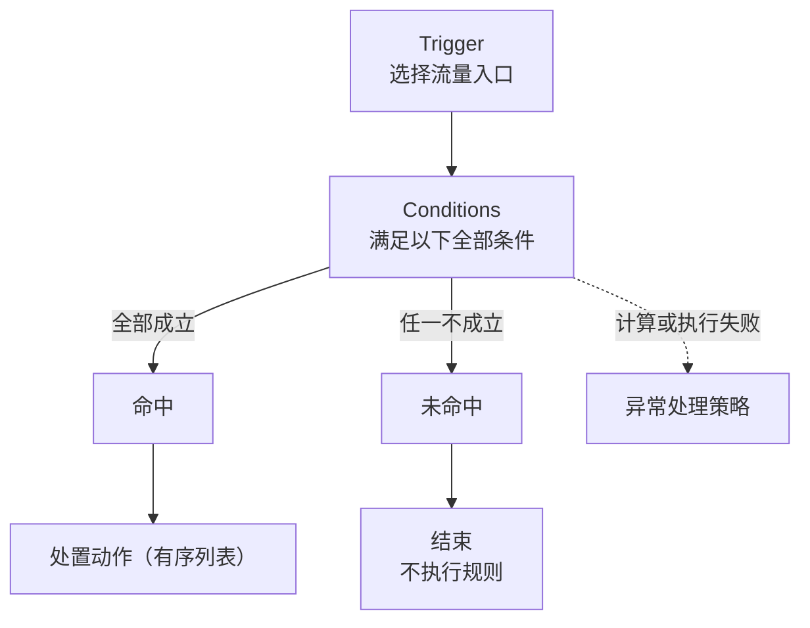

# Rule Flow Editor 01 产品与交互规格

## 1. 文档状态

- 状态：核心实现完成
- 目标：先确定规则编辑器的业务结构、空状态、交互和数据边界，再进入组件实现
- 适用场景：流量进入后，依次完成条件判断、正常处置和异常处理的规则编排

## 2. 核心结论

Rule Flow Editor 应表达三个业务阶段，而不是固定三张 Card：

1. **Trigger / 流量入口**：定义哪些流量进入这条规则，只允许一个入口。
2. **Conditions / 条件规则**：展示图片中梳理出的全部条件；当前版本所有条件固定为 AND 关系。
3. **Outcomes / 结果处置**：条件命中后执行处置动作；未命中固定结束且不执行本规则；命中结果或执行过程需要兜底时，按需展开异常处理策略。

Condition 是一个包含多条条件的逻辑组，不应把每条 AND 条件画成独立分支。只有条件组完成整体判断后，才产生结果分支。

## 3. 业务语义

### 3.1 Trigger

Trigger 代表进入规则的流量来源，例如请求入口、事件类型、资源范围或告警来源。

约束：

- 一条规则只能有一个 Trigger；
- Trigger 未选择时，规则不可发布；
- Trigger 选择后，决定后续可用的条件字段和动作类型；
- 更换 Trigger 时，如果已有条件或动作不再兼容，必须先提示影响，不可静默删除。

### 3.2 Conditions

Conditions 是一组必须同时成立的判断：

```text
Condition 1 AND Condition 2 AND ... AND Condition N
```

约束：

- 当前版本只支持 AND，不在界面中提供 AND / OR 切换；
- 条件组标题直接使用“满足以下全部条件”，避免用户误解；
- 每条条件由字段、操作符和值组成；
- 图片中整理的条件是“可选择的条件全集”，不是默认已填写的数据；
- 用户添加多少条，画布就完整展示多少条，不用“还有 N 条”隐藏核心规则；
- 条件顺序不影响逻辑结果；当前版本按添加顺序展示，不提供条件排序。

### 3.3 Outcomes

条件组完成判断后，至少要区分以下结果：

| 分支 | 业务含义 | 推荐默认行为 |
| --- | --- | --- |
| 命中 | 所有条件都成立 | 执行主要处置动作 |
| 未命中 | 任意一个条件不成立 | 立即结束，不执行本规则的任何动作 |
| 异常处理 | 命中结果或执行过程需要兜底 | 按产品提供的固定策略选择处理方式 |

“未命中”和“异常处理”不能合并成同一个概念：未命中是正常判断结果，固定跳过本规则，不允许配置处置动作；异常处理覆盖命中后的特殊结果和组件不可用等执行失败。为了让图完整表达所有情况，未命中路径始终显示在画布上，但终点是不可编辑的“结束：不执行规则”；异常分支默认隐藏，用户需要时再展开。

## 4. 推荐图结构



视觉布局建议：

- Trigger 和 Conditions 保持在主轴上；
- 命中主流程 Card 保持左对齐；异常 Card 位于处置动作右侧，未命中终点位于更右侧；
- 命中使用主连接线，未命中使用次级连接线，异常处理使用虚线；
- 颜色只用于辅助识别，连线标签和分支标题必须始终可见；
- 命中动作集中在一个 Card 中纵向排列，表示执行顺序；
- 避免把每条条件都连接到每个动作，这会造成连线爆炸，也会错误表达 AND 语义。

## 5. 默认空状态

数据默认必须为空，不带演示 Trigger、条件或动作：

```ts
const emptyRuleDefinition = {
  trigger: null,
  conditions: [],
  outcomes: {
    matched: [],
    unmatched: { behavior: "skip-rule" },
    error: [],
  },
};
```

空数据不等于空白画布。画布应显示固定的配置骨架：

1. Trigger 空卡：“选择流量入口”；
2. Conditions 空卡：“添加判断条件”，在 Trigger 未完成前为禁用态；
3. Outcomes 区域显示命中主流程和未命中固定终点；命中路径提供待配置动作 Card，未命中路径固定显示“结束：不执行规则”。在至少存在一条完整条件前，整个区域为禁用态。

异常处理不属于默认骨架。条件 Card 提供“添加异常分支”入口；用户展开后，在处置动作右侧显示一个统一 Card。已保存的异常策略会让该 Card 在重新打开规则时保持可见。

这些空卡只是引导入口，不写入规则数据。用户完成选择后，才生成真实节点。

推荐配置顺序：

```text
选择 Trigger → 添加全部 AND 条件 → 配置命中动作 → 配置异常处理 → 校验并发布
```

## 6. 交互规格

### 6.1 Trigger 选择

- 点击空 Trigger 卡打开当前组件库的 Select、Popover 或选择面板；
- 选择后立即在卡片中显示入口名称和摘要；
- 卡片提供“更换”操作；
- 如果更换会使下游配置失效，先显示受影响的条件和动作数量，再让用户确认。

### 6.2 条件编辑

- 条件卡内完整显示所有条件行；
- 每行使用当前组件库的 32px Select、Input 和 Button；
- 选择字段后，只显示该字段支持的操作符和值控件；
- 未完成的条件行显示就地校验，不阻断其他条件的编辑；
- “添加条件”放在条件列表底部；
- 删除最后一条条件后回到 Conditions 空状态；
- 条件之间固定显示 AND，不提供可交互切换。

### 6.3 动作和异常处理

- 命中分支使用一个处置动作 Card；用户选择动作类型后，在 Card 内展开该动作需要的配置；
- 处置动作按“转发到上游前”和“收到响应后”分段，各分段内支持拖拽排序，动作不能跨越执行阶段；
- 异常处理使用一个非排序 Card，按“命中后的结果”和“执行失败时”分组列出产品提供的全部策略；
- 异常策略只在用户选择处理方式后写入数据，不把未选择的展示行自动保存成规则；
- 未命中分支固定连接到“结束：不执行规则”，不提供添加动作或编辑入口；
- Block 允许保存不完整草稿；发布校验由接入它的业务页面负责。

### 6.4 画布操作

- Card 可拖动，但表单控件、下拉弹层和按钮不触发拖动；
- 新增节点后自动落在对应阶段或分支的合理位置；
- 自动布局只解决初始排布和碰撞，用户拖动后的坐标应持久化；
- 提供“整理布局”能力作为后续增强，不把自由拖动作为理解规则的前提；
- 画布默认占满父容器，内容超出时内部滚动；
- 第一版保持单向自上而下的阅读顺序，不支持任意创建连线。

## 7. 信息展示原则

这张图承担“完整规则审计”的职责，因此：

- 所有已配置条件必须直接可见；
- 所有结果分支必须有明确标题；
- 所有动作必须列在所属分支中；
- 不用颜色单独表达成功或异常；
- 不把重要配置只放在 Tooltip、Drawer 或选中态侧栏中；
- Card 内只展示识别和审计所需信息，复杂参数仍可在就地展开区或侧面配置面板编辑；
- 默认视图展示规则定义，而不是某一次流量的实时执行结果。

如果未来需要展示实际运行路径，应增加独立的“运行查看模式”，用高亮覆盖当前定义图，而不是改变编辑模式的数据结构。

## 8. 推荐数据模型

当前自由 `nodes + edges` 模型适合渲染，但不足以约束“单 Trigger、固定 AND、固定结果类型”等业务规则。建议用领域模型作为数据源，再派生画布节点和连线。

```ts
interface RuleTrigger {
  type: string;
  config: Record<string, unknown>;
}

interface RuleCondition {
  id: string;
  field: string;
  operator: string;
  value: unknown;
}

interface RuleAction {
  id: string;
  type: string;
  config: Record<string, unknown>;
}

interface RuleDefinition {
  trigger: RuleTrigger | null;
  conditions: RuleCondition[];
  conditionMatch: "all";
  outcomes: {
    matched: RuleAction[];
    unmatched: { behavior: "skip-rule" };
    error: RuleAction[];
  };
  layout?: {
    nodePositions: Record<string, { x: number; y: number }>;
  };
}
```

数据原则：

- 规则定义和画布布局分开保存；
- `conditionMatch` 第一版固定为 `all`，仍保留字段方便未来迁移；
- 三种 outcome 始终存在，但只有 `matched` 和 `error` 包含可配置动作；
- `unmatched` 固定保存为 `skip-rule`，明确表示未命中时不执行本规则；
- 图片中的条件全集应转换为字段 schema，作为选择数据传入，不应硬编码在 Block 内；
- Block 只负责编辑和展示，字段权限、动作权限及发布校验由业务层提供。

## 9. 状态与校验

### 草稿状态

- 允许 Trigger、条件和动作暂时不完整；
- 未完成节点显示“待配置”状态；
- 用户离开前保存草稿，不自动补入默认值。

### 可发布状态

至少满足：

- 已选择 Trigger；
- 至少有一条完整条件；
- 命中分支至少有一个动作；
- 未命中分支固定为 `skip-rule`，且不能包含动作；
- 执行异常分支有动作或显式异常策略；
- 不存在与 Trigger 不兼容的字段或动作；
- 所有动作参数完整且具有执行权限。

### 错误呈现

- 字段错误显示在具体条件或动作内部；
- 分支缺失显示在对应分支空卡上；
- 顶部可以显示校验摘要，但点击后必须定位到具体节点；
- 不用一个笼统 Toast 替代可操作的错误说明。

## 10. 响应式策略

- 宽容器：Trigger、Conditions 和处置动作 Card 左侧对齐，异常处理位于处置动作右侧，未命中位于更右侧并避让异常 Card；
- 中等容器：结果分支保持横向，但允许画布水平滚动；
- 窄容器：切换为纵向分段列表，按“命中、异常处理、未命中”依次展示；
- 不在窄屏隐藏异常分支或条件详情；
- 移动端优先保证查看和基础编辑，复杂拖动可退化为上移/下移操作。

## 11. 第一版范围

包含：

- 单 Trigger；
- 一个 AND 条件组；
- 完整显示全部条件；
- 一个支持分阶段排序的命中动作 Card、未命中固定结束，以及按需展开的异常策略 Card；
- 默认空数据和引导式空卡；
- 草稿与发布校验；
- 受约束的节点拖动和响应式布局。

暂不包含：

- OR、嵌套条件组和条件表达式树；
- 多 Trigger 或 Trigger 合并；
- 用户任意创建、删除和连接边；
- 每个动作独立的异常分支；
- 循环、回跳、并行汇合和子流程；
- 实时运行监控、流量比例和执行日志叠加。

## 12. 实施拆分建议

1. 将默认值从演示流程改为空规则定义，并实现三个阶段的空卡。
2. 将当前 `condition` 节点固定为 AND 条件组，接入图片对应的字段 schema。
3. 增加 `matched`、`unmatched`、`error` 三类结果；其中 `matched` 使用一个可排序动作 Card，`unmatched` 固定连接结束节点，`error` 使用一个非排序策略 Card。
4. 从领域模型派生画布的 nodes 和 edges，布局信息单独持久化。
5. 增加草稿校验、发布校验和 Trigger 变更兼容性检查。
6. 补充空状态、条件增删、三类分支、鼠标/键盘操作和响应式测试。

## 13. 验收标准

- 初次打开没有任何演示业务数据，但用户能立即看懂从哪里开始；
- 用户只能配置一个 Trigger；
- 条件组明确表达“全部满足”，所有已选条件完整可见；
- 图上始终存在命中和未命中路径，未命中明确显示“不执行规则”；异常路径按需展开并在有已保存配置时保持可见；
- 所有已配置动作均能在图上定位到所属分支和执行顺序；
- Select、Input、Button、Card、Badge、颜色、边框和尺寸均来自当前 Zeron 组件库及语义变量；
- 编辑控件不会触发 Card 拖动；
- 未完成规则可以保存草稿，但不能误发布；
- 规则定义不依赖节点坐标，重新布局不会改变业务语义。

## 14. 已确认的业务决定

- 条件未命中时，立即结束且不执行本规则；
- 未命中路径不允许配置处置动作；
- 未命中不是异常，不进入异常处理；
- 命中后的特殊结果、动作执行失败或外部依赖失败进入异常分支；
- 为保证规则图完整，未命中路径仍需显示，并明确连接到“结束：不执行规则”。
